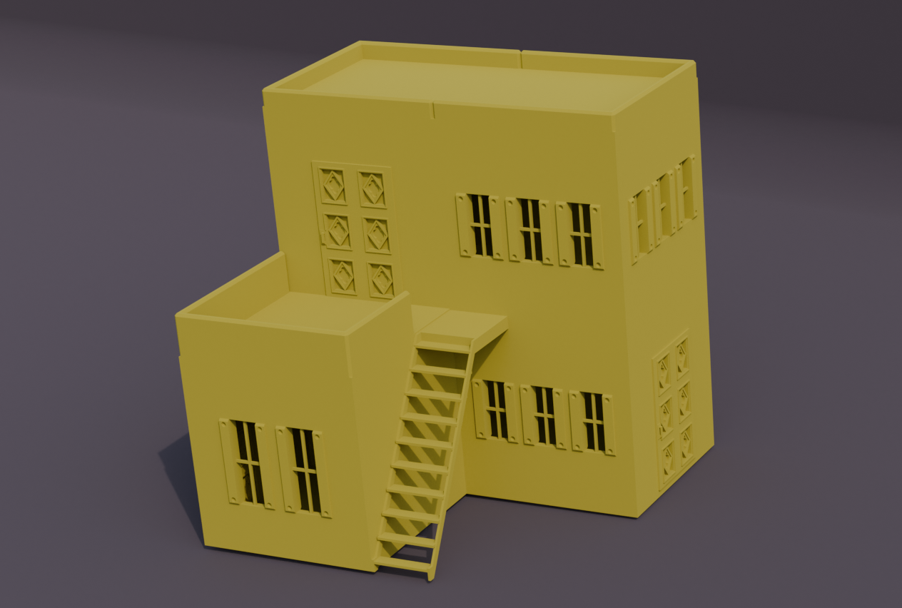
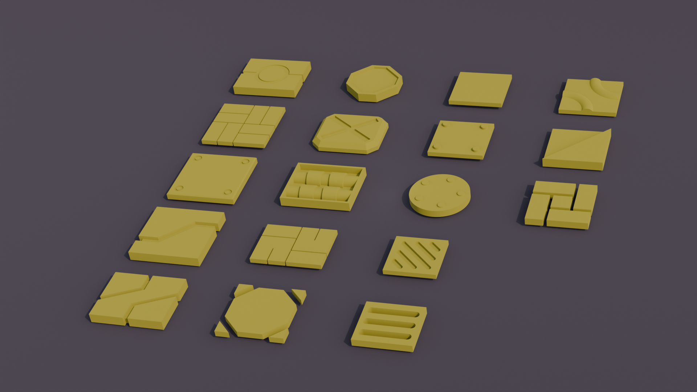
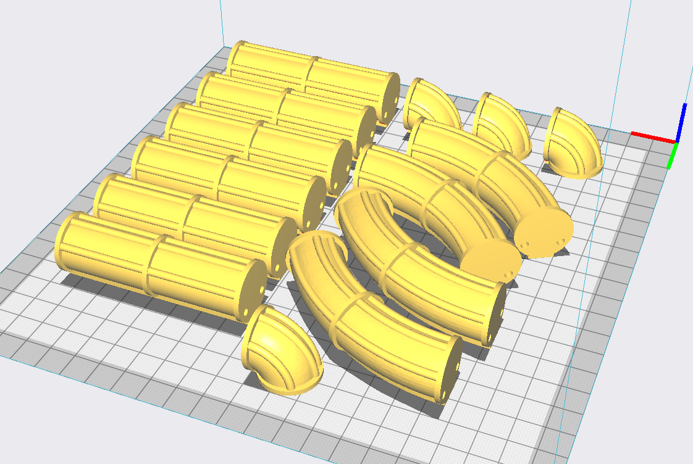
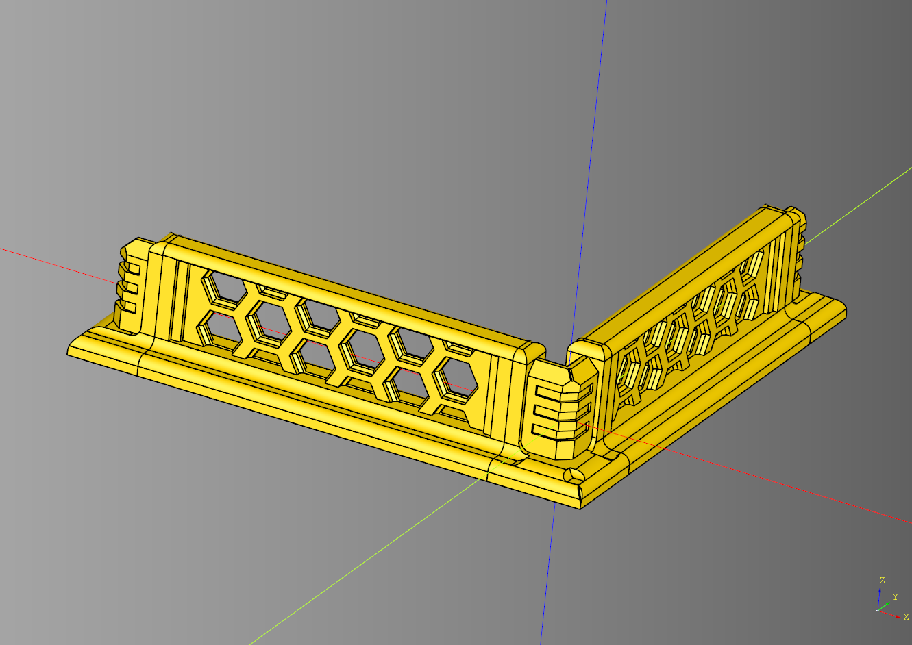

# cqterrain
Helper Libary to Generate 3d models of buildings / terrain using CadQuery.

## Examples
|||
|-|-|
|[](documentation/building.md)|[](documentation/tile.md)|
|[](documentation/pipe.md)|[](documentation/shieldwall.md)|

## Project Documention
* [Documentation](documentation/README.md)
  * [Barrier](documentation/barrier.md)
  * [Book](book.md)
  * [Bridge](documentation/bridge.md)
  * [Building](documentation/building.md)
  * [Crystal](documentation/crystal.md) 
  * [Damage](documentation/damage.md)
  * [Door](documentation/door.md)
  * [Greeble](documentation/greeble.md)
  * [Material](documentation/material.md)
  * [Minibase](documentation/minibase.md)
  * [Pipe](documentation/pipe.md)
  * [Roof](documentation/roof.md)
  * [Shieldwall](documentation/shieldwall.md)
  * [Spool](documentation/spool.md)
  * [Stairs](documentation/stairs.md)
  * [Tile](documentation/tile.md)
  * [Window](documentation/window.md)
  * [Walkway](documentation/walkway.md)
  * [Misc](documentation/misc.md) aka everything else
    * ladder
    * obelisk
    * stones
    * support

## Changes
* [Changelog](./changes.md)

## Dependencies
* [CadQuery 2.x](https://github.com/CadQuery/cadquery)
* [cadqueryhelper](https://github.com/medicationforall/cadqueryhelper)

## Projects
* [Jersey Barrier Set](https://miniforall.com/jerseybarriers)
* [Pipe Terrain Set](https://miniforall.com/pipeterrain)
* [Shieldwall Terrain Set](https://miniforall.com/shieldwall)
* [Walkway Terrain Set](https://miniforall.com/walkways)

---

## Installation
To install CQ Terrain directly from GitHub, run the following `pip` command:

	pip install git+https://github.com/medicationforall/cqterrain

**OR**

### Local Installation
From the cloned cqterrain directory run.

	pip install ./

---

## Running Example Scripts
[example_runner.py](example_runner.py) runs all examples.

``` bash
C:\Users\<user>\home\3d\cqterrain>python example_runner.py
```

**OR**

### Running individual examples
* From the root of the project run one of the example scripts:
  
``` bash
C:\Users\<user>\home\3d\cqterrain>python ./example/stairs.py
```
