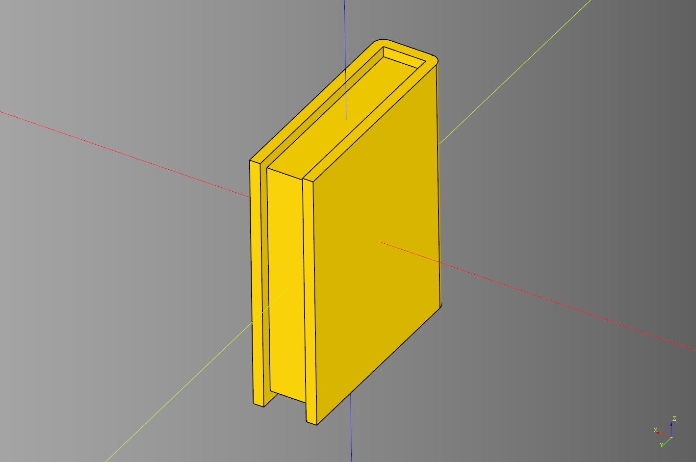
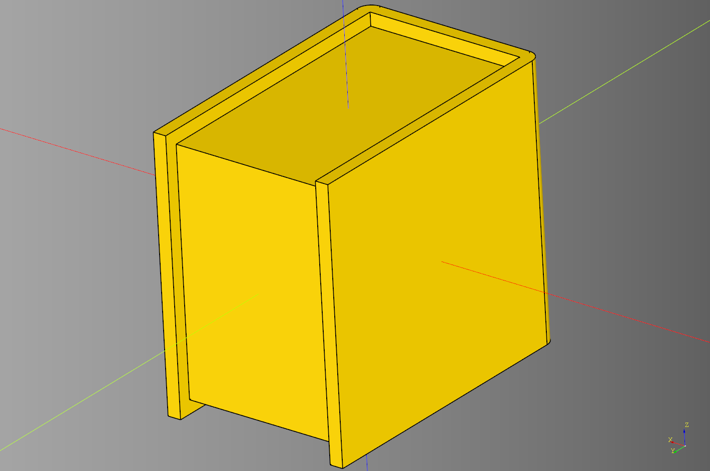
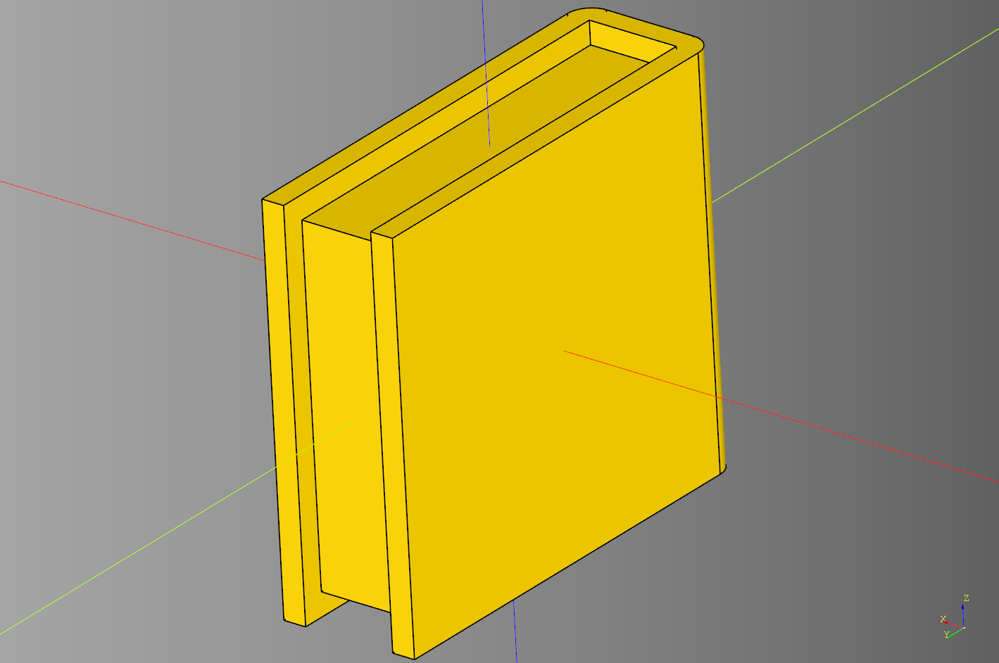
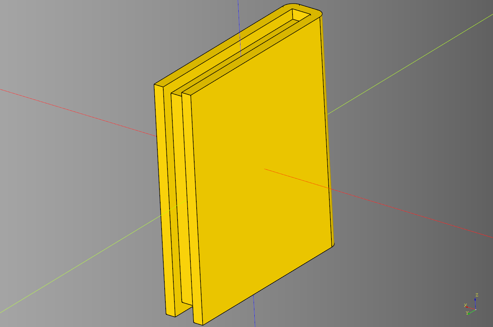
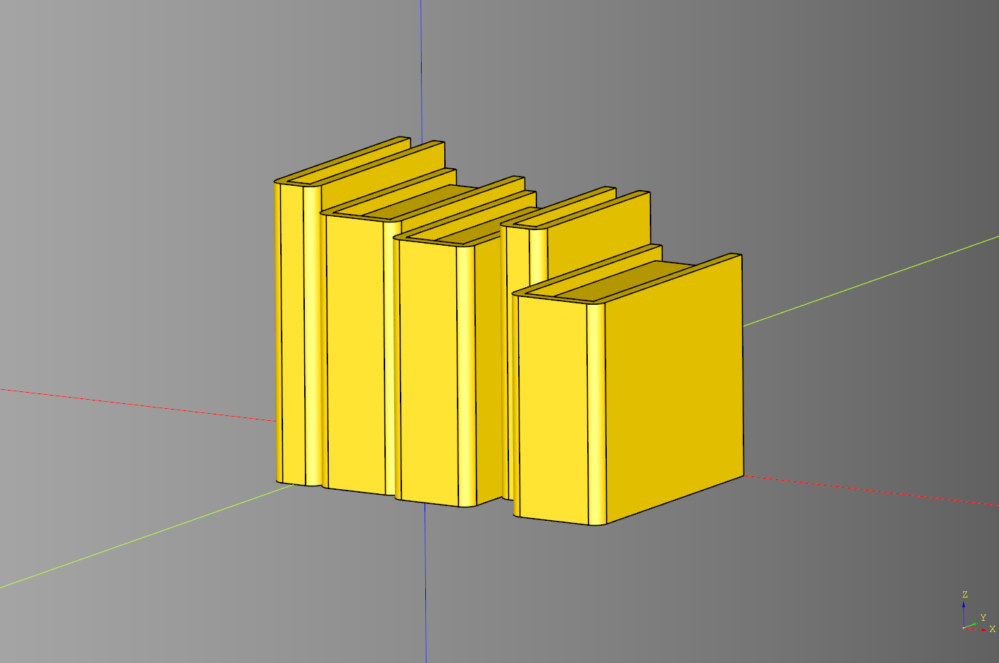
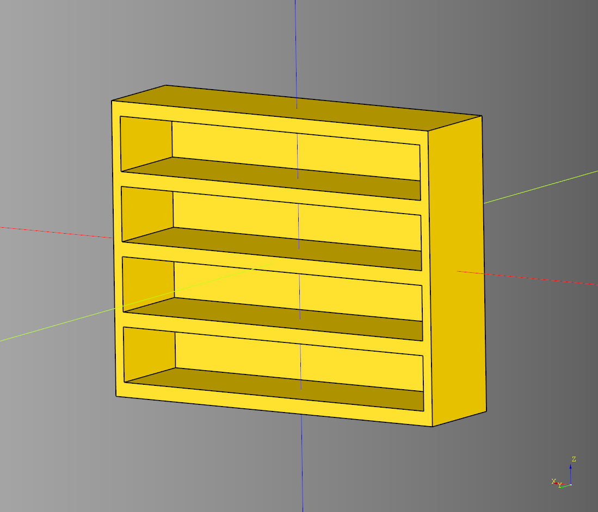
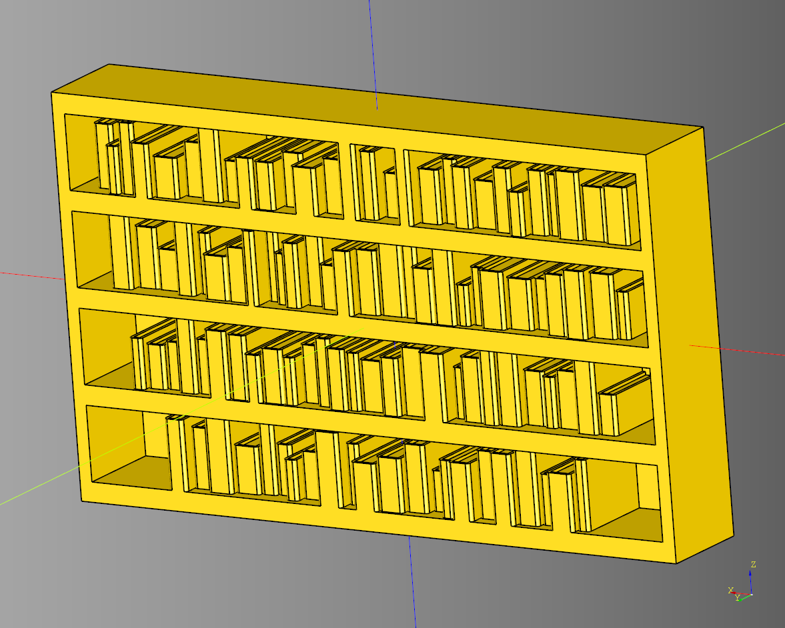

# Book

---

## Book
Method for making a solid that resembles a blosed book.

### parameters
* length: float 
* width: float 
* height: float
* binder_width: float
* page_width: float
* page_height: float
* bottom_align: bool
* fillet: float

``` python
import cadquery as cq
from cqterrain.book import book

ex_book = book(
    length = 3, 
    width = 10, 
    height = 12,
    binder_width = 0.5,
    page_width = 9,
    page_height = 11,
    bottom_align = False,
    fillet = 0.5
)

show_object(ex_book)
```



* [source](../src/cqterrain/book.py)
* [example](../example/book/book.py)
* [stl](../stl/book.stl)

---

## Book Random
Randomized book generator. Wrapper function around [book](#book) that adds min and max values to parameters.

### parameters
* length: tuple[float,float,float]|float
* width: tuple[float,float,float]|float 
* height: tuple[float,float,float]|float
* binder_width: tuple[float,float,float]|float
* page_width_inset: float
* page_height_inset: float
* bottom_align: bool
* fillet: float
* seed: str|None

### returns
Returns a cadquery workplane and a tuple which has length, width and height of the generated book.

``` python
import cadquery as cq
from cqterrain.book import book_random

seed = 'test'

ex_book, dim = book_random(
    length=(2.0,8.0,0.5),
    width = (8,11,0.5), 
    height = (8,12,0.5),
    binder_width=.5,
    page_width_inset = 1,
    page_height_inset=1,
    bottom_align = False,
    seed=seed
)

show_object(ex_book)
```



* [source](../src/cqterrain/book.py)
* [example](../example/book/book_random.py)
* [stl](../stl/book_random_test.stl)

### Alternative seed blue
``` python
import cadquery as cq
from cqterrain.book import book_random

seed = 'blue'

blue_book, dim = book_random(
    length=(2.0,8.0,0.5),
    width = (8,11,0.5), 
    height = (8,12,0.5),
    binder_width=.5,
    page_width_inset = 1,
    page_height_inset=1,
    bottom_align = False,
    seed=seed
)

show_object(blue_book)
```



* [source](../src/cqterrain/book.py)
* [example](../example/book/book_random.py)
* [stl](../stl/book_random_blue.stl)

### Alternative seed green
``` python
import cadquery as cq
from cqterrain.book import book_random

seed = 'green'

ex_book, dim = book_random(
    length=(2.0,8.0,0.5),
    width = (8,11,0.5), 
    height = (8,12,0.5),
    binder_width=.5,
    page_width_inset = 1,
    page_height_inset=1,
    bottom_align = False,
    seed=seed
)

show_object(green_book)
```



* [source](../src/cqterrain/book.py)
* [example](../example/book/book_random.py)
* [stl](../stl/book_random_green.stl)

---

## Books

### parameters
* count: tuple[int,int,int]|int
* length: tuple[float,float,float]|float
* width: tuple[float,float,float]|float
* height: tuple[float,float,float]|float
* binder_width: tuple[float,float,float]|float
* page_width_inset: float
* page_height_inset: float
* bottom_align: bool
* seed: str

### returns
Returns a cadquery workplane and a tuple which has length, width and height of the generated books.

``` python
import cadquery as cq
from cqterrain.book import books

seed = "pink"
ex_books,dim = books(
    count=5,
    length = (2.0,4.0,0.5),
    width = (8,11,0.5), 
    height = (8,12,0.5),
    binder_width = .5,
    page_width_inset = 1,
    page_height_inset = 1,
    bottom_align = True,
    seed=seed
)

show_object(ex_books)
```



* [source](../src/cqterrain/books.py)
* [example](../example/book/books.py)
* [stl](../stl/books_pink.stl)

---

## Bookcase

### parameters
* length: float
* width: float 
* height: float
* segments: int
* margin_top: float
* margin_sides: float
* back_translate: float

``` python
import cadquery as cq
from cqterrain.book import bookcase 

ex_bookcase = bookcase(
    length = 75,
    width = 20,
    height = 60,
    segments = 4,
    margin_top = 1.5,
    margin_sides = 2,
    back_translate = 1
)
show_object(ex_bookcase)
```



* [source](../src/cqterrain/book/book_case.py)
* [example](../example/book/bookcase.py)
* [stl](../stl/book_bookcase.stl)
  
---

## Bookcase Class
Base derrived class that combines a bookcase and books.

### parameters
* length: float
* width: float
* height: float
* segments: int
* margin_top: float
* margin_sides: float
* back_translate: float 
* render_books: bool
* book_length: float|tuple[float,float,float]
* minus_width: float
* seed: str
* book_count: int|tuple[int,int,int]
* bottom_align: bool
* binder_width: float
* page_width_inset: float
* page_height_inset: float
* min_book_height: float

``` python
import cadquery as cq
from cqterrain.book import Bookcase

bp_case = Bookcase()
bp_case.length = 100
bp_case.width = 15
bp_case.segments = 4
bp_case.minus_width = 3
bp_case.seed = "purple"
bp_case.book_count =(16,30,1)
bp_case.min_book_height = 6

#closed
bp_case.bottom_align = True
bp_case.page_width_inset=0.5
bp_case.back_translate = 1

# open
#bp_case.bottom_align = False#True
#bp_case.page_width_inset=1#0.5
#bp_case.back_translate = 0#1

bp_case.render_books = True
bp_case.make()

ex_case = bp_case.build()
show_object(ex_case)
```



* [source](../src/cqterrain/book/Bookcase.py)
* [example](../example/book/bookcase_class.py)
* [stl](../stl/book_bookcase_books.stl)