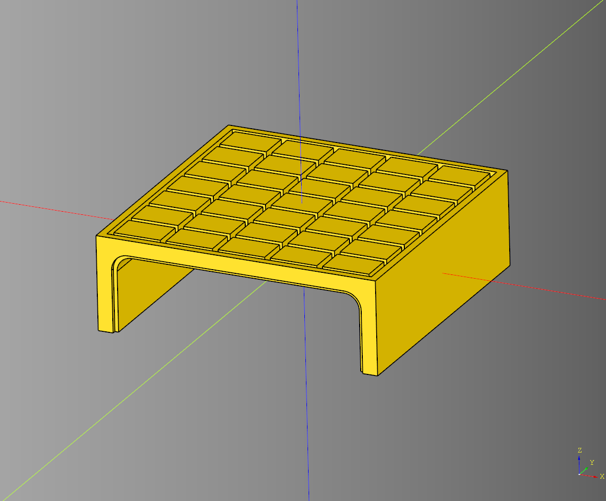

# Bridge

- [Bridge](#bridge)
  - [Base Ramp](#base-ramp)
    - [parameters](#parameters)
  - [Base Straight](#base-straight)
    - [parameters](#parameters-1)
  - [Bridge](#bridge-1)
    - [parameters](#parameters-2)
    - [Blueprints](#blueprints)
  - [Tile Straight](#tile-straight)
    - [parameters](#parameters-3)
---

## Base Ramp
### parameters
* length: float
* width: float
* height: float

``` python
import cadquery as cq
from cqterrain.bridge import BaseRamp

bp_ramp = BaseRamp()
bp_ramp.length = 75*2
bp_ramp.width = 75*2
bp_ramp.height = 50
bp_ramp.make()

ex_ramp = bp_ramp.build()

show_object(ex_ramp)
```


* [source](../src/cqterrain/bridge/BridgeRamp.py) 
* [example](../example/bridge/bridge_ramp.py)
* [stl](../stl/bridge_ramp.stl)

## Base Straight
### parameters
* length: float
* width: float
* height: float

``` python
import cadquery as cq
from cqterrain.bridge import BaseStraight

bp_straight = BaseStraight()

bp_straight.length = 75*2
bp_straight.width = 75*2
bp_straight.height = 50
bp_straight.make()

ex_straight = bp_straight.build()

show_object(ex_straight)
```


* [source](../src/cqterrain/bridge/BridgeStraight.py)
* [example](../example/bridge/bridge_straight.py)
* [stl](../stl/bridge_straight.stl)

## Bridge
### parameters
* straight_count:int - Count of bridge straight sections to build.
* width:float - Overall width of the bridge.
* height:float - Overall height of the bridge.

### Blueprints
* bp_straight: [BaseStraight](#base-straight)
* bp_ramp: [BaseRamp](#base-ramp)

``` python
import cadquery as cq
from cqterrain.bridge import Bridge

bp_bridge = Bridge()

bp_bridge.straight_count = 1
bp_bridge.width = 75*2
bp_bridge.height = 50

bp_bridge.make()
ex_bridge = bp_bridge.build()

show_object(ex_bridge)
```


* [source](../src/cqterrain/bridge/Bridge.py)
* [example](../example/bridge/bridge.py)
* [stl](../stl/bridge.stl)

## Tile Straight
Inherits from [BaseStraight](#base-straight)

### parameters
* padding: float
* tile_height: float
* tile_length: float
* tile_width: float
* tile_padding: float
* tile_method = plain - swap out for a callable method that take length, width, height parameters and returns a cq.Workpplane object.
* base_top_margin: float
* base_side_margin: float
* base_fillet: float
* base_inset_distance_height: float
* base_inset_distance: float
* base_inset_depth: float
* base_inset_fillet: float
* render_tile:bool

``` python
import cadquery as cq
from cqterrain.bridge import TileStraight
from cqterrain.tile import plain

bp_straight = TileStraight()

bp_straight.length = 75*2
bp_straight.width = 75*2
bp_straight.height = 50

bp_straight.padding = 4
bp_straight.tile_height = 4
bp_straight.tile_length = 26
bp_straight.tile_width = 18
bp_straight.tile_padding = 1
bp_straight.tile_method = plain

bp_straight.base_top_margin = 10
bp_straight.base_side_margin = 10
bp_straight.base_fillet = 8

bp_straight.base_inset_distance_height = 2
bp_straight.base_inset_distance = 2
bp_straight.base_inset_depth = 2
bp_straight.base_inset_fillet = 9

bp_straight.render_tile = True

bp_straight.make()

ex_straight = bp_straight.build()

show_object(ex_straight)
```



* [source](../src/cqterrain/bridge/TileStraight.py)
* [example](../example/bridge/tile_straight.py)
* [stl](../stl/bridge_tile_straight.stl)