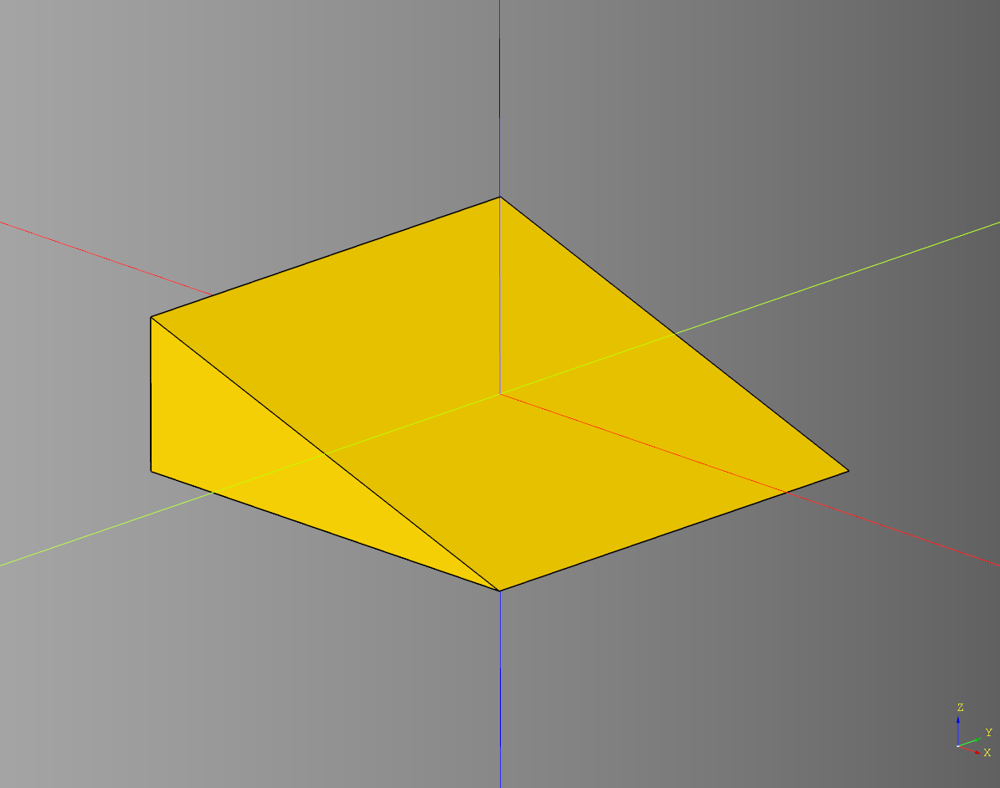
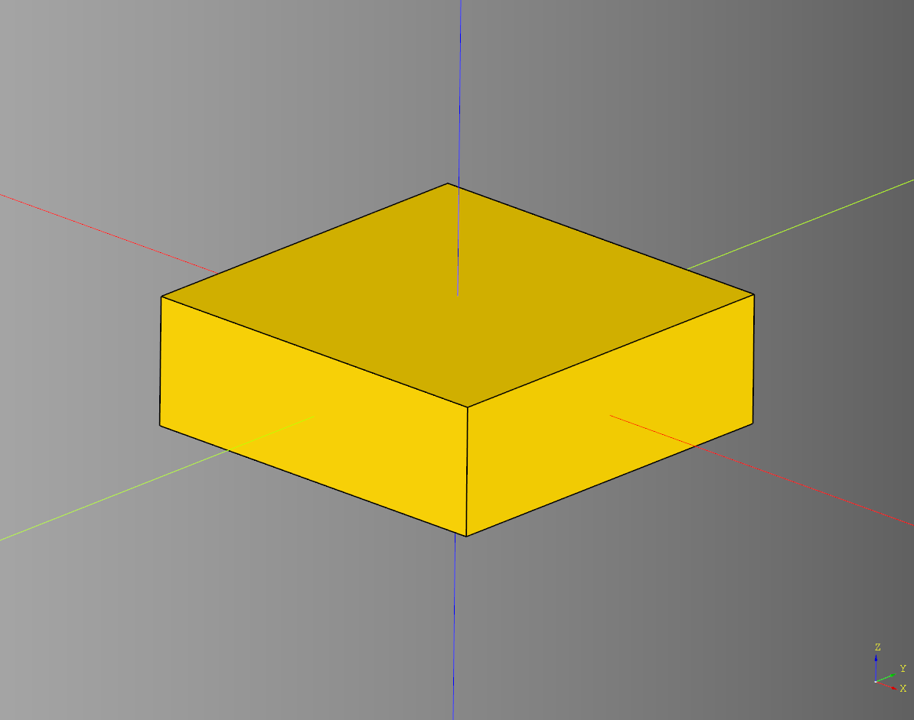
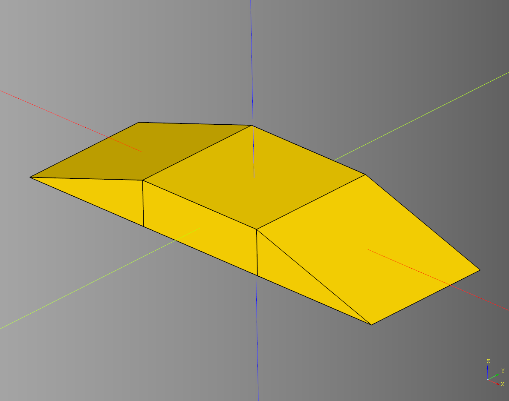

# Bridge

## Base Ramp
### parameters
* length: float
* width: float
* height: float

``` python
import cadquery as cq
from cqterrain.bridge import BaseRamp

bp_ramp = BaseRamp()
bp_ramp.length = 75*2
bp_ramp.width = 75*2
bp_ramp.height = 50
bp_ramp.make()

ex_ramp = bp_ramp.build()

show_object(ex_ramp)
```



* [source](../src/cqterrain/bridge/BridgeRamp.py) 
* [example](../example/bridge/bridge_ramp.py)
* [stl](../stl/bridge_ramp.stl)

## Base Straight
### parameters
* length: float
* width: float
* height: float

``` python
import cadquery as cq
from cqterrain.bridge import BaseStraight

bp_ramp = BaseStraight()

length:float = 75*2
width:float = 75*2
height:float = 50
bp_ramp.make()

ex_straight = bp_ramp.build()

show_object(ex_ramp)
```



* [source](../src/cqterrain/bridge/BridgeStraight.py)
* [example](../example/bridge/bridge_straight.py)
* [stl](../stl/bridge_straight.stl)

## Bridge
### parameters
* straight_count:int - Count of bridge straight sections to build.
* width:float - Overall width of the bridge.
* height:float - Overall height of the bridge.

### Blueprints
* bp_straight: [BaseStraight](#base-straight)
* bp_ramp: [BaseRamp](#base-ramp)

``` python
import cadquery as cq
from cqterrain.bridge import Bridge

bp_bridge = Bridge()

bp_bridge.straight_count = 1
bp_bridge.width = 75*2
bp_bridge.height = 50

bp_bridge.make()
ex_bridge = bp_bridge.build()

show_object(ex_bridge)
```



* [source](../src/cqterrain/bridge/Bridge.py)
* [example](../example/bridge/bridge.py)
* [stl](../stl/bridge.stl)