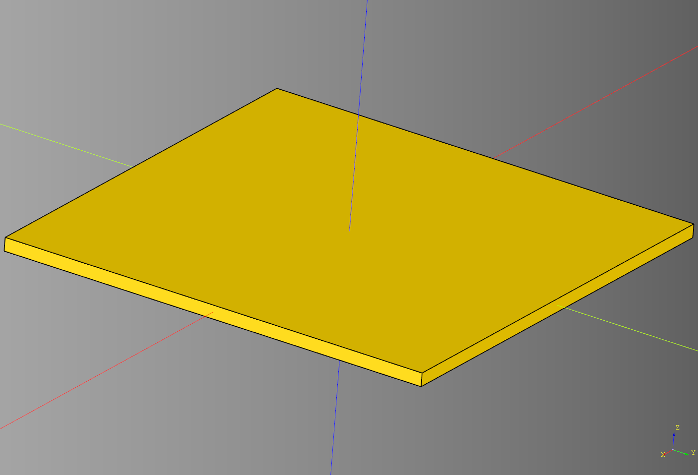
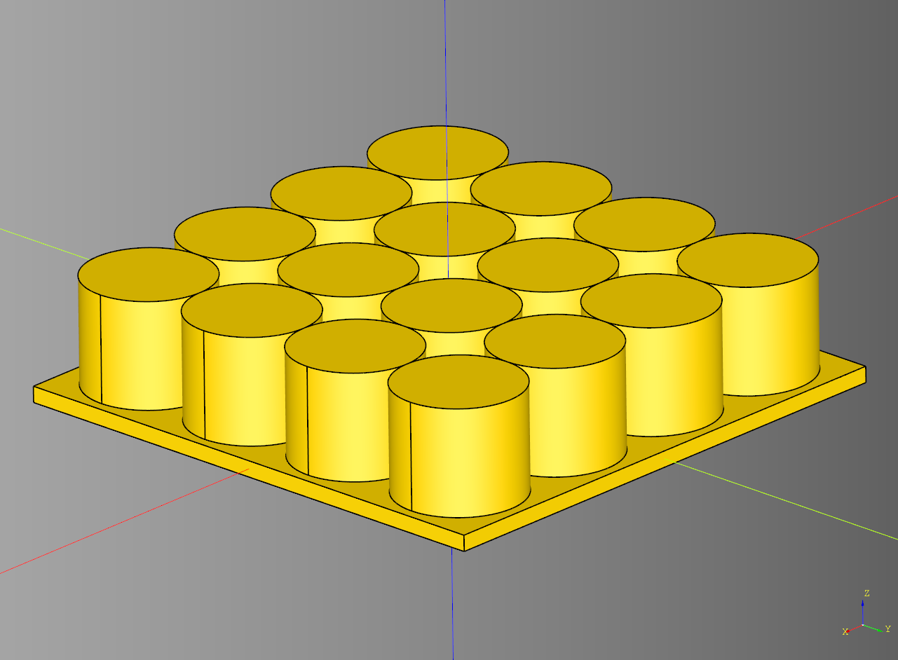
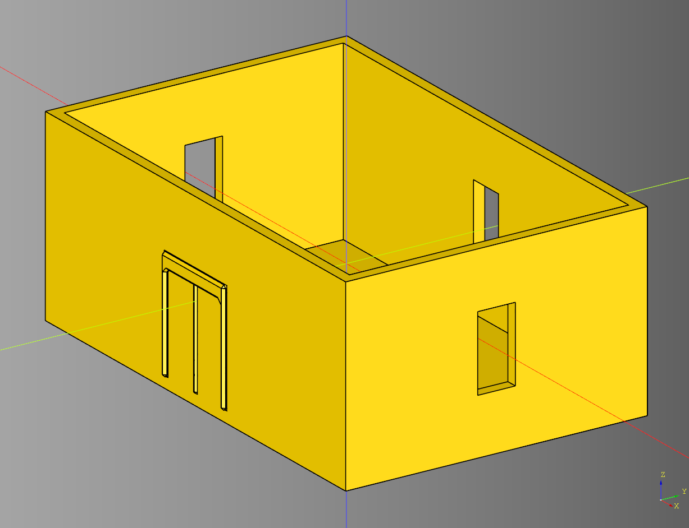
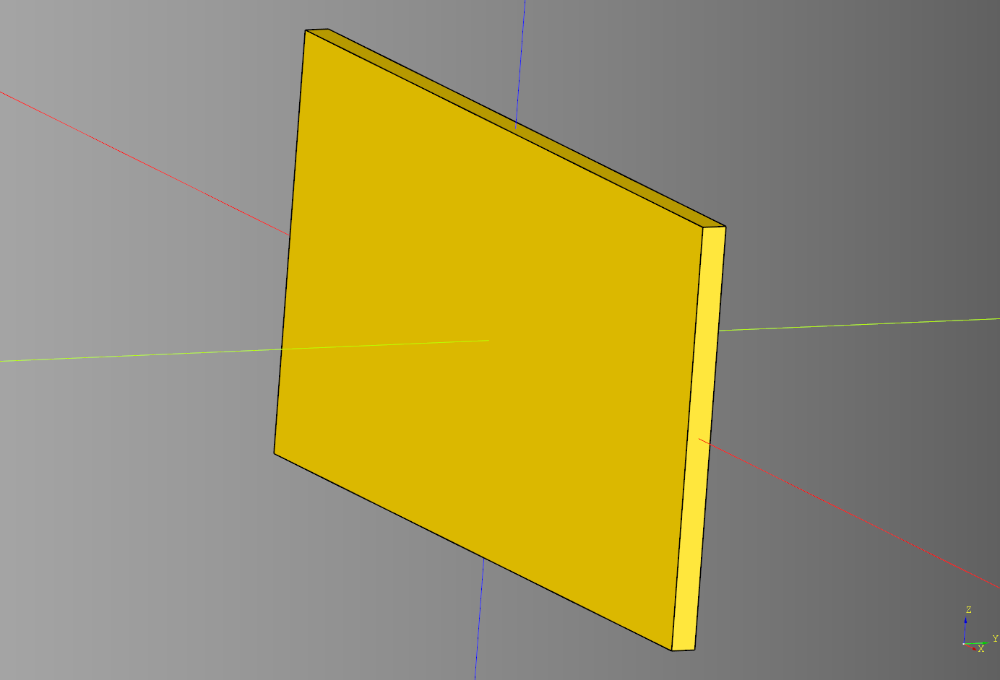
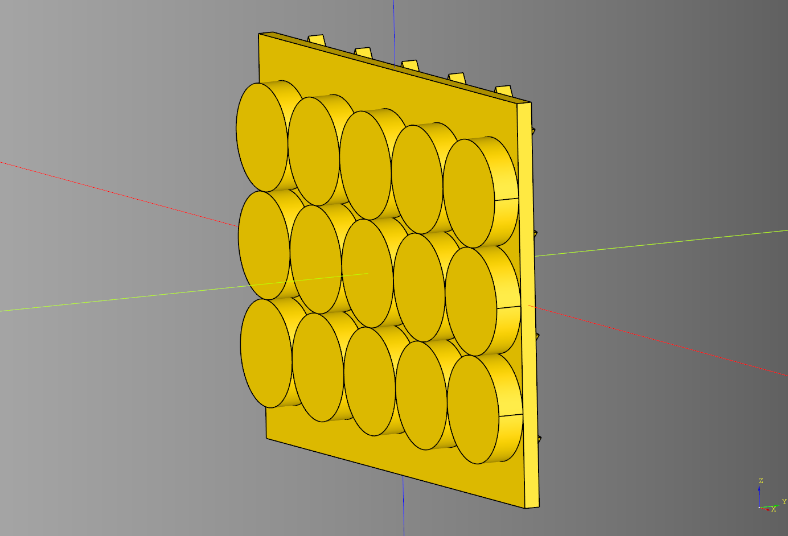
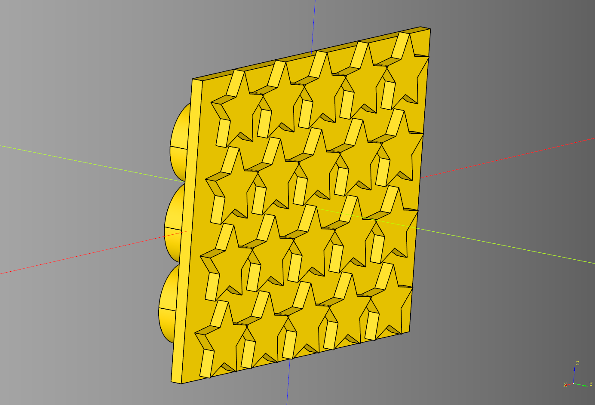

# Building


## Floor
### parameters
* length: float
* width: float
* height: float
* tile: cq.Workplane|None
* tile_padding: float

```python
bp_floor = Floor()
bp_floor.length = 100 
bp_floor.width = 100
bp_floor.height = 3 
bp_floor.tile = None 
bp_floor.tile_padding = 0

bp_floor.make()
floor_ex = bp_floor.build()
```

<br />

### With tile example
```python
cone = shape.cone()
cube = cq.Workplane("XY").box(5,5,5)
cylinder = cq.Workplane("XY").cylinder(20, 12)

bp_floor = Floor(tile=cylinder, width=200)
bp_floor.length = 100 
bp_floor.width = 100
bp_floor.height = 3 
bp_floor.tile = cylinder 
bp_floor.tile_padding = 0

bp_floor.make()
floor_ex = bp_floor.build()
```

<br />

* [source](../src/cqterrain/building/floor.py)
* [example](../example/building/floor.py)
* [stl](../stl/building_floor.stl)

## Room
### parameters
length:float = length
width:float = width
height:float = height
wall_width:float = wall_width
floor_height:float = floor_height
floor_padding:float = floor_padding
floor_tile:cq.Workplane|None = floor_tile
floor_tile_padding:float = floor_tile_padding
style:str = style
window_count:int = window_count
door_walls:list[bool] = door_walls
window_walls:list[bool] = window_walls
build_walls:list[bool] = build_walls

```python
bp_room = Room()
bp_room.length= 120
bp_room.width = 80
bp_room.height= 50
bp_room.wall_width = 3
bp_room.floor_height = 3
bp_room.floor_padding = 0
bp_room.floor_tile = None
bp_room.floor_tile_padding = 0
bp_room.style = "office"
bp_room.window_count= 1
bp_room.door_walls = [False, True, False, False]
bp_room.window_walls = [True, True, True, True]
bp_room.build_walls = [True, True, True, True]

bp_room.make()
result = bp_room.build()
```

<br />

* [source](../src/cqterrain/building/room.py)
* [example](../example/building/room.py)
* [stl](../stl/building_room.stl)


## Wall
### parameters
* length: float
* width: float 
* height: float
* inside_tile: cq.Workplane|None = None 
* outside_tile: cq.Workplane|None = None

```python
bp_wall = Wall()
bp_wall.length = 100
bp_wall.width = 3
bp_wall.height = 50
bp_wall.inside_tile = None
bp_wall.outside_tile = None

bp_wall.make()
result = bp_wall.build()
```

<br />

### With tile example

```python
from cqterrain.building import Wall
from cadqueryhelper import shape

cylinder = cq.Workplane("XY").cylinder(5, 10)
star = shape.star()

bp_wall = Wall()
bp_wall.length = 100
bp_wall.width = 3
bp_wall.height = 75
bp_wall.inside_tile = cylinder
bp_wall.outside_tile = star

bp_wall.make()
result = bp_wall.build()
```

<br />
<br />

* [source](../src/cqterrain/building/wall.py)
* [example](../example/building/wall.py)
* [stl](../stl/building_wall.stl)