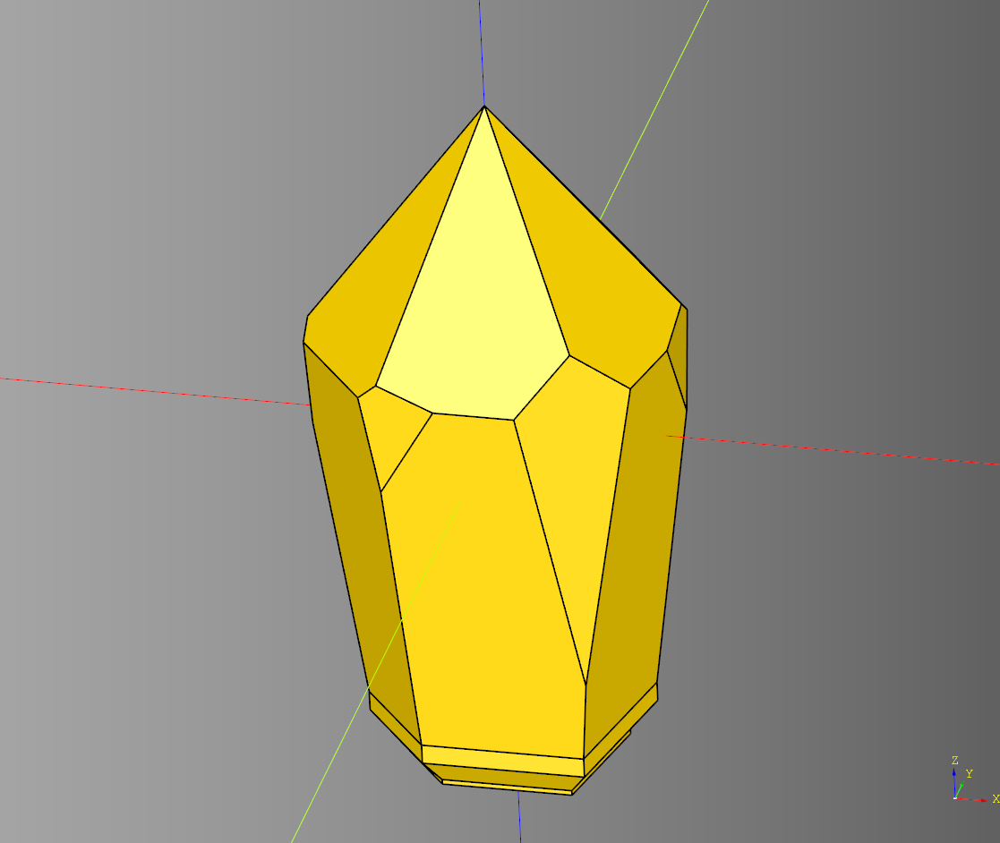
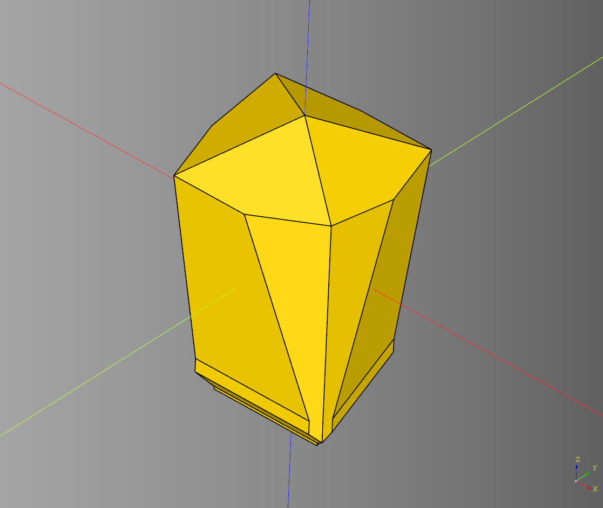
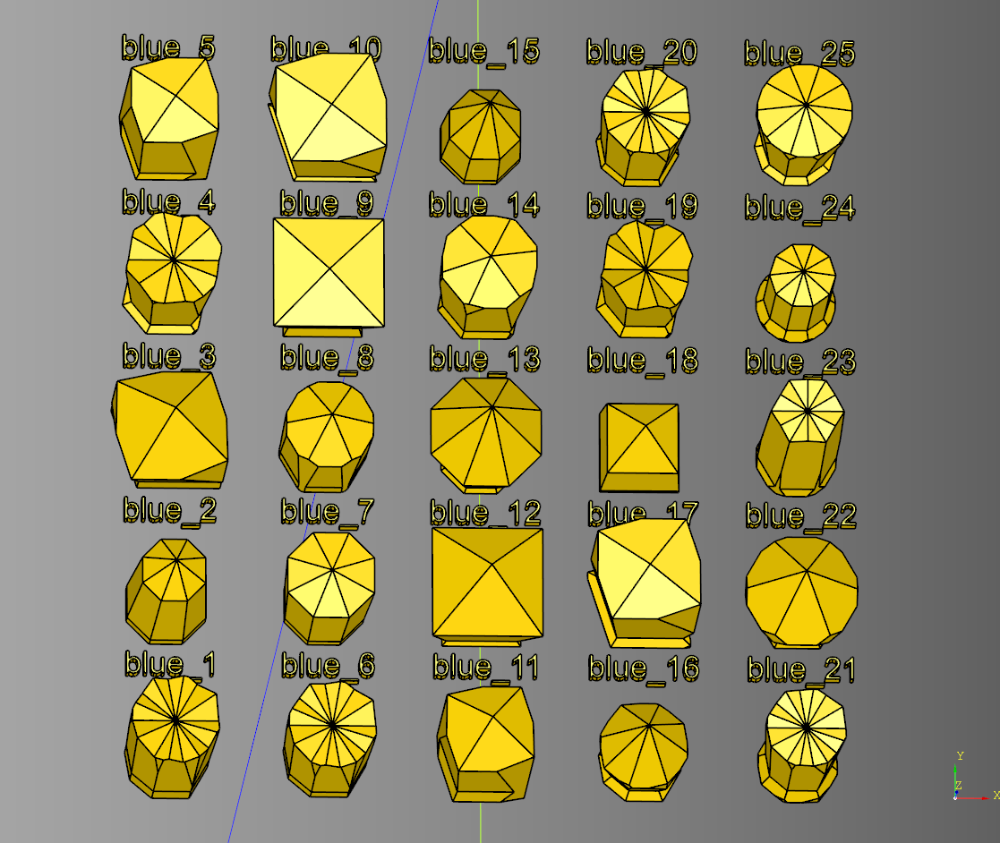
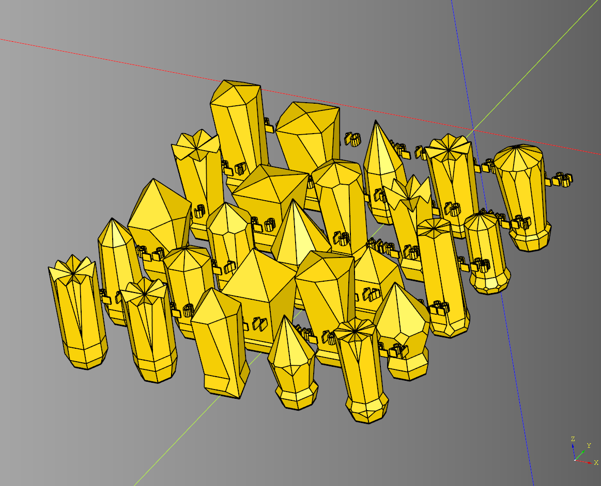
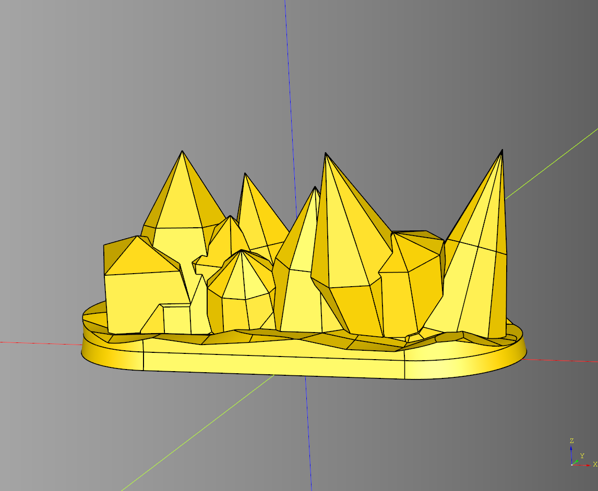
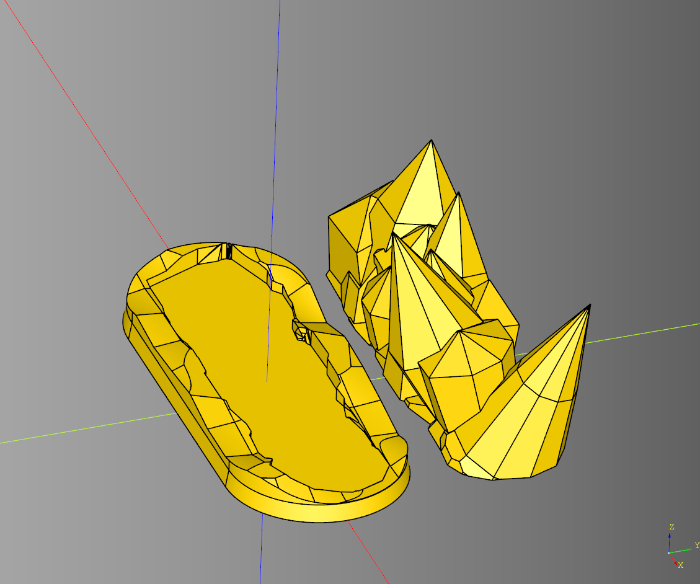
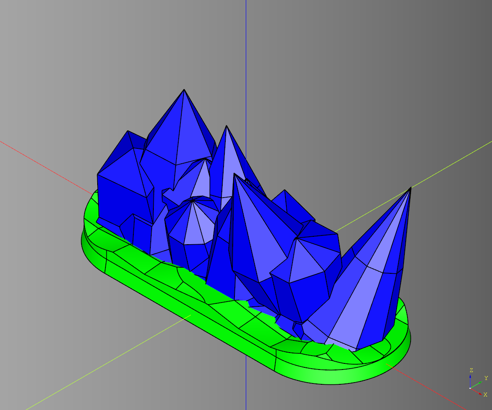

# Crystal

---

## Crystal
Just a hardcoded implementation of an obelisk

``` python
import cadquery as cq
from cqterrain import obelisk

model = obelisk(
        base_width=20.0,
        base_height=0.5,
        inset_width=25.0,
        inset_height=3.1,
        mid_width=25.0,
        mid_height=2.0,
        top_width=35.0,
        top_height=40.0,
        height=70.0,
        faces=7,
        intersect=True
    ).rotate((0,0,1),(0,0,0),0)

show_object(model)
```



* [source](../src/cqterrain/obelisk.py)
* [example](../example/crystal/crystal.py)
* [stl](../stl/crystal.stl)
  
---

## Crystal Random
Method for creating a psuedo random crystal like looking structure.

### parameters
* height: tuple[float,float,float]|float -min,max,step
* base_width: tuple[float,float,float]|float
* base_height: tuple[float,float,float]|float
* inset_width: tuple[float,float,float]|float
* inset_height: tuple[float,float,float]|float
* mid_height: tuple[float,float,float]|float
* mid_width: tuple[float,float,float]|float
* top_height: tuple[float,float,float]|float
* top_width: tuple[float,float,float]|float
* faces: tuple[int,int,int]|int - min,max,step
* seed: str|None
* intersect: bool

``` python
import cadquery as cq
from cqterrain.crystal import crystal_random

ex_crystal,ex_height = crystal_random(
    height = (50,80,2.5),#min,max,step
    base_width = 20.0,
    base_height = 0.5,
    inset_width = 25.0,
    inset_height = 3.1,
    mid_height = (2.0,10.0,0.5),
    mid_width = (20,35.0,2.5),
    top_height = (20,40,5),
    top_width = (20,35.0,2.5),
    faces=(5,10,2),#min,max,step
    seed='purple',
    intersect = True
)

# show_object(model)
```



* [source](../src/cqterrain/crystal_random.py)
* [example](../example/crystal/crystal_random.py)
* [stl](../stl/crystal_random.stl)
  
---

## Crytal Random Group
Example of creating a group of crystals by specific seeds.

``` python
import cadquery as cq
from cqterrain.crystal import crystal_random

def crystal_adder():
    # closure
    count = 0
    def add_crystal(loc:cq.Location)->cq.Shape:
        nonlocal count
        count += 1
        adder_seed = f"blue_{count}"
        crystal,crystal_height = crystal_random(
            height = (50,75,2.5), 
            base_height = 0.5,
            inset_height = (5.0,10.0,1.0),
            mid_height = (1.0,10.0,1.0),
            mid_width = (20,25.0,2.5),
            top_height=(20,65,5),
            seed=adder_seed,
            faces=(4,10,1),
            intersect = True
        )
        
        crystal = crystal.translate((0,0,crystal_height/2)).union(cq.Workplane("XY").text(adder_seed,10,5).translate((0,25,30)))
        return crystal.val().located(loc) #type:ignore
    return add_crystal

size = 5
group = (
    cq.Workplane("XY")
    .rarray(
    xSpacing = 50, 
    ySpacing = 50,
    xCount = size, 
    yCount= size,
    center = True)
    .eachpoint(crystal_adder())
)

show_object(model)
```




* [example](../example/crystal/crystal_random_group.py)
* [stl](../stl/crystal_random_group.stl)
  
---

## Crystal Wall

### parameters
* length: float 
* width: float 
* height: tuple[float,float,float]|float 
* seed: str
* crystal_count: int 
* crystal_margin: float 
* render_base: bool 
* base_height: float 
* base_taper: float 
* base_render_magnet: bool 
* base_detail_height: float 
* base_uneven_height: float 
* base_peak_count: tuple[int,int]|int 
* base_segments:int
* render_crystals: bool 
* crystal_base_width: tuple[float,float,float]|float 
* crystal_base_height: tuple[float,float,float]|float 
* crystal_inset_width: tuple[float,float,float]|float 
* crystal_inset_height: tuple[float,float,float]|float 
* crystal_mid_height: tuple[float,float,float]|float 
* crystal_mid_width: tuple[float,float,float]|float 
* crystal_top_height: tuple[float,float,float]|float 
* crystal_top_width: tuple[float,float,float]|float 
* crystal_faces: tuple[int,int,int]|int
* crystal_intersect: bool 
* random_rotate_x: tuple[float,float,float]|float|None 
* random_rotate_y: tuple[float,float,float]|float|None 

``` python
import cadquery as cq
from cqterrain.crystal import CrystalWall

bp_wall = CrystalWall()
bp_wall.length = 75
bp_wall.height = (20,40,2.5)
bp_wall.width = 30
bp_wall.render_base = True
bp_wall.base_height = 3
bp_wall.base_taper = -1
bp_wall.base_render_magnet = False
bp_wall.base_detail_height = 3
bp_wall.base_uneven_height= 4
bp_wall.base_peak_count = (9,10)
bp_wall.base_segments = 6
bp_wall.render_crystals = True
bp_wall.crystal_base_width = 20.0
bp_wall.crystal_base_height = 0.5
bp_wall.crystal_inset_width = 20.0
bp_wall.crystal_inset_height = (1.0,3.0,0.5)
bp_wall.crystal_mid_height = (2.0,5.0,0.5)
bp_wall.crystal_mid_width = (10,20.0,2.5)
bp_wall.crystal_top_height = (10,15,2.5)
bp_wall.crystal_top_width = (10,15.0,2.5)
bp_wall.crystal_faces = (5,10,1)
bp_wall.crystal_intersect = True
bp_wall.crystal_margin = 10
bp_wall.crystal_count = 10
bp_wall.seed = "zoe"
bp_wall.random_rotate_x = (-20.0, 20.0, 2.5)
bp_wall.random_rotate_y = (-15.0, 15.0, 2.5)
#bp_wall.random_rotate_x = 30
#bp_wall.random_rotate_y = None
bp_wall.make()

ex_wall = bp_wall.build()

show_object(ex_wall)
```



* [source](../src/cqterrain/crystal/CrystalWall.py)
* [example](../example/crystal/crystal_wall.py)
* [stl](../stl/crystal_wall.stl)

### Build Plate Example
``` python 
import cadquery as cq
from cqterrain.crystal import CrystalWall

bp_wall = CrystalWall()
bp_wall.length = 75
bp_wall.height = (20,40,2.5)
bp_wall.width = 30
bp_wall.render_base = True
bp_wall.base_height = 3
bp_wall.base_taper = -1
bp_wall.base_render_magnet = False
bp_wall.base_detail_height = 3
bp_wall.base_uneven_height= 4
bp_wall.base_peak_count = (9,10)
bp_wall.base_segments = 6
bp_wall.render_crystals = True
bp_wall.crystal_base_width = 20.0
bp_wall.crystal_base_height = 0.5
bp_wall.crystal_inset_width = 20.0
bp_wall.crystal_inset_height = (1.0,3.0,0.5)
bp_wall.crystal_mid_height = (2.0,5.0,0.5)
bp_wall.crystal_mid_width = (10,20.0,2.5)
bp_wall.crystal_top_height = (10,15,2.5)
bp_wall.crystal_top_width = (10,15.0,2.5)
bp_wall.crystal_faces = (5,10,1)
bp_wall.crystal_intersect = True
bp_wall.crystal_margin = 10
bp_wall.crystal_count = 10
bp_wall.seed = "zoe"
bp_wall.random_rotate_x = (-20.0, 20.0, 2.5)
bp_wall.random_rotate_y = (-15.0, 15.0, 2.5)

bp_wall.make()

ex_plate = bp_wall.build_plate()
cq.exporters.export(ex_plate,'stl/crystal_wall_plate.stl')
```



* [example](../example/crystal/crystal_wall_plate.py)
* [stl](../stl/crystal_wall_plate.stl)


### Build Assembly Example
``` python
import cadquery as cq
from cqterrain.crystal import CrystalWall

bp_wall = CrystalWall()
bp_wall.length = 75
bp_wall.height = (20,40,2.5)
bp_wall.width = 30
bp_wall.render_base = True
bp_wall.base_height = 3
bp_wall.base_taper = -1
bp_wall.base_render_magnet = False
bp_wall.base_detail_height = 3
bp_wall.base_uneven_height= 4
bp_wall.base_peak_count = (9,10)
bp_wall.base_segments = 6
bp_wall.render_crystals = True
bp_wall.crystal_base_width = 20.0
bp_wall.crystal_base_height = 0.5
bp_wall.crystal_inset_width = 20.0
bp_wall.crystal_inset_height = (1.0,3.0,0.5)
bp_wall.crystal_mid_height = (2.0,5.0,0.5)
bp_wall.crystal_mid_width = (10,20.0,2.5)
bp_wall.crystal_top_height = (10,15,2.5)
bp_wall.crystal_top_width = (10,15.0,2.5)
bp_wall.crystal_faces = (5,10,1)
bp_wall.crystal_intersect = True
bp_wall.crystal_margin = 10
bp_wall.crystal_count = 10
bp_wall.seed = "zoe"
bp_wall.random_rotate_x = (-20.0, 20.0, 2.5)
bp_wall.random_rotate_y = (-15.0, 15.0, 2.5)

bp_wall.make()

ex_assembly = bp_wall.build_assembly()
show_object(ex_assembly)
```



* [example](../example/crystal/crystal_wall_assembly.py)
* [gltf](../gltf/crystal_wall_assembly.gltf)
