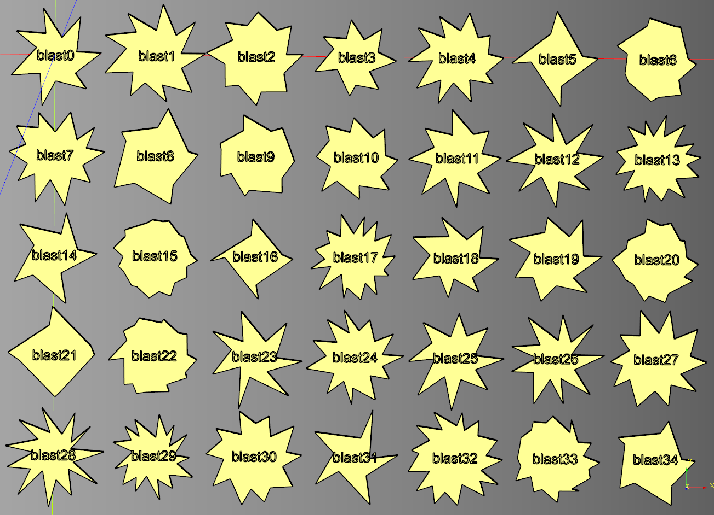
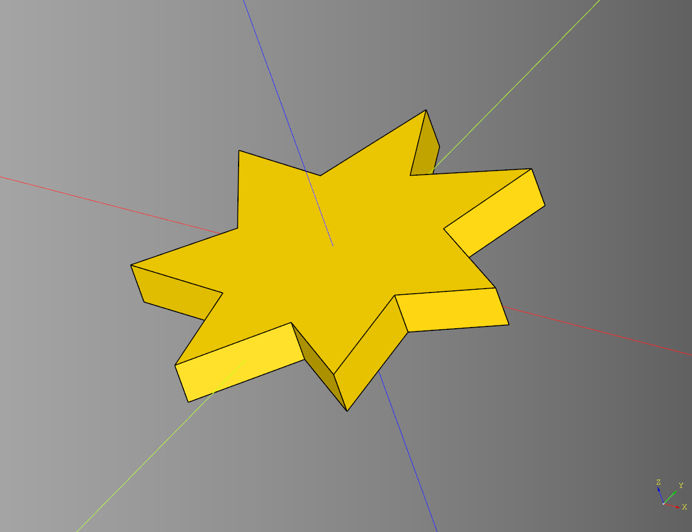
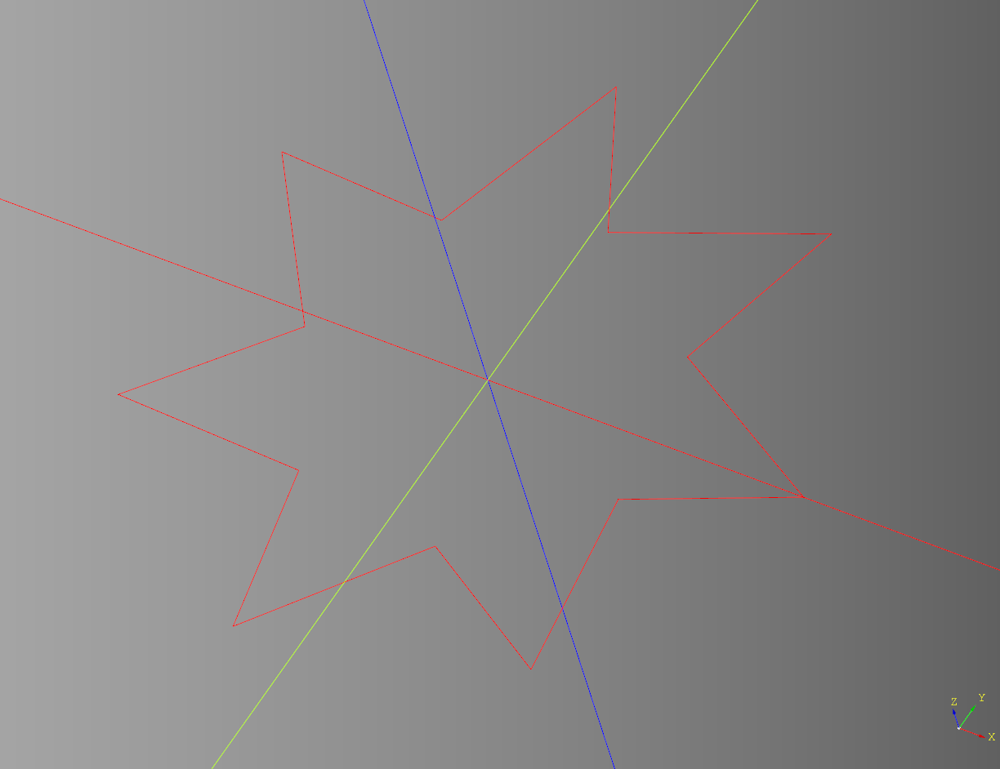

# Damage

Quickly generate randomized damage templates driven by seed.
<br />see: [example](../example/damage/damage_blast_set_large.py.py)

<br />

The idea is that you generate a plate of randomized damage templates. And choose the ones you like best.

## Blast

Generates damage template derived from a modified [pinwheel](https://github.com/medicationforall/cadqueryhelper/blob/main/documentation/shapes.md#pinwheel).

### Parameters
* seed: str
* height: float
* count: tuple[int,int]
* x_jiggle: tuple[int,int] | int - can be tuple or int
* y_jiggle: tuple[int,int] | int - can be tuple or int
* ring_params: list[dict]

``` python
result = damage.blast(
    seed="test",
    height=10,
    count = (5,10),
    x_jiggle = (-2,2), 
    y_jiggle = 0,
    ring_params = [
        {"radius":(35,50), "start_angle":0}, 
        {"radius":25,"start_angle":30}
    ]
)
```

<br />

if given a height of 0 will return the wire instead.

<br />

* [source](../src/cqterrain/damage/blast.py)
* [example](../example/damage/damage_blast.py)
* [stl 1](../stl/damage_blast_1.stl)
* [stl 2](../stl/damage_blast_2.stl)
* [stl 3](../stl/damage_blast_3.stl)

## Random Nudge Points

Utility function to randomize the x and y values of a list of points.

### Parameters
* seed: str
* points
* x_jiggle: tuple[int,int] | int - can be tuple or int
* y_jiggle: tuple[int,int] | int - can be tuple or int

### Returns
* list[tuple[int,int]]

* [source](../src/cqterrain/damage/blast.py)