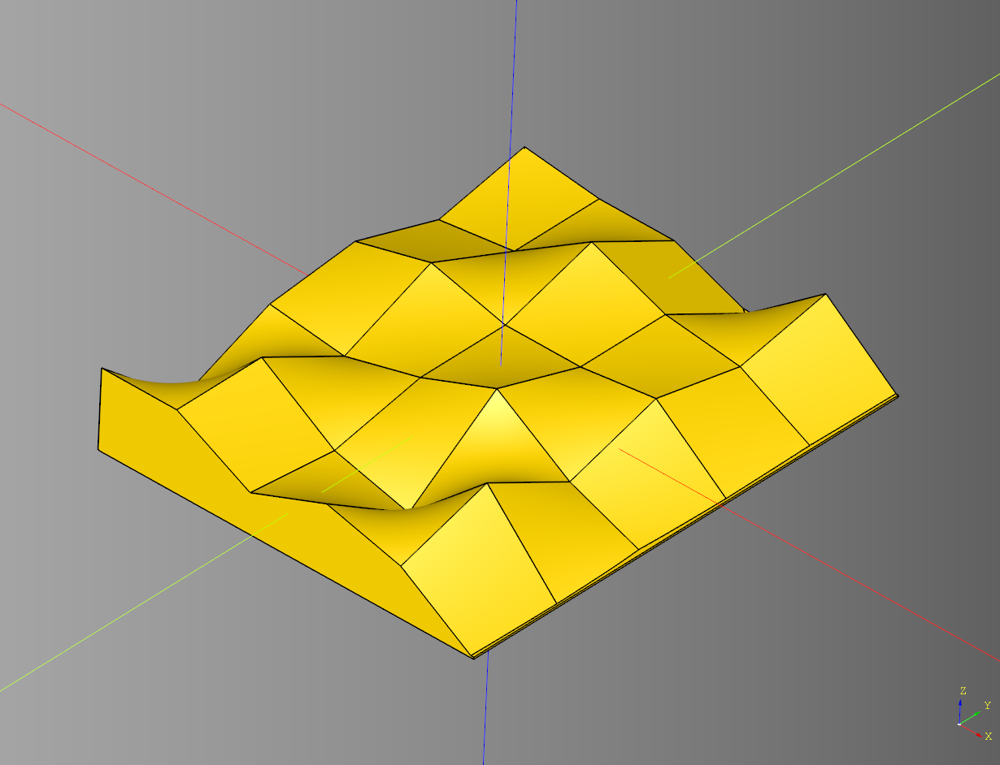
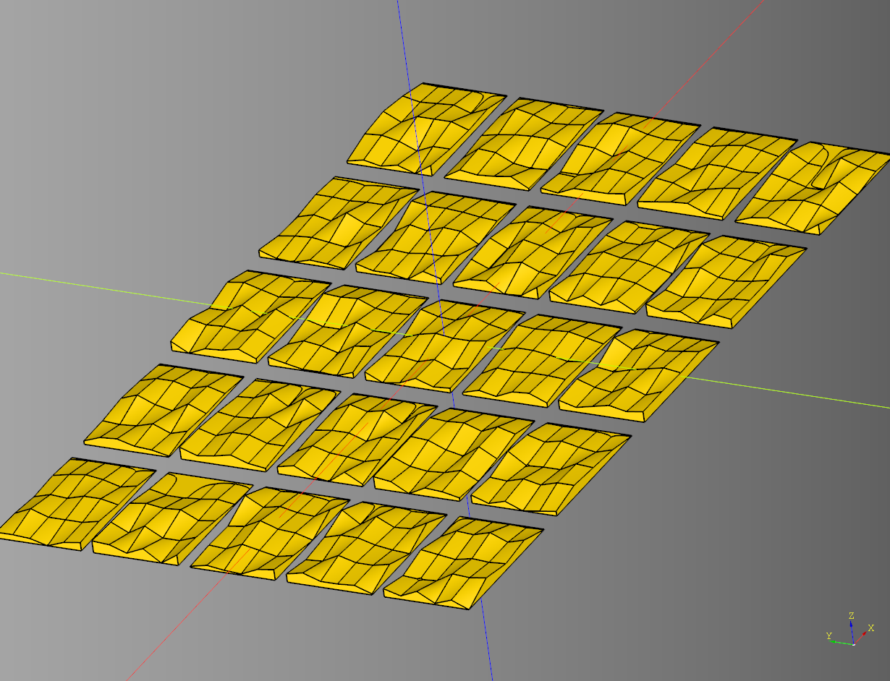

# Damage

Quickly generate randomized damage templates driven by seed.
<br />see: [example](../example/damage/damage_blast_set_large.py.py)

<br />

The idea is that you generate a plate of randomized damage templates. And choose the ones you like best.

## Blast

Generates damage template derived from a modified [pinwheel](https://github.com/medicationforall/cadqueryhelper/blob/main/documentation/shapes.md#pinwheel).

### parameters
* seed: str
* height: float
* count: tuple[int,int]
* x_jiggle: tuple[int,int] | int - can be tuple or int
* y_jiggle: tuple[int,int] | int - can be tuple or int
* ring_params: list[dict]

``` python
result = damage.blast(
    seed="test",
    height=10,
    count = (5,10),
    x_jiggle = (-2,2), 
    y_jiggle = 0,
    ring_params = [
        {"radius":(35,50), "start_angle":0}, 
        {"radius":25,"start_angle":30}
    ]
)
```

<br />

if given a height of 0 will return the wire instead.

<br />

* [source](../src/cqterrain/damage/blast.py)
* [example](../example/damage/damage_blast.py)
* [stl 1](../stl/damage_blast_1.stl)
* [stl 2](../stl/damage_blast_2.stl)
* [stl 3](../stl/damage_blast_3.stl)

## Random Nudge Points

Utility function to randomize the x and y values of a list of points.

### parameters
* seed: str
* points
* x_jiggle: tuple[int,int] | int - can be tuple or int
* y_jiggle: tuple[int,int] | int - can be tuple or int

### Returns
* list[tuple[int,int]]

* [source](../src/cqterrain/damage/blast.py)

## Uneven Plane
Creates an uneven plane.

### parameters
* length: float
* width: float
* segments: int
* height: float
* min_height: float
* step: float
* peak_count: tuple[int,int] | int
* seed: str | None
* render_plate: bool
* plate_height: float

``` python
import cadquery as cq
from cqterrain.damage import uneven_plane

u_plane_safe = uneven_plane(
    length=20, 
    width=25,
    height=4,
    #peak_count=(3,5),
    peak_count=5,

    segments=5,
    seed='test',
    render_plate=True,
    plate_height = 0.1
)

show_object(u_plane_safe)
```



* [source](../src/cqterrain/damage/uneven_plane.py)
* [example](../example/damage/uneven_plane_safe.py)
* [stl](../stl/damage_uneven_plane_safe.stl)

### Uneven Plane Grid Example


``` python
import cadquery as cq
from cqterrain.damage import uneven_plane

#grid of surfaces
seed='test_2'

def add_surface(loc:cq.Location) -> cq.Shape:
    u_plane_risky = uneven_plane(
        length = 60, 
        width = 35,
        height = 5,
        peak_count = (4,5),
        step = .5,
        #peak_count=5,
        segments = 5,
        seed = None,
        render_plate = True,
        plate_height = 0.1
    )
    return u_plane_risky.val().located(loc) #type:ignore

uneven_surface_example = (
    cq.Workplane("XY")
    .rarray(
        xSpacing = 70, 
        ySpacing = 40,
        xCount = 5, 
        yCount= 5, 
        center = True)
    .eachpoint(callback = add_surface)
)

show_object(uneven_surface_example)
```



* [example](../example/damage/uneven_plane_grid.py)
* [stl](../stl/damage_uneven_plane_grid.stl)