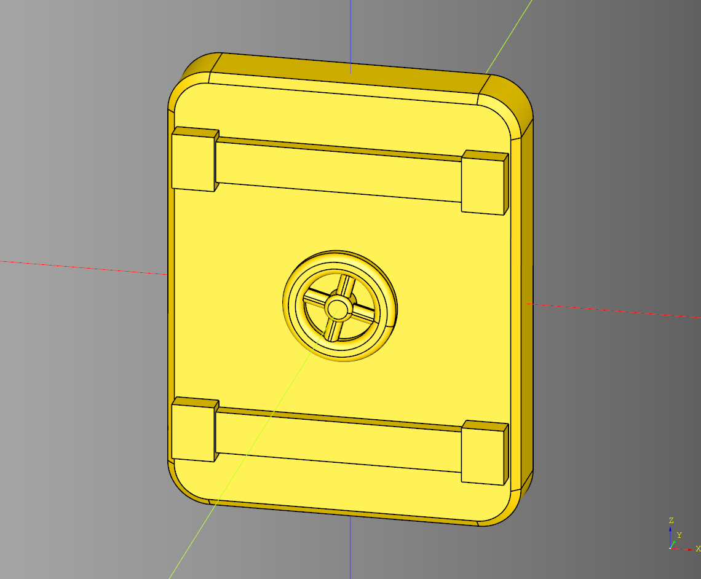
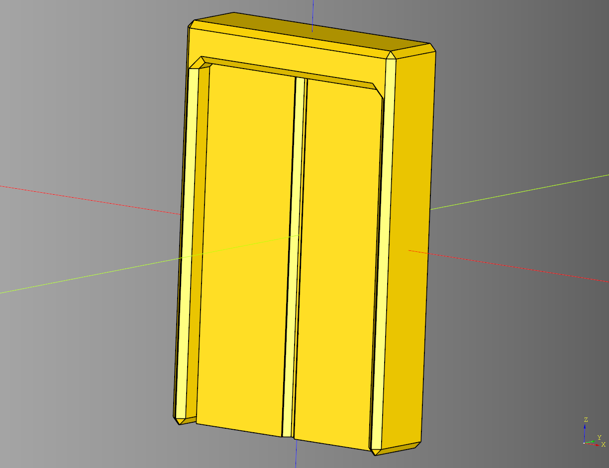
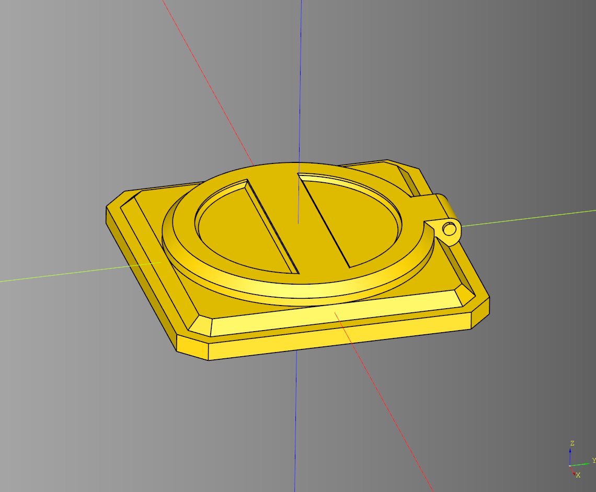
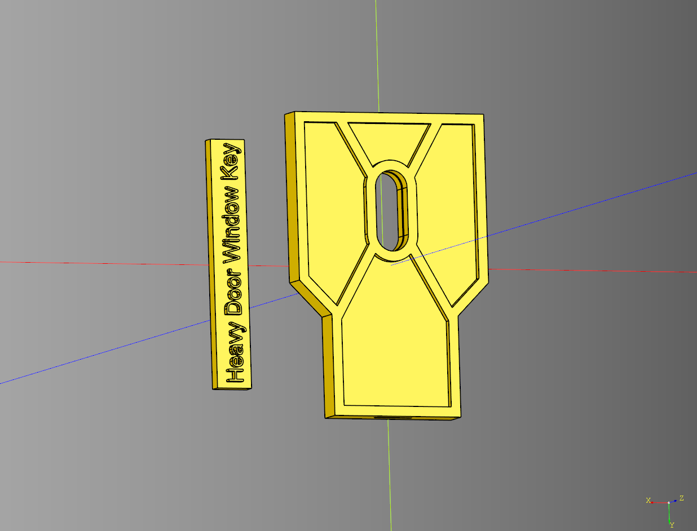
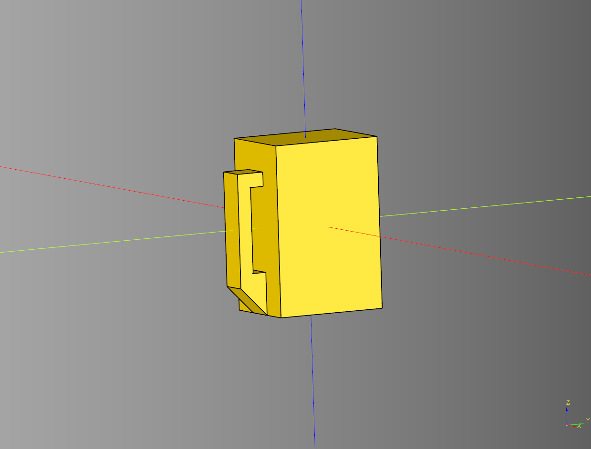
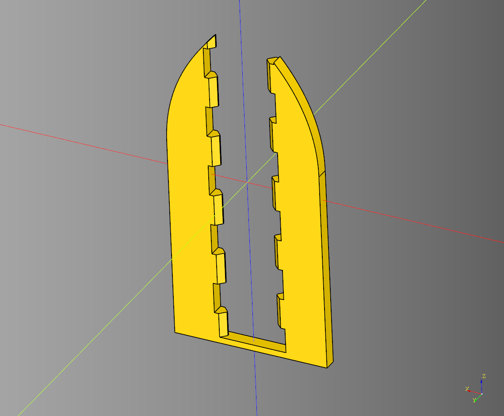
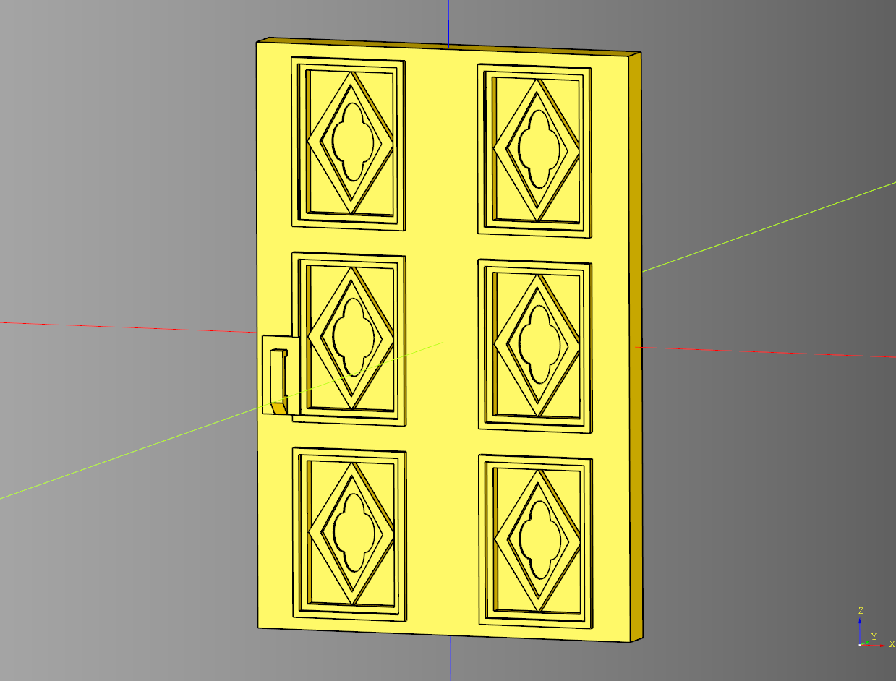

# Door

- [Door](#door)
  - [Blast Door](#blast-door)
    - [parameters](#parameters)
  - [Door](#door-1)
    - [parameters](#parameters-1)
  - [Hatch](#hatch)
    - [parameters](#parameters-2)
  - [Heavy Door](#heavy-door)
    - [parameters](#parameters-3)
  - [Pull Handle](#pull-handle)
    - [parameters](#parameters-4)
  - [Split Door](#split-door)
    - [parameters](#parameters-5)
  - [Tiled Door](#tiled-door)
    - [parameters](#parameters-6)
    - [method callbacks](#method-callbacks)


---

## Blast Door
### parameters
length: float
* width: float
* height: float
* fillet: float
* chamfer: float
* bar_height: float
* bar_width: float
* bar_margin_z: float
* bar_margin_x: float
* bar_cap_length: float
* handle_height: float
* handle_radius: float
* handle_rotation: float

``` python
import cadquery as cq
from cqterrain.door import BlastDoor

bp = BlastDoor()

bp.length = 25
bp.width = 5
bp.height = 32
bp.fillet = 3
bp.chamfer = .6

bp.bar_height = 3
bp.bar_width = 1
bp.bar_margin_z = 5
bp.bar_margin_x = 1.5
bp.bar_cap_length = 3

bp.handle_height = 1.5
bp.handle_radius = 4
bp.handle_rotation = -15

bp.make()
blast_door = bp.build()
show_object(blast_door)
```



* [source](../src/cqterrain/door/BlastDoor.py)
* [example](../example/door/blastDoor.py)
* [stl](../stl/door_blastDoor.stl)

---

## Door
### parameters
* length: float 
* width: float 
* frame_length: float 
* frame_height: float 
* inner_width: float 
* height: float 
* x_offset: float

``` python
import cadquery as cq
from  cqterrain.door  import Door

bp_door = Door()
bp_door.length = 25
bp_door.width = 8
bp_door.frame_length = 3 
bp_door.frame_height = 4
bp_door.inner_width = 3
bp_door.height  = 40
bp_door.x_offset = 0

bp_door.make()
result = bp_door.build()

show_object(result)
```



* [source](../src/cqterrain/door/Door.py)
* [example](../example/door/door.py)
* [stl](../stl/door.stl)


---

## Hatch
### parameters
* length: float
* width: float
* height: float
* base_corner_chamfer: float
* base_top_chamfer: float
* base_extrude: float
* hatch_radius: float
* hatch_height: float
* hatch_chamfer: float
* cross_bar_width: float
* inner_ring_width: float
* cut_out_chamfer: float

``` python
import cadquery as cq
from cqterrain.door import Hatch

bp = Hatch()

bp.length = 25
bp.width = 25
bp.height = 4
bp.base_corner_chamfer = 2
bp.base_top_chamfer = 2
bp.base_extrude = 1.5

bp.hatch_radius = 10.5
bp.hatch_height = 1.5
bp.hatch_chamfer = 0.8
bp.cross_bar_width = 4
bp.inner_ring_width = 2.5
bp.cut_out_chamfer = 0.3

bp.make()
hatch_ex = bp.build()
show_object(hatch_ex)
```



* [source](../src/cqterrain/door/Hatch.py)
* [example](../example/door/hatch.py)
* [stl](../stl/door_hatch.stl)

---
## Heavy Door

### parameters
* length: float 
* width: float
* height: float
* trim_size: float
* inset_depth: float
* render_side_cuts: bool
* side_cut_height: float 
* side_cut_length: float
* side_cut_distance: float
* side_cut_operation: Literal['chamfer','fillet']|None
* render_cross_bars: bool
* cross_bars_angle: float
* cross_bar_offset: float
* cross_bar_height: float|None
* render_window: float
* window_height: float
* window_width: float
* window_trim: float|None
* window_offset: float
* render_window_pane_cut: bool
* window_pane_margin: float
* window_pane_width: float
* window_key_width: float
* window_key_margin: float
* wndow_key_text: str
* render_cross_section: bool

``` python
import cadquery as cq
from cqterrain.door import HeavyDoor

bp_door = HeavyDoor()
bp_door.length = 30 
bp_door.width =  4
bp_door.height = 45
bp_door.trim_size = 1.5
bp_door.inset_depth = 1

bp_door.render_side_cuts = True

bp_door.side_cut_height = 20 
bp_door.side_cut_length = 5
bp_door.side_cut_distance = 5
bp_door.side_cut_operation = 'chamfer'

bp_door.render_cross_bars = True
bp_door.cross_bars_angle = 30
bp_door.cross_bar_offset = 8
bp_door.cross_bar_height = None

bp_door.render_window = True
bp_door.make()

ex_door = bp_door.build_plate()

show_object(ex_door)
```



* [source](../src/cqterrain/door/HeavyDoor.py)
* [example](../example/door/heavy_door.py)
* [stl](../stl/door_heavy_door.stl)

---

## Pull Handle

### parameters
* length: float 
* width: float 
* height: float
* handle_length: float
* handle_width_padding: float
* handle_z_margin: float
* handle_base_chamfer: float
* mirrored: bool

``` python
import cadquery as cq
from cqterrain.door import pull_handle

handle_ex = pull_handle(
    length = 3, 
    width = 4, 
    height = 6,
    handle_length = 1,
    handle_width_padding = 1,
    handle_z_margin = 2,
    handle_base_chamfer = 1,
    mirrored = False
)
```



* [source](../src/cqterrain/door/pull_handle.py)
* [example](../example/door/pull_handle.py)
* [stl](../stl/door_pull_handle.stl)

---

## Split Door
### parameters
* length: float
* width: float
* height: float
* base_height: float
* open: float
* bar_height: float
* chamfer_minus: float

``` python
import cadquery as cq
from cqterrain.door import SplitDoor

bp = SplitDoor()
bp.width = 24
bp.width = 2
bp.chamfer_minus = 0.1
bp.height = 56
bp.base_height = 32.5
bp.open=5
bp.bar_height = 1

bp.make()

door_ex = bp.build()

show_object(door_ex)
```



* [source](../src/cqterrain/door/splitDoor.py)
* [example](../example/door/splitDoor.py)
* [stl](../stl/door_splitDoor.stl)

---

## Tiled Door

### parameters
* length: float
* width: float
* height: float
* render_tiles: bool
* tiles_x_count: int
* tiles_y_count: int
* tile_x_padding: float
* tile_y_padding: float
* tile_width_padding: float
* render_handle: bool
* handle_length: float
* handle_width_padding: float
* handle_height: float
* handle_x_margin: float
* handle_mirrored:bool
* handle_handle_length:float
* handle_base_chamfer:float

### method callbacks
* tile_bp: Callable[[float, float, float], cq.Workplane]
* handle_bp: Callable[[float, float, float], cq.Workplane]

``` python
import cadquery as cq
from cqterrain.door import TiledDoor

door_bp = TiledDoor()
door_bp.length = 30
door_bp.width = 3
door_bp.height = 45

door_bp.render_tiles = True
door_bp.tiles_x_count = 2
door_bp.tiles_y_count = 3
door_bp.tile_x_padding = 3
door_bp.tile_y_padding = 1
door_bp.tile_width_padding = .5

door_bp.render_handle = True
door_bp.handle_length = 3
door_bp.handle_height = 6
door_bp.handle_x_margin = .5
door_bp.handle_mirrored  = False
door_bp.handle_handle_length = 1
door_bp.handle_base_chamfer = 1

door_bp.make()

door_ex = door_bp.build()

show_object(door_ex)
```



* [source](../src/cqterrain/door/TiledDoor.py)
* [example](../example/door/tiled_door.py)
* [stl](../stl/door_tiled_door.stl)