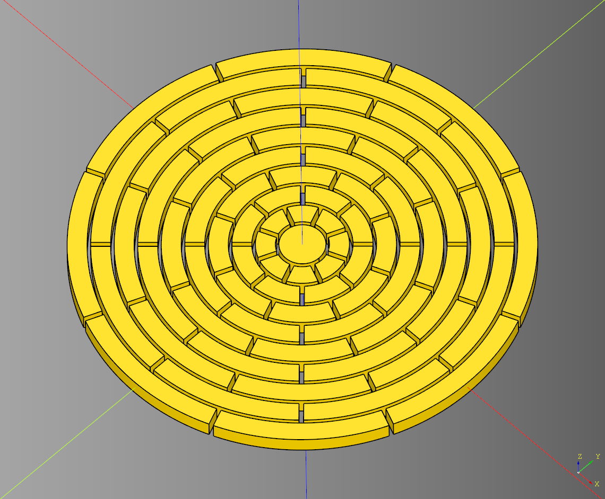
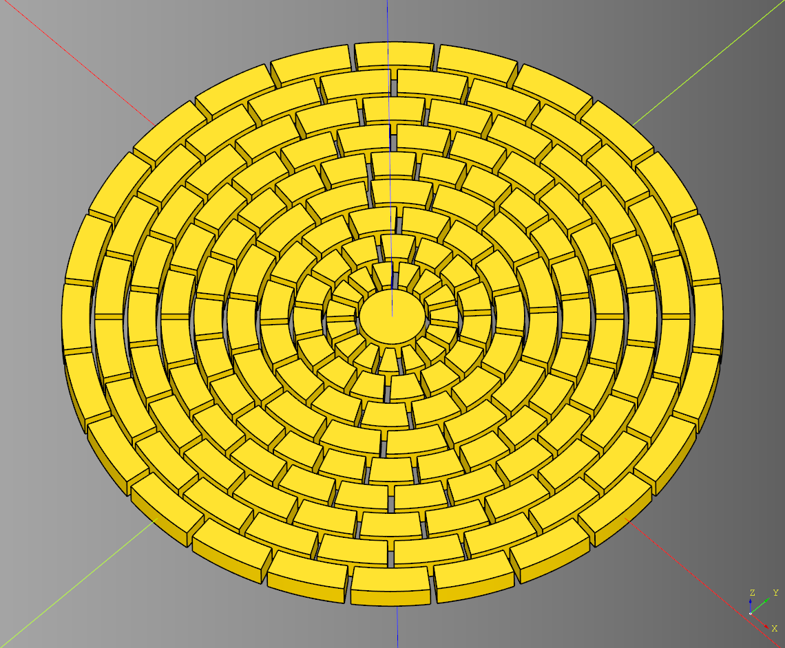

# Floor

## Round Brick Floor

Round Brick / Stone Pattern

### Parameters
* diameter:float
* height:float
* rows:int
* block_count:int
* ring_spacing:float
* spacer_width:float
* ring_skip_index:int|None
  
``` python
import cadquery as cq
from cqterrain.floor import RoundBrickFloor

bp_floor = RoundBrickFloor()
bp_floor.diameter = 100
bp_floor.height = 4
bp_floor.block_count = 8
bp_floor.rows = 10
bp_floor.ring_spacing = 1.5
bp_floor.spacer_width = 1

bp_floor.ring_skip_index = None
bp_floor.make()

ex_floor = bp_floor.build()
show_object(ex_floor)
```

<br />

* [source](../src/cqterrain/foor/RoundBrickFloor.py)
* [example](../example/foor/round_brick_floor.py)
* [stl](../stl/floor_roundBrickFloor.stl)

### Advanced Example
This example joins two RoundBrickFloor instances together to make a more dense brick pattern.

``` python
import cadquery as cq
from cqterrain.floor import RoundBrickFloor

bp_floor = RoundBrickFloor()
bp_floor.diameter = 50
bp_floor.block_count = 15
bp_floor.rows = 5
bp_floor.ring_skip_index = None
bp_floor.make()

ex_floor = bp_floor.build()

bp_floor_two = RoundBrickFloor()
bp_floor_two.ring_skip_index = 5
bp_floor_two.block_count = 24
bp_floor_two.make()

ex_floor_two = bp_floor_two.build()

combined = ex_floor.union(ex_floor_two)

show_object(combined)
```

<br />

* [example](../example/foor/round_brick_floor_alt.py)
* [stl](../stl/floor_roundBrickFloor_alt.stl)


---


