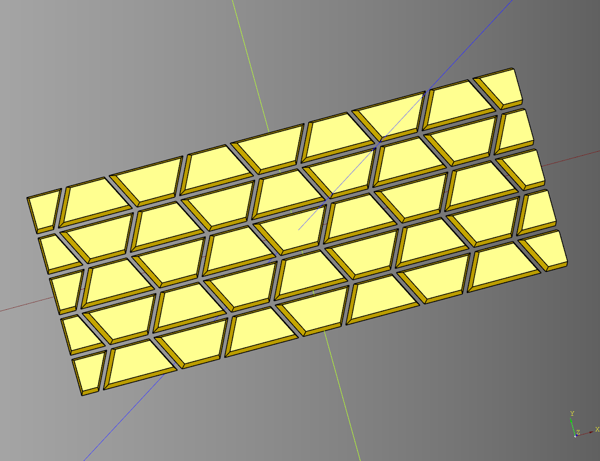
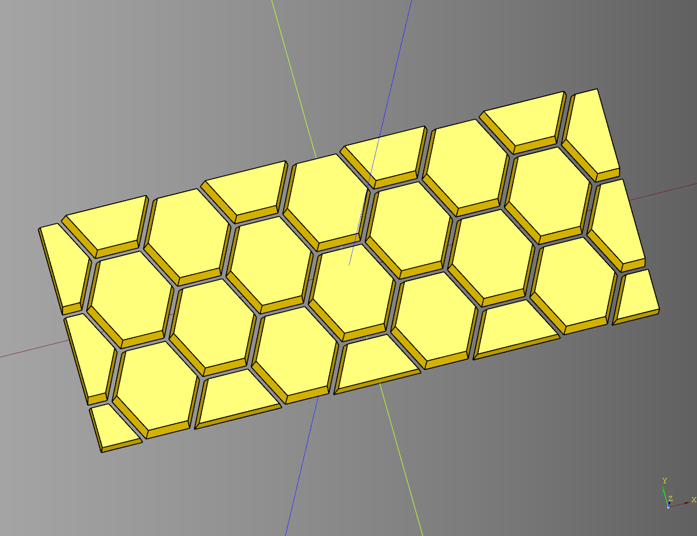
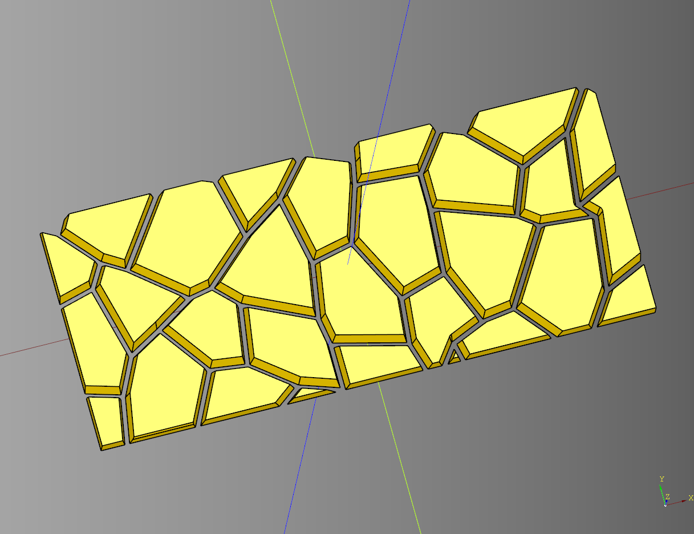
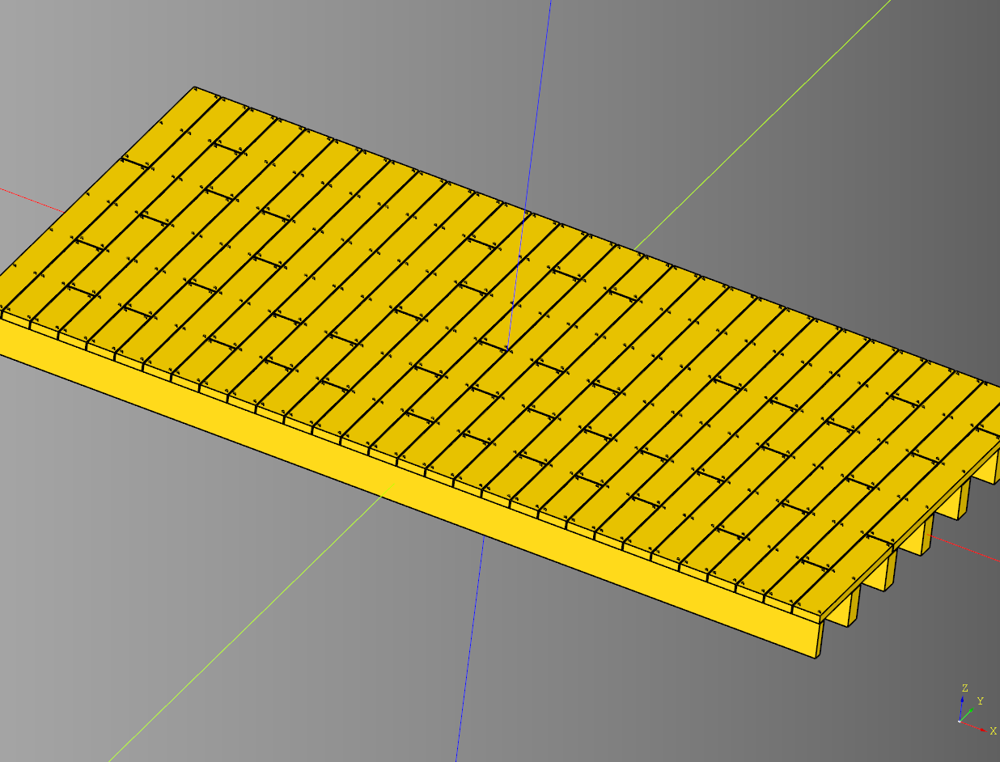
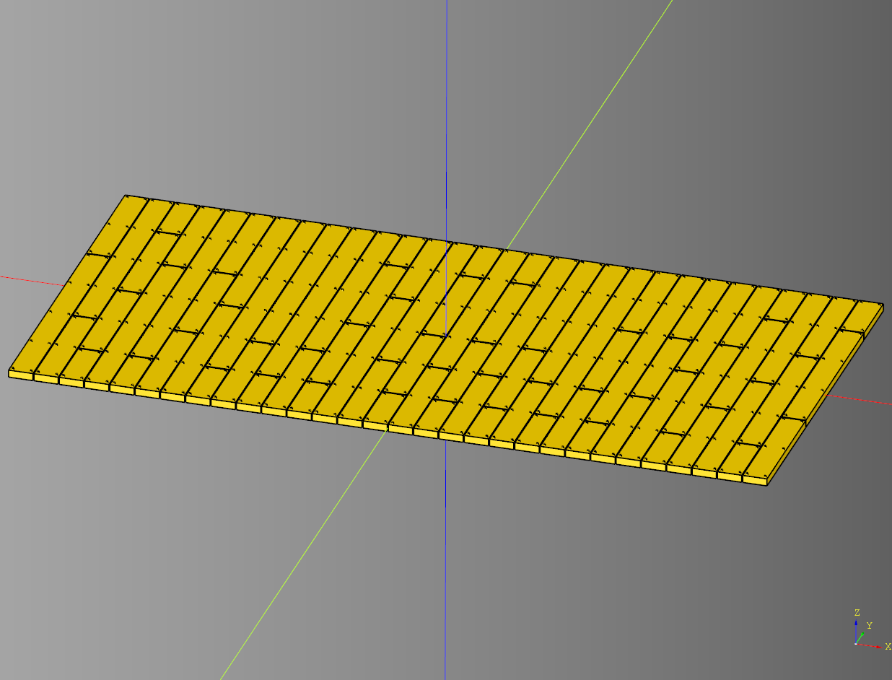

# Floor

- [Floor](#floor)
  - [Mod Pattern](#mod-pattern)
    - [parameters](#parameters)
    - [Mod Pattern Interlock](#mod-pattern-interlock)
    - [Mod Pattern Interlock Random](#mod-pattern-interlock-random)
  - [Round Brick Floor](#round-brick-floor)
    - [parameters](#parameters-1)
    - [Advanced Example](#advanced-example)
  - [Wood Floor Struct](#wood-floor-struct)
    - [parameters](#parameters-2)
    - [Wood Floor example](#wood-floor-example)

---

## Mod Pattern

### parameters
* length: float
* width: float
* height: tuple[float,float,float]|float
* render_points: bool
* debug: bool
* x_spacing: list[float]
* y_spacing: list[float]
* row_x_mod: list[int]
* row_x_offset: list[float]
* randomize_points: bool
* shift_x: tuple[float,float,float]
* shift_y: tuple[float,float,float]
* seed: str
* x_stretch: int
* y_stretch: int
* taper: tuple[float,float,float]|float|None
* offset: tuple[float,float,float]|float|None
* grid_offset_x: float
* grid_offset_y: float
* column_pad: int
* row_pad: int
* enforce_even_columns: bool = True - Makes sure the final column count is even this is important for interlock operations
* enforce_even_rows: bool = True - Makes sure the final row count is even this is important for interlock operations
* interlock_cells: bool
* start: int
* top_end_index: int
* bottom_start_index: int
* top_cap_index: int

``` python
import cadquery as cq
from cqterrain.floor import ModPattern

bp_hex = ModPattern()
bp_hex.x_spacing = [5,10]
bp_hex.y_spacing = [5]
bp_hex.row_x_mod = [0,1]
bp_hex.row_x_offset = [0,-2.5]

bp_hex.x_stretch = 1
bp_hex.y_stretch = 1

bp_hex.taper = 10
bp_hex.offset = -.25
bp_hex.render_points = False

bp_hex.debug = False
bp_hex.column_pad = 1
bp_hex.row_pad = 0
bp_hex.grid_offset_x = -1.25 - 4
bp_hex.grid_offset_y = 0

bp_hex.make()

ex_hex_outline = bp_hex.build_outline()
ex_hex = bp_hex.build()

show_object(ex_hex)
```




* [source](../src/cqterrain/floor/ModPattern.py)
* [example](../example/floor/mod_pattern.py)
* [stl](../stl/floor_mod_pattern.stl)

### Mod Pattern Interlock

``` python
import cadquery as cq
from cqterrain.floor import ModPattern

bp_hex = ModPattern()
bp_hex.x_spacing = [5,10]
bp_hex.y_spacing = [5]
bp_hex.row_x_mod = [0,1]
bp_hex.row_x_offset = [0,-2.5]

bp_hex.x_stretch = 1
bp_hex.y_stretch = 1

bp_hex.taper = 10
bp_hex.offset = -.25
bp_hex.render_points = False

bp_hex.debug = False
bp_hex.column_pad = 1
bp_hex.row_pad = 2
bp_hex.grid_offset_x = -1.25 - 4
bp_hex.grid_offset_y = 5

bp_hex.interlock_cells = True
bp_hex.start = 1
bp_hex.top_end_index = 3
bp_hex.bottom_start_index = 2
bp_hex.top_cap_index = 3

bp_hex.make()

ex_hex_outline = bp_hex.build_outline()
ex_hex = bp_hex.build()

show_object(ex_hex)
```



* [example](../example/floor/mod_pattern_interlock.py)
* [stl](../stl/floor_mod_pattern_interlock.stl)

### Mod Pattern Interlock Random

``` pattern
import cadquery as cq
from cqterrain.floor import ModPattern

bp_hex = ModPattern()
bp_hex.x_spacing = [5,10]
bp_hex.y_spacing = [5]
bp_hex.row_x_mod = [0,1]
bp_hex.row_x_offset = [0,-2.5]

bp_hex.randomize_points = True
bp_hex.shift_x = (-2,2,.5)
bp_hex.shift_y = (-2,2,.5)
bp_hex.seed = 'test'

bp_hex.x_stretch = 1
bp_hex.y_stretch = 1

bp_hex.taper = 10
bp_hex.offset = -.25
bp_hex.render_points = False

bp_hex.debug = False
bp_hex.column_pad = 1
bp_hex.row_pad = 3
bp_hex.grid_offset_x = -1.25 - 4
bp_hex.grid_offset_y = 5

bp_hex.interlock_cells = True
bp_hex.start = 1
bp_hex.top_end_index = 3
bp_hex.bottom_start_index = 2
bp_hex.top_cap_index = 3

bp_hex.make()

ex_hex_outline = bp_hex.build_outline()
ex_hex = bp_hex.build()

show_object(ex_hex)
```



* [example](../example/floor/mod_pattern_interlock_random.py)
* [stl](../stl/floor_mod_pattern_interlock_random.stl)


---

## Round Brick Floor

Round Brick / Stone Pattern

### parameters
* diameter:float
* height:float
* rows:int
* block_count:int
* ring_spacing:float
* spacer_width:float
* ring_skip_index:int|None
  
``` python
import cadquery as cq
from cqterrain.floor import RoundBrickFloor

bp_floor = RoundBrickFloor()
bp_floor.diameter = 100
bp_floor.height = 4
bp_floor.block_count = 8
bp_floor.rows = 10
bp_floor.ring_spacing = 1.5
bp_floor.spacer_width = 1

bp_floor.ring_skip_index = None
bp_floor.make()

ex_floor = bp_floor.build()
show_object(ex_floor)
```

<br />

* [source](../src/cqterrain/floor/RoundBrickFloor.py)
* [example](../example/floor/round_brick_floor.py)
* [stl](../stl/floor_roundBrickFloor.stl)

### Advanced Example
This example joins two RoundBrickFloor instances together to make a more dense brick pattern.

``` python
import cadquery as cq
from cqterrain.floor import RoundBrickFloor

bp_floor = RoundBrickFloor()
bp_floor.diameter = 50
bp_floor.block_count = 15
bp_floor.rows = 5
bp_floor.ring_skip_index = None
bp_floor.make()

ex_floor = bp_floor.build()

bp_floor_two = RoundBrickFloor()
bp_floor_two.ring_skip_index = 5
bp_floor_two.block_count = 24
bp_floor_two.make()

ex_floor_two = bp_floor_two.build()

combined = ex_floor.union(ex_floor_two)

show_object(combined)
```

<br />

* [example](../example/floor/round_brick_floor_alt.py)
* [stl](../stl/floor_roundBrickFloor_alt.stl)


---

## Wood Floor Struct

### parameters
* length: float
* width: float
* height: float
* joist_width: float
* joist_space: float
* joist_count: float
* render_joists: bool
* board_width: float
* board_width_spacer: float
* board_height: float
* nail_diameter: float
* nail_overlap_height: float
* nail_x_margin: float
* nail_y_margin: float
* seed: str
* board_lengths: list[int]
* board_break_width: float
* grid: list[str]

``` python
import cadquery as cq
from cqterrain.floor import WoodFloor

bp_floor = WoodFloor()
bp_floor.length= 150
bp_floor.width= 75
bp_floor.height = 8

#joist
bp_floor.joist_width = 3
bp_floor.joist_space = 12.5
bp_floor.joist_count= 7
bp_floor.render_joists= True

# Board
bp_floor.board_width= 5
bp_floor.board_width_spacer = .1
bp_floor.board_height = 1.5

#nail
bp_floor.nail_diameter = .4
bp_floor.nail_overlap_height = .2
bp_floor.nail_x_margin = .5
bp_floor.nail_y_margin = .5

# grid
bp_floor.seed= "redd2"
bp_floor.board_lengths = [1,4]
bp_floor.board_break_width= .2
bp_floor.grid = []

bp_floor.make()

ex_floor = bp_floor.build()

show_object(ex_floor)
```

<br />

* [source](../src/cqterrain/floor/WoodFloor.py)
* [example](../example/floor/wood_floor_struct.py)
* [stl](../stl/floor_woodfloor_struct.stl)

### Wood Floor example

``` python
import cadquery as cq
from cqterrain.floor import WoodFloor

bp_floor = WoodFloor()
bp_floor.board_width = 5
bp_floor.render_joists = False
bp_floor.make()

ex_floor = bp_floor.build()

show_object(ex_floor)
```

<br />

* [example](../example/floor/wood_floor.py)
* [stl](../stl/floor_woodfloor.stl)

---


