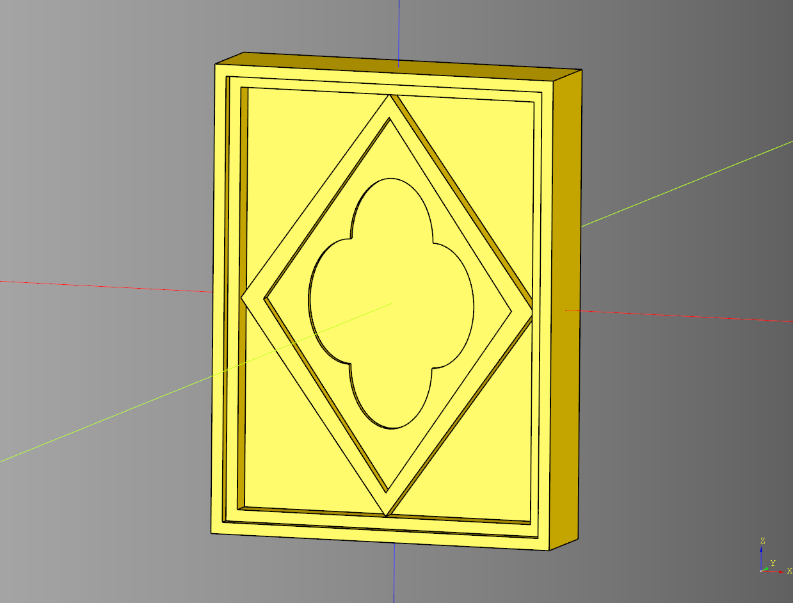
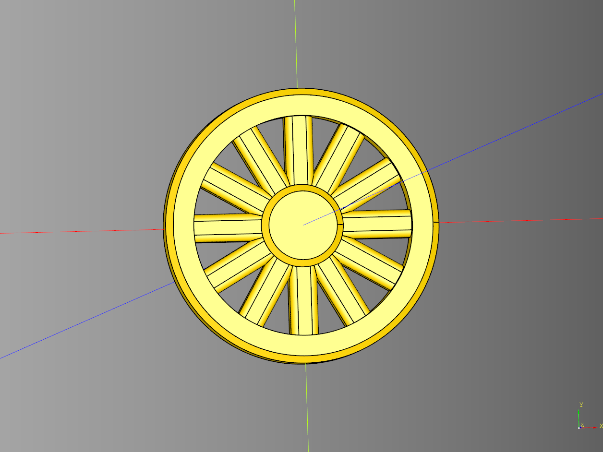
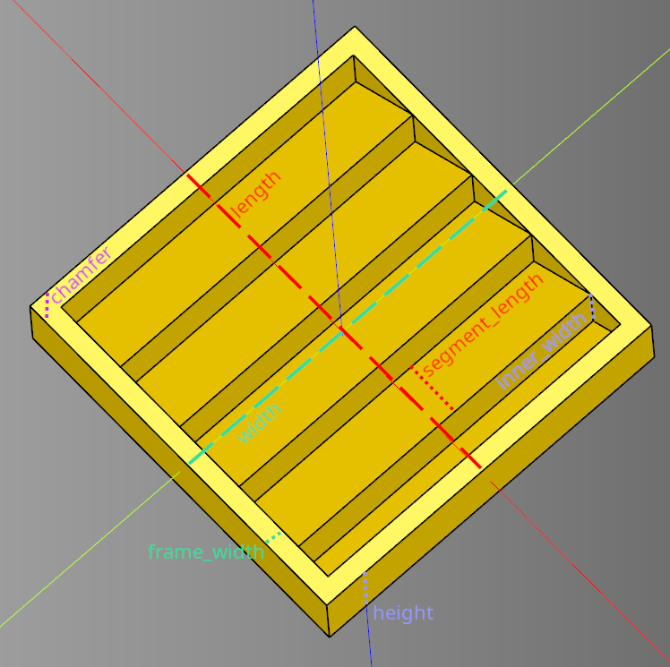

# Greebles

- [Greebles](#greebles)
  - [Gothic One](#gothic-one)
    - [Parameters](#parameters)
  - [Spoked Wheel](#spoked-wheel)
    - [Parameters](#parameters-1)
  - [Vent](#vent)
    - [Parameters](#parameters-2)


---

## Gothic One

Design is mirrored on both sides.

### Parameters
* length: float
* width: float
* height: float
* frame_size: float
* pane_width: float
* inside_frame_width: float
* inside_frame_size: float
* diamond_frame_size: float
* diamond_frame_width: float
* diamond_inside: float

``` python
import cadquery as cq
from cqterrain.greeble import gothic_one

result = gothic_one(
    length = 15,
    width = 4,
    height = 20,
    frame_size = .5,
    pane_width = 1,
    inside_frame_width = -.5,
    inside_frame_size = .5,
    diamond_frame_size = 1,
    diamond_frame_width = -.25,
    diamond_inside = -.5
)
```

<br />

* [source](../src/cqterrain/greeble/gothic_one.py)
* [example](../example/greeble/gothic_one.py)
* [stl](../stl/greeble_gothic_one.stl)

## Spoked Wheel
### Parameters
* radius: float
* height: float
* frame: float
* inner_radius: float
* spoke_width: float
* spoke_height: float
* spoke_fillet: float
* spoke_count: int
* frame_chamfer: float
* inner_chamfer: float

``` python
result = greeble.spoked_wheel(
    radius = 10,
    height = 2,
    frame = 2,
    inner_radius = 3,
    spoke_width = 2,
    spoke_height = 1.5,
    spoke_fillet = .5,
    spoke_count = 12,
    frame_chamfer = .5,
    inner_chamfer = .5
)
```

<br />

* [source](../src/cqterrain/greeble/spokedWheel.py)
* [example](../example/greeble/spokedWheel.py)
* [stl](../stl/greeble_spoked_wheel.stl)

## Vent

### Parameters
* length: float
* width: float
* height: float
* segment_length: float
* inner_width: float
* frame_width: float
* chamfer: float|None
* wave_pattern = wave.sawtooth

``` python
vent = greeble.vent(
    length = 25,
    width = 25,
    height = 4,
    segment_length = 3,
    inner_width = 2,
    frame_width = 2,
    chamfer = None
)
```

<br />

* [source](../src/cqterrain/greeble/vent.py)
* [example](../example/greeble_vent.py)
* [stl](../stl/greeble_vent.stl)
