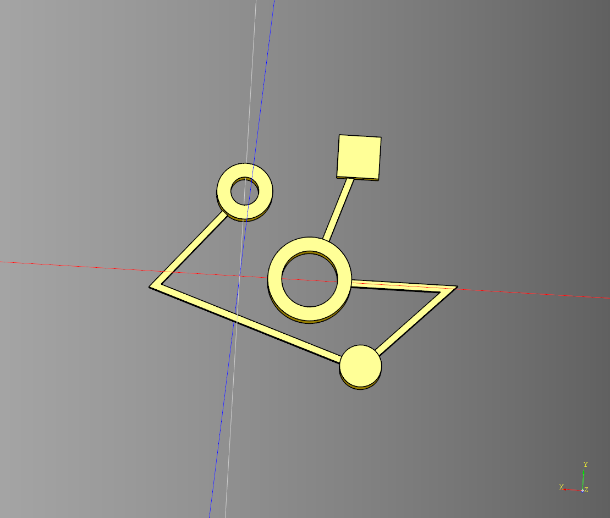
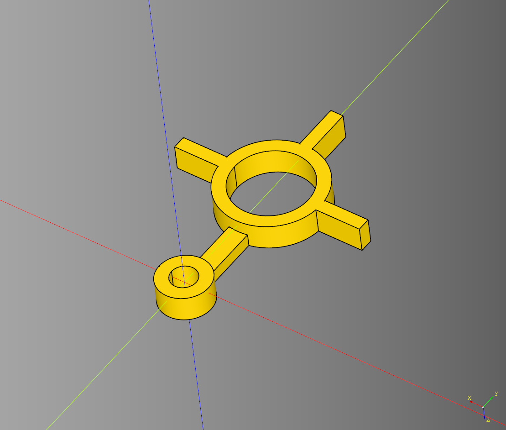

# Greebles

- [Greebles](#greebles)
  - [Circuit Glyph](#circuit-glyph)
    - [Parameters](#parameters)
    - [Example two](#example-two)
  - [Gothic One](#gothic-one)
    - [Parameters](#parameters-1)
  - [Spoked Wheel](#spoked-wheel)
    - [Parameters](#parameters-2)
  - [Vent](#vent)
    - [Parameters](#parameters-3)


---

## Circuit Glyph
Takes a collection of points, draws a line between each point. 
Renders a cq.Workplane at each point specified.

### Parameters
* length: float
* width: float
* height: float
* point_diameter: float
* line_width: float
* line_height: float
* kind: Literal['arc', 'intersection', 'tangent']
* outline_margin: float
* pts: list[Tuple[int,int]] 
* render_outline: bool

``` python
import cadquery as cq
from cqterrain.greeble import CircuitGlyph 
from cadqueryhelper.shape import ring

bp_glyph = CircuitGlyph()

bp_glyph.add_point(0,6,ring(4,2,3))
bp_glyph.add_point(6,-1)
bp_glyph.add_point(-9,-6,cq.Workplane("XY").cylinder(3,1.5))
bp_glyph.add_point(-15,-0)
bp_glyph.add_point(-5,-0,ring(6,4,3))
bp_glyph.add_point(-8,9,cq.Workplane("XY").box(3,3,2).translate((0,0,0.5)))
bp_glyph.make()

ex_glyph = bp_glyph.build()

show_object(ex_glyph)
```

<br />

* [source](../src/cqterrain/greeble/CircuitGlyph.py)
* [example](../example/greeble/glyph_greeble_one.py)
* [stl](../stl/greeble_circuit_glyph_one.stl)


### Example two 
``` python
import cadquery as cq
from cqterrain.greeble import CircuitGlyph 
from cadqueryhelper.shape import ring

#----------------
spoke = cq.Workplane("XY").box(4,1,2).translate((5.5,0,0))
spoke_two =spoke.rotate((0,0,1),(0,0,0),-90) 
spoke_three =spoke.rotate((0,0,1),(0,0,0),-180)

large = (
    ring(8,6,2)
    .add(spoke)
    .add(spoke_two)
    .add(spoke_three)
).translate((0,0,.5))
#----------------

bp_glyph = CircuitGlyph()
bp_glyph.line_width = 1.5
bp_glyph.add_point(0,0, ring(4,2,2).translate((0,0,.5)))
bp_glyph.add_point(0,10,large)
bp_glyph.make()

ex_glyph = bp_glyph.build()
show_object(ex_glyph.translate((0,0,0)))
```

<br />

* [example](../example/greeble/glyph_greeble_two.py)
* [stl](../stl/greeble_circuit_glyph_two.stl)
 
---

## Gothic One

Design is mirrored on both sides.

### Parameters
* length: float
* width: float
* height: float
* frame_size: float
* pane_width: float
* inside_frame_width: float
* inside_frame_size: float
* diamond_frame_size: float
* diamond_frame_width: float
* diamond_inside: float

``` python
import cadquery as cq
from cqterrain.greeble import gothic_one

result = gothic_one(
    length = 15,
    width = 4,
    height = 20,
    frame_size = .5,
    pane_width = 1,
    inside_frame_width = -.5,
    inside_frame_size = .5,
    diamond_frame_size = 1,
    diamond_frame_width = -.25,
    diamond_inside = -.5
)
```

<br />

* [source](../src/cqterrain/greeble/gothic_one.py)
* [example](../example/greeble/gothic_one.py)
* [stl](../stl/greeble_gothic_one.stl)

---

## Spoked Wheel
### Parameters
* radius: float
* height: float
* frame: float
* inner_radius: float
* spoke_width: float
* spoke_height: float
* spoke_fillet: float
* spoke_count: int
* frame_chamfer: float
* inner_chamfer: float

``` python
result = greeble.spoked_wheel(
    radius = 10,
    height = 2,
    frame = 2,
    inner_radius = 3,
    spoke_width = 2,
    spoke_height = 1.5,
    spoke_fillet = .5,
    spoke_count = 12,
    frame_chamfer = .5,
    inner_chamfer = .5
)
```

<br />

* [source](../src/cqterrain/greeble/spokedWheel.py)
* [example](../example/greeble/spokedWheel.py)
* [stl](../stl/greeble_spoked_wheel.stl)

---

## Vent

### Parameters
* length: float
* width: float
* height: float
* segment_length: float
* inner_width: float
* frame_width: float
* chamfer: float|None
* wave_pattern = wave.sawtooth

``` python
vent = greeble.vent(
    length = 25,
    width = 25,
    height = 4,
    segment_length = 3,
    inner_width = 2,
    frame_width = 2,
    chamfer = None
)
```

<br />

* [source](../src/cqterrain/greeble/vent.py)
* [example](../example/greeble_vent.py)
* [stl](../stl/greeble_vent.stl)

---
