# Greebles

## Index

* [Cap Greeble](#cap-greeble)
* [Circuit Glyph](#circuit-glyph)
* [Fan Blade](#fan-blade)
* [Fan Housing](#fan-housing)
* [Fan Industrial](#fan-industrial)
* [Gothic One](#gothic-one)
* [Panel](#panel)
* [Spoked Wheel](#spoked-wheel)
* [Vent](#vent)

---

## BottomClamps
* length: float
* width: float
* height: float
* clamp_height: float
* clamp_chamfer: float
* clamp_count: int
* clamp_width: float
* clamp_bottom_length: float
* clamp_top_length: float

### parameters

``` python
import cadquery as cq
from cqterrain.greeble import BottomClamps

bp_clamps = BottomClamps()

bp_clamps.length = 100
bp_clamps.width = 8
bp_clamps.height = 2

bp_clamps.clamp_height = 7
bp_clamps.clamp_chamfer = 1
bp_clamps.clamp_count = 3
bp_clamps.clamp_width = 8
bp_clamps.clamp_bottom_length = 25
bp_clamps.clamp_top_length = 10

bp_clamps.make()

ex_clamps = bp_clamps.build()

show_object(ex_clamps)
```

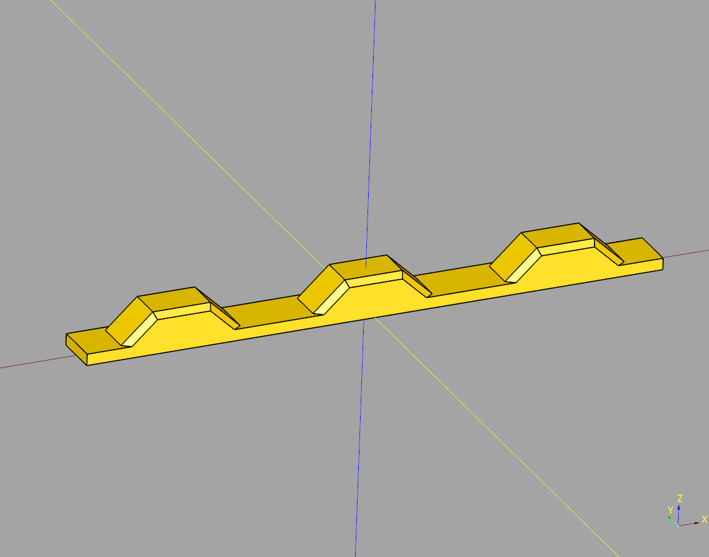<br />


* [source](../src/cqterrain/greeble/BottomClamps.py)
* [example](../example/greeble/bottom_clamps.py)
* [stl](../stl/greeble_bottom_clamps.stl)


---

## Cap Greeble


### parameters
* diameter: float 
* teeth: int
* rotate_teeth: int
* body_height: float
* teeth_diameter: float
* chamfer: float
* interior_height: float
* interior_diameter: float
* interior_cut_diameter: float
* bars_count: int
* bar_length: float
* bar_diameter: float
* inset_distance: float
* bar_shift: float
* bar_shift_z: float


``` python
import cadquery as cq
from cqterrain.greeble import cap_greeble

result = cap_greeble(
    diameter = 28, 
    teeth = 14,
    rotate_teeth = 20,
    body_height = 3,
    teeth_diameter = 3,
    chamfer = 2,
    interior_height = 2,
    interior_diameter = 4,
    interior_cut_diameter = 5,
    bars_count = 6,
    bar_length = 6,
    bar_diameter = 2,
    inset_distance = 2,
    bar_shift = 1,
    bar_shift_z = 2.4
)

show_object(result)
```

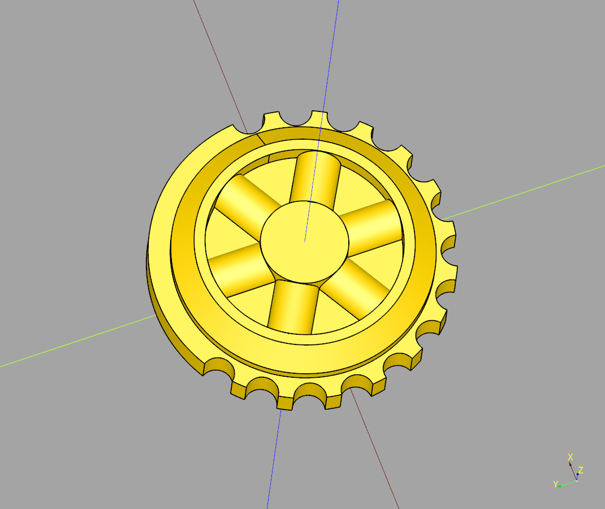<br />


* [source](../src/cqterrain/greeble/cap_greeble.py)
* [example](../example/greeble/cap_greeble.py)
* [stl](../stl/greeble_cap_greeble.stl)


---

## Circuit Glyph
Takes a collection of points, draws a line between each point. 
Renders a cq.Workplane at each point specified.

### parameters
* length: float
* width: float
* height: float
* point_diameter: float
* line_width: float
* line_height: float
* kind: Literal['arc', 'intersection', 'tangent']
* outline_margin: float
* pts: list[Tuple[int,int]] 
* render_outline: bool

``` python
import cadquery as cq
from cqterrain.greeble import CircuitGlyph 
from cadqueryhelper.shape import ring

bp_glyph = CircuitGlyph()

bp_glyph.add_point(0,6,ring(4,2,3))
bp_glyph.add_point(6,-1)
bp_glyph.add_point(-9,-6,cq.Workplane("XY").cylinder(3,1.5))
bp_glyph.add_point(-15,-0)
bp_glyph.add_point(-5,-0,ring(6,4,3))
bp_glyph.add_point(-8,9,cq.Workplane("XY").box(3,3,2).translate((0,0,0.5)))
bp_glyph.make()

ex_glyph = bp_glyph.build()

show_object(ex_glyph)
```

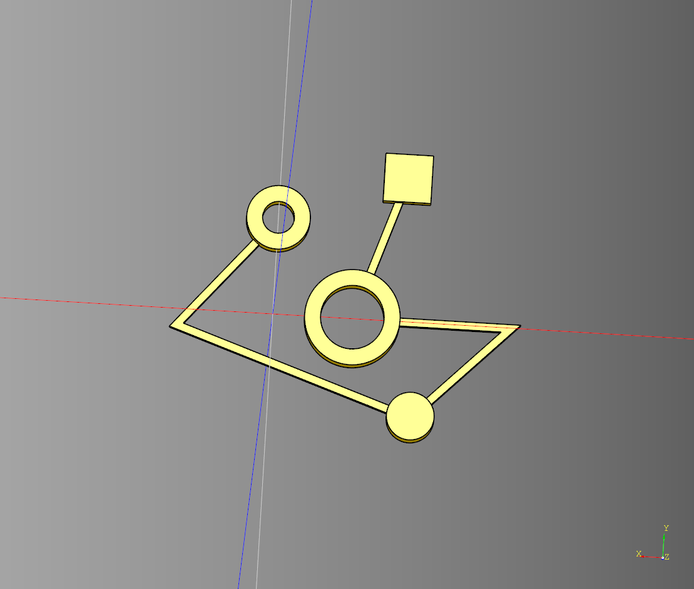<br />

* [source](../src/cqterrain/greeble/CircuitGlyph.py)
* [example](../example/greeble/glyph_greeble_one.py)
* [stl](../stl/greeble_circuit_glyph_one.stl)


### example two 
``` python
import cadquery as cq
from cqterrain.greeble import CircuitGlyph 
from cadqueryhelper.shape import ring

#----------------
spoke = cq.Workplane("XY").box(4,1,2).translate((5.5,0,0))
spoke_two =spoke.rotate((0,0,1),(0,0,0),-90) 
spoke_three =spoke.rotate((0,0,1),(0,0,0),-180)

large = (
    ring(8,6,2)
    .add(spoke)
    .add(spoke_two)
    .add(spoke_three)
).translate((0,0,.5))
#----------------

bp_glyph = CircuitGlyph()
bp_glyph.line_width = 1.5
bp_glyph.add_point(0,0, ring(4,2,2).translate((0,0,.5)))
bp_glyph.add_point(0,10,large)
bp_glyph.make()

ex_glyph = bp_glyph.build()
show_object(ex_glyph.translate((0,0,0)))
```

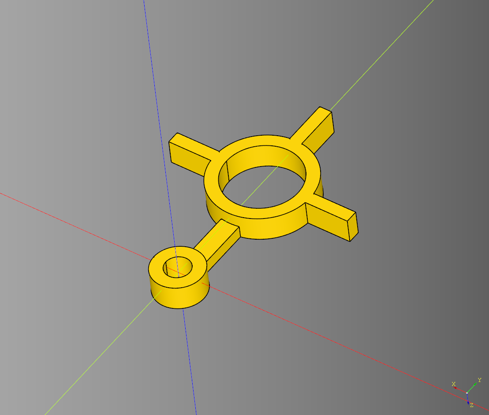<br />

* [example](../example/greeble/glyph_greeble_two.py)
* [stl](../stl/greeble_circuit_glyph_two.stl)

### example three
``` python
import cadquery as cq
from cqterrain.greeble import CircuitGlyph 
from cadqueryhelper.shape import ring

bp_glyph = CircuitGlyph()
bp_glyph.debug= True
bp_glyph.line_width = 1
bp_glyph.point_diameter = 3
bp_glyph.line_height = 1
bp_glyph.kind = 'arc'

bp_glyph.render_outline = False
bp_glyph.outline_margin = 0

bp_glyph.add_point(0,0,ring(4,2,3))
bp_glyph.add_point_rotate(10,0,20,cq.Workplane("XY").cylinder(3,1.5))
bp_glyph.add_point_rotate(15,0,40,cq.Workplane("XY").cylinder(3,1.5))
bp_glyph.add_point_rotate(0,-10,0,cq.Workplane("XY").cylinder(3,1.5))
bp_glyph.make()

ex_glyph = bp_glyph.build()

show_object(ex_glyph)
``` 

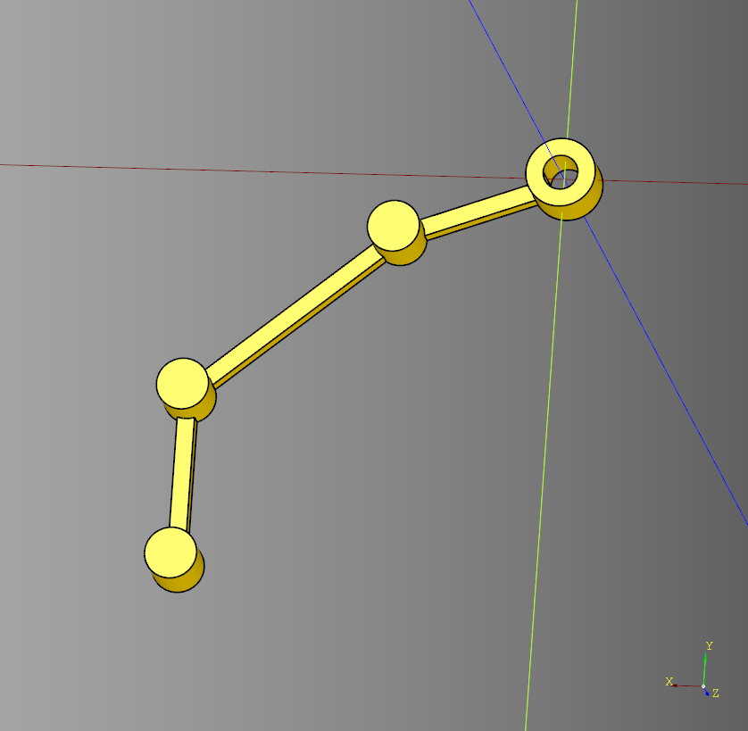<br />

* [example](../example/greeble/glyph_greeble_three.py)
* [stl](../stl/greeble_circuit_glyph_three.stl)
---

## Fan Blade
Fan Blade Inherits from Base class

### parameters
* diameter: float
* height: float
* cylinder_height: float
* cylinder_diameter: float
* blade_width: float
* blade_rotate: float
* blade_count: int
* debug: bool
* shift_rotate: float
* shift_translate: float

``` python
import cadquery as cq
from cqterrain.greeble import FanBlade

bp_fan = FanBlade()

bp_fan.diameter = 15
bp_fan.height = 5
bp_fan.cylinder_height = 2.5
bp_fan.cylinder_diameter = 5
bp_fan.blade_width = 1
bp_fan.blade_rotate = 23
bp_fan.blade_count = 3
bp_fan.debug = False
bp_fan.shift_rotate = 10
bp_fan.shift_translate = .5

bp_fan.make()

ex_fan = bp_fan.build()
show_object(ex_fan)
```

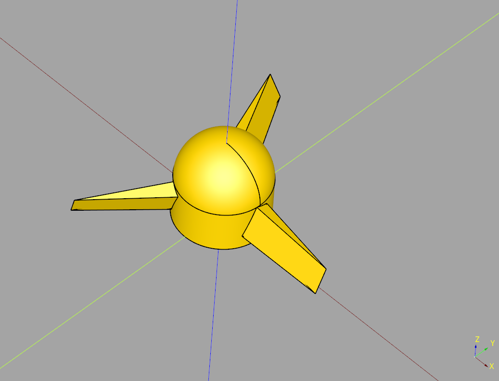<br />

* [source](../src/cqterrain/greeble/FanBlade.py)
* [example](../example/greeble/fan_blade.py)
* [stl](../stl/greeble_fan_blade.stl)

---

## Fan Housing
Circular Fan Housing Inherits from Base class

## parameters
self.diameter:f loat
self.height: float
self.housing_inner_diameter: float
self.housing_wall_cut_width: float
self.housing_wall_height: float
self.housing_wall_chamfer: float
self.render_fins: bool
self.fin_length: float
self.fin_width: float
self.fin_count: int

``` python
import cadquery as cq
from cqterrain.greeble import FanHousing

bp_fan = FanHousing()

bp_fan.diameter = 10
bp_fan.height = 5

#housing
bp_fan.housing_inner_diameter = 2
bp_fan.housing_wall_cut_width = 1
bp_fan.housing_wall_height = 1
bp_fan.housing_wall_chamfer = 0.499

#fin
bp_fan.render_fins = True
bp_fan.fin_length = 0.5
bp_fan.fin_width = 0.5
bp_fan.fin_count = 3

bp_fan.make()

ex_fan = bp_fan.build()
show_object(ex_fan)
```

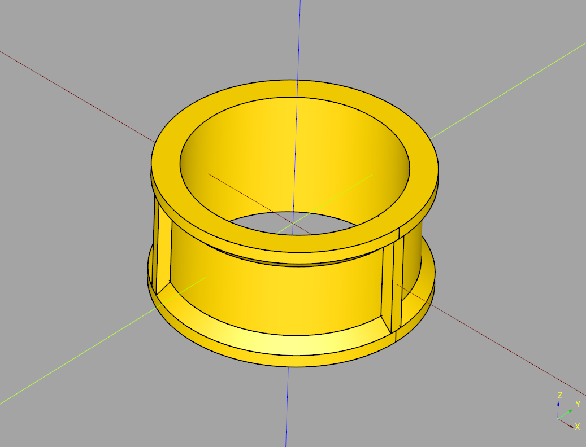<br />

* [source](../src/cqterrain/greeble/FanHousing.py)
* [example](../example/greeble/fan_housing.py)
* [stl](../stl/greeble_fan_housing.stl)

---

## Fan Industrial

### parameters
* length: float
* width: float
* height: float
* diameter: float
* housing_inner_diameter: float
* fan_cylinder_diameter: float
* fin_width: float
* fin_length: float
* fin_count: int
* housing_wall_cut_width: float
* housing_wall_height: float
* blade_count: int
* shift_rotate: float
* blade_width: float
* blade_rotate: float

### blueprints
* bp_housing:Base = [FanHousing](#fan-housing)
* bp_fan:Base = [FanBlade](#fan-blade)

``` python
import cadquery as cq
from cqterrain.greeble import FanIndustrial

bp_fan = FanIndustrial()
bp_fan.length = 30
bp_fan.width = 25
bp_fan.height = 20
bp_fan.diameter = 40
bp_fan.housing_inner_diameter = 4
bp_fan.fan_cylinder_diameter = 10
bp_fan.fin_width = 1.5
bp_fan.fin_length = 1.5
bp_fan.fin_count = 6
bp_fan.housing_wall_cut_width = 2
bp_fan.housing_wall_height = 3
bp_fan.blade_count = 14
bp_fan.shift_rotate = 10
bp_fan.blade_width = 3
bp_fan.blade_rotate = 25

bp_fan.make()

ex_fan = bp_fan.build()
show_object(ex_fan)
```

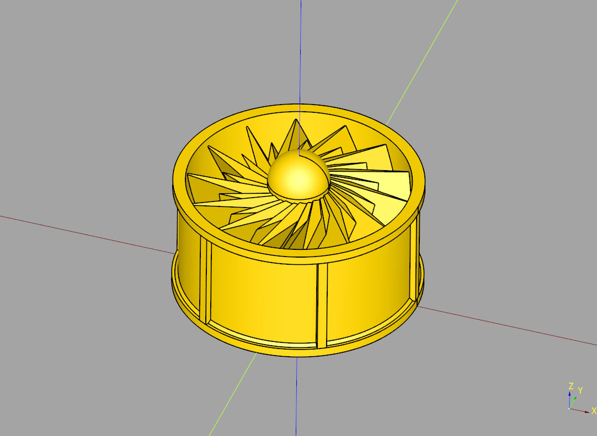<br />

* [source](../src/cqterrain/greeble/FanIndustrial.py)
* [example](../example/greeble/fan_industrial.py)
* [stl](../stl/greeble_fan_industrial.stl)

---

## Gothic One

Design is mirrored on both sides.

### parameters
* length: float
* width: float
* height: float
* frame_size: float
* pane_width: float
* inside_frame_width: float
* inside_frame_size: float
* diamond_frame_size: float
* diamond_frame_width: float
* diamond_inside: float

``` python
import cadquery as cq
from cqterrain.greeble import gothic_one

result = gothic_one(
    length = 15,
    width = 4,
    height = 20,
    frame_size = .5,
    pane_width = 1,
    inside_frame_width = -.5,
    inside_frame_size = .5,
    diamond_frame_size = 1,
    diamond_frame_width = -.25,
    diamond_inside = -.5
)
```

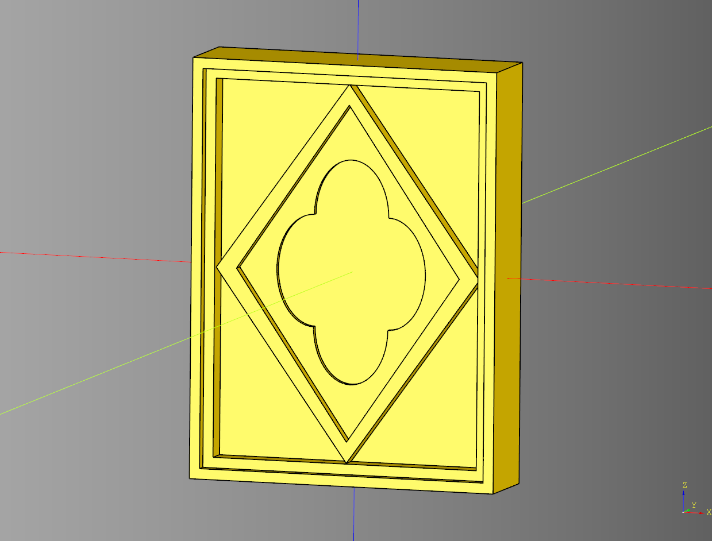<br />

* [source](../src/cqterrain/greeble/gothic_one.py)
* [example](../example/greeble/gothic_one.py)
* [stl](../stl/greeble_gothic_one.stl)

---

## Panel

### parameters
* length: float
* width: float
* height: float
* outer_height: float
* frame: float
* frame_depth: float

``` python
import cadquery as cq
from cqterrain.greeble import Panel

bp_panel = Panel()

bp_panel.length = 8
bp_panel.width = 6
bp_panel.height = 35
bp_panel.outer_height = 15

bp_panel.frame = 1.5
bp_panel.frame_depth = 1

bp_panel.make()

ex_panel = bp_panel.build()

show_object(ex_panel)
```

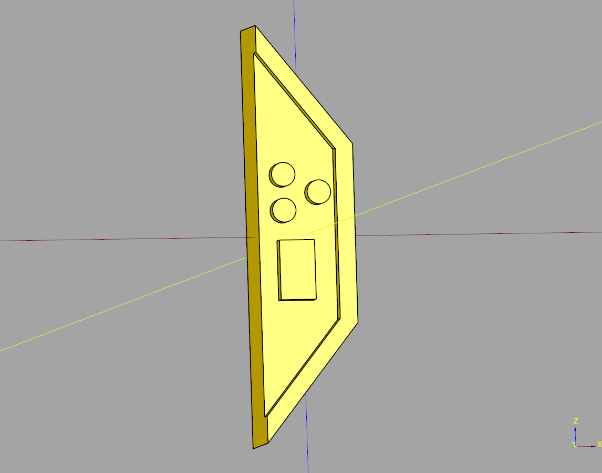<br />

* [source](../src/cqterrain/greeble/Panel.py)
* [example](../example/greeble/panel.py)
* [stl](../stl/greeble_panel.stl)


---

## Spoked Wheel

### parameters
* radius: float
* height: float
* frame: float
* inner_radius: float
* spoke_width: float
* spoke_height: float
* spoke_fillet: float
* spoke_count: int
* frame_chamfer: float
* inner_chamfer: float

``` python
result = greeble.spoked_wheel(
    radius = 10,
    height = 2,
    frame = 2,
    inner_radius = 3,
    spoke_width = 2,
    spoke_height = 1.5,
    spoke_fillet = .5,
    spoke_count = 12,
    frame_chamfer = .5,
    inner_chamfer = .5
)
```

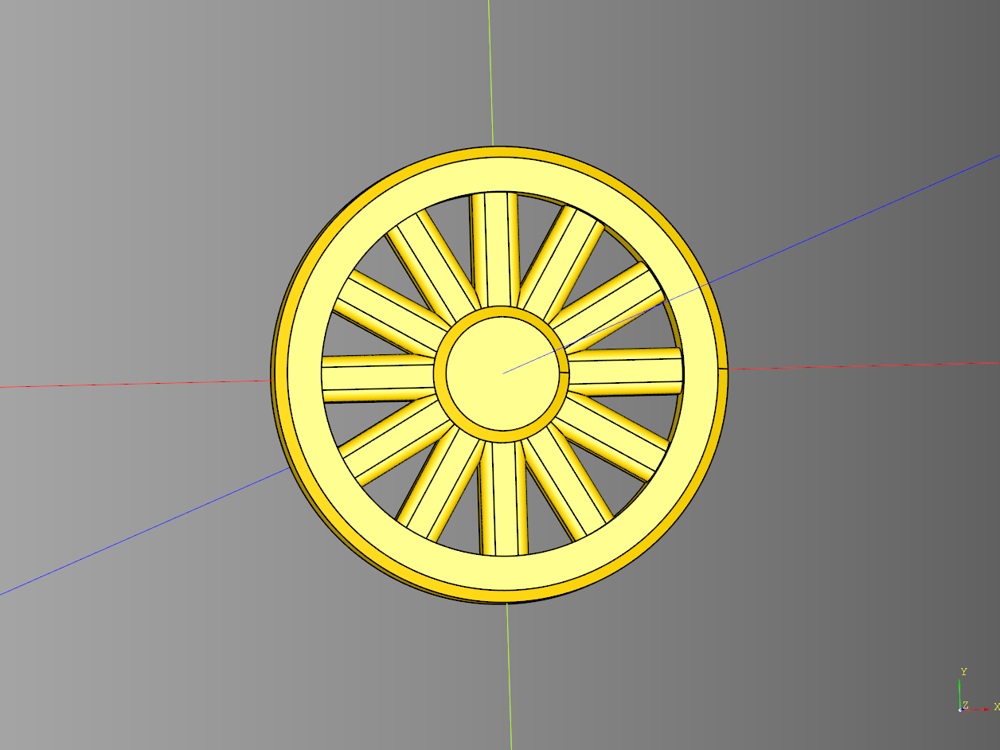<br />

* [source](../src/cqterrain/greeble/spokedWheel.py)
* [example](../example/greeble/spokedWheel.py)
* [stl](../stl/greeble_spoked_wheel.stl)

---

## Vent

### parameters
* length: float
* width: float
* height: float
* segment_length: float
* inner_width: float
* frame_width: float
* chamfer: float|None
* wave_pattern = wave.sawtooth

``` python
vent = greeble.vent(
    length = 25,
    width = 25,
    height = 4,
    segment_length = 3,
    inner_width = 2,
    frame_width = 2,
    chamfer = None
)
```

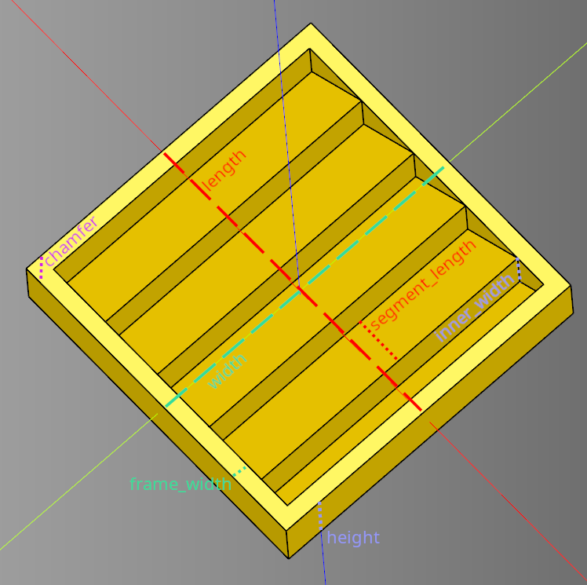<br />

* [source](../src/cqterrain/greeble/vent.py)
* [example](../example/greeble_vent.py)
* [stl](../stl/greeble_vent.stl)

---
