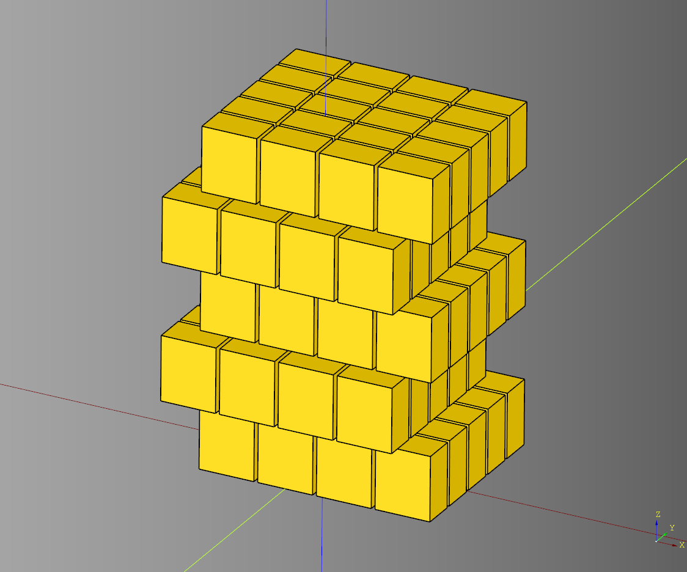
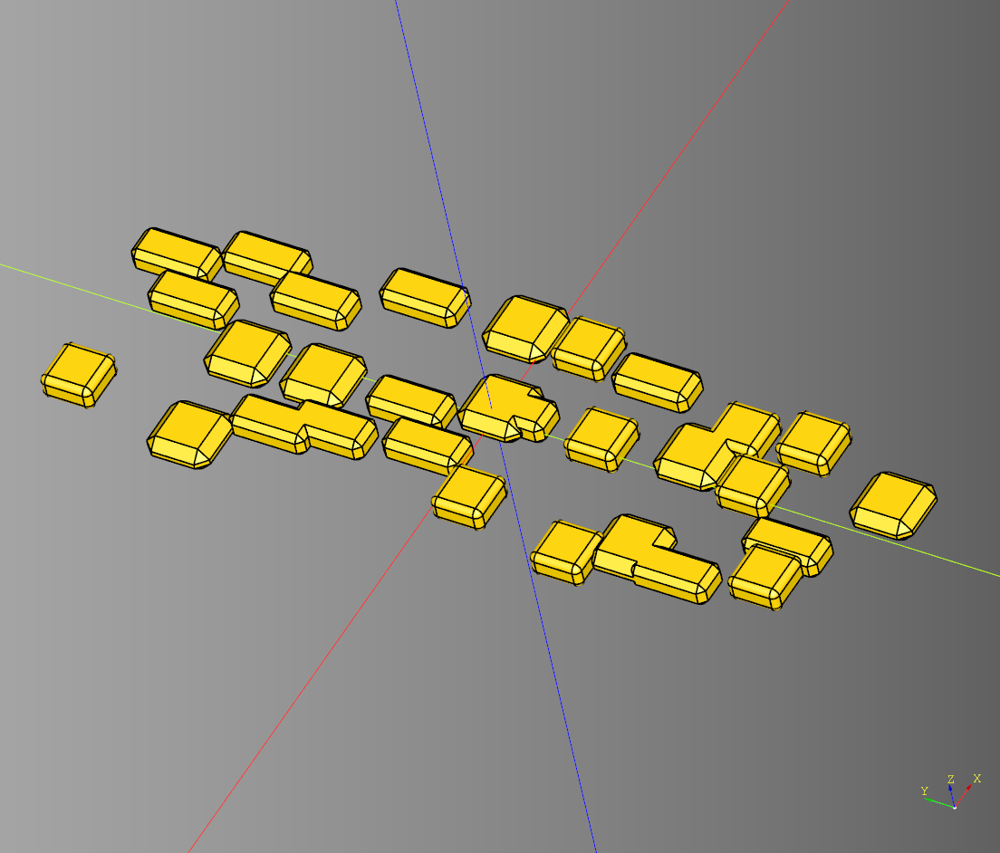
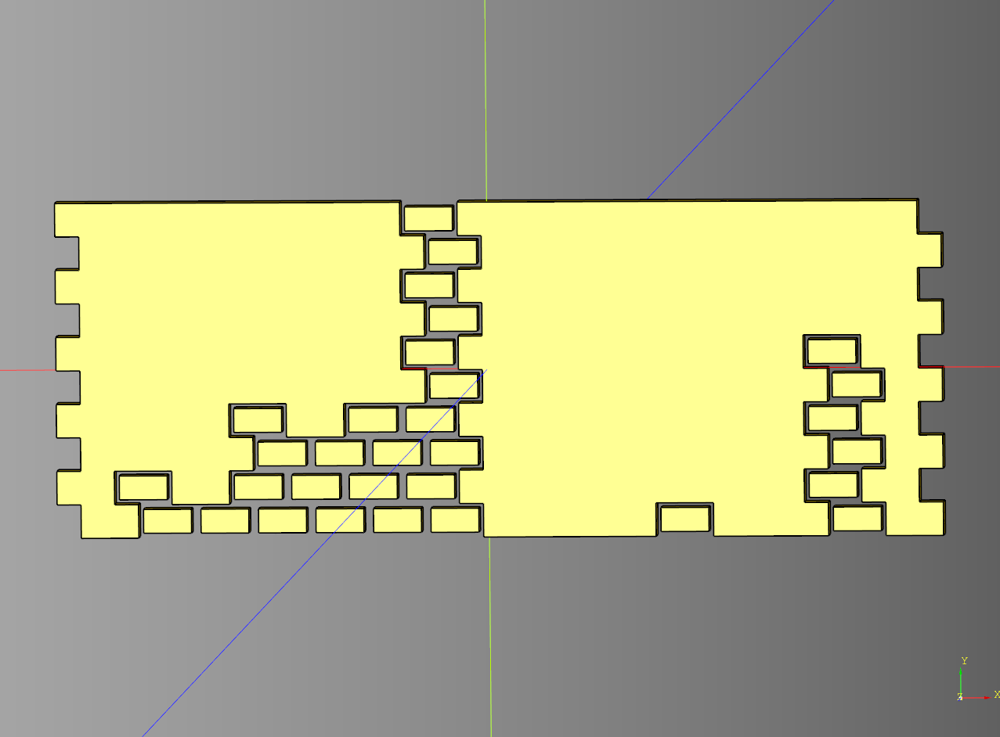
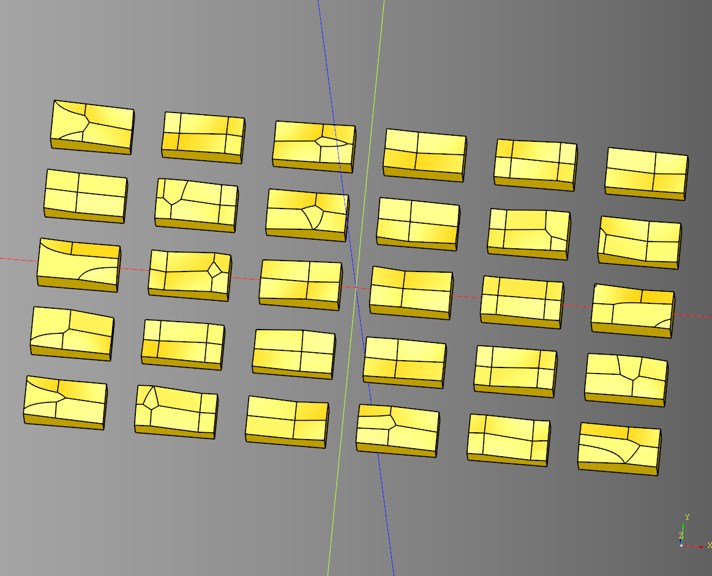
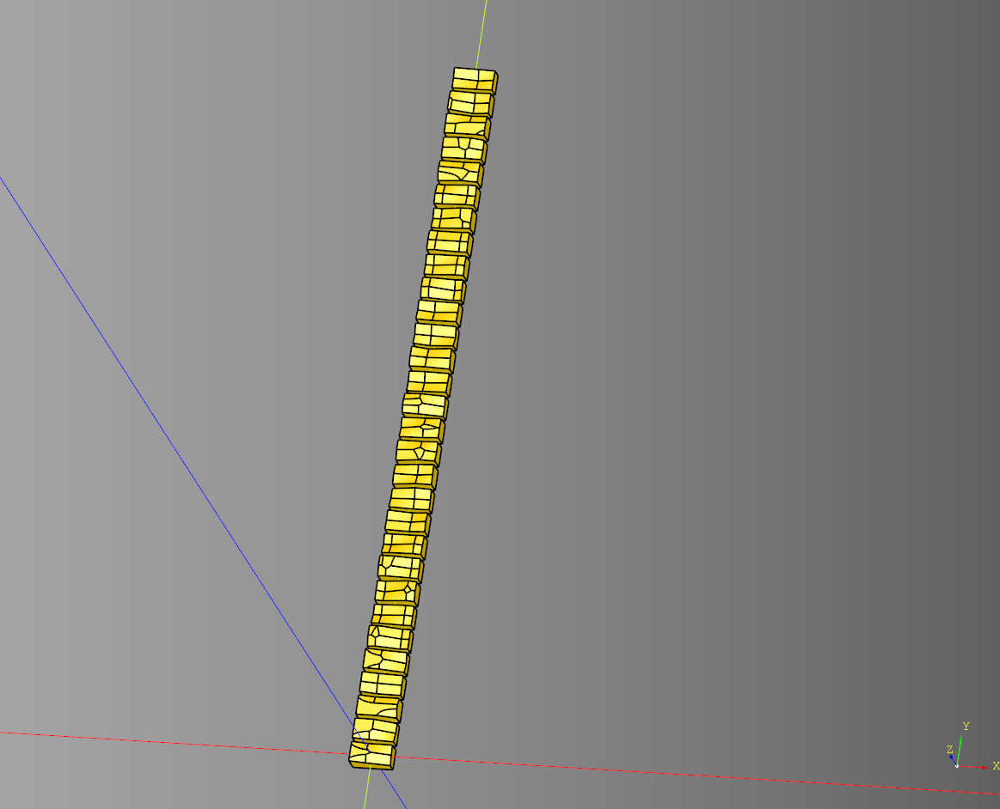

# Material

- [Material](#material)
  - [Bricks Layered](#bricks-layered)
    - [parameters](#parameters)
  - [center\_blocks](#center_blocks)
    - [parameters](#parameters-1)
  - [make\_stones](#make_stones)
    - [parameters](#parameters-2)
  - [stucco\_brick\_blocks](#stucco_brick_blocks)
    - [parameters](#parameters-3)
  - [stacked\_wave\_form\_map](#stacked_wave_form_map)
    - [parameters](#parameters-4)
  - [uneven\_blocks](#uneven_blocks)
    - [parameters](#parameters-5)
  - [uneven\_centered\_blocks](#uneven_centered_blocks)
    - [parameters](#parameters-6)


---

## Bricks Layered

### parameters

``` python
import cadquery as cq
from cqterrain.material import BricksLayered

bp_bricks = BricksLayered()
bp_bricks.length = 30
bp_bricks.width = 25
bp_bricks.height = 60
bp_bricks.rows = 4
bp_bricks.columns = 3
bp_bricks.layers = 5
bp_bricks.spacing = .7
bp_bricks.spacing_z = 0
bp_bricks.tile_padding = 2
bp_bricks.make()

ex_bricks = bp_bricks.build()

show_object(ex_bricks)
```



* [source](../src/cqterrain/material/BricksLayered.py)
* [example](../example/material/bricks_layered.py)
* [stl](../stl/material_bricks_layered.stl)

---

## center_blocks
Helper functino to make a list of workplane objects centered at the 0,0 origin point.

### parameters
* blocks: cq.Workplane

<br />

* [source](../src/cqterrain/material/center_blocks.py)

---

## make_stones

Create a sparse pattern of the given parts. 
This method of generation should be relatively performant.

### parameters
* parts: list[cq.Workplane]
* dim: list[float]
* rows: int
* columns: int
* seed: str

``` python
import cadquery as cq
from cqterrain.material import make_stones


tile = cq.Workplane("XY").box(5,5,2).chamfer(0.8)
tile2 = cq.Workplane("XY").box(4,4,2).fillet(.5)
tile3 = cq.Workplane("XY").box(3,6,2).chamfer(0.5)
tiles = make_stones(
    [
        tile, 
        tile2, 
        tile3
    ], 
    [6,6,2], 
    columns = 10, 
    rows = 3,
    seed = "test4"
)

show_object(tiles)
```



* [source](../src/cqterrain/material/make_stones.py)
* [example](../example/material/stones.py)
* [stl](../stl/material_stones.stl)

---

## stucco_brick_blocks
Makes a grid of bricks based on the output from stacked_wave_form_map.

### parameters
* wfc_data: list[list[str]] 
* length: float
* width: float 
* height: float
* spacing: float

``` python
import cadquery as cq
from cqterrain.material import stacked_wave_form_map, stucco_brick_blocks

map = stacked_wave_form_map(
    size = (10,15),
    seed = 'test',
    cell_types = ['block','block','empty','block']
)

ex_matarial = stucco_brick_blocks(
    map,
    length = 10, 
    width = 5, 
    height = 5,
    spacing = 2
)

show_object(ex_matarial)
```



* [source](../src/cqterrain/material/stucco_brick_blocks.py)
* [example](../example/material/stucco_brick_blocks.py)
* [stl](../stl/material_stucco_brick_blocks.stl)

---

## stacked_wave_form_map
Helper function creates a list of lists. Each row is informed by the preceding row to determing if the cell should be empty based on the cell below.

### parameters
* size:Tuple[int,int]
* seed:str|None
* cell_types:list[str]

<br />

* [source](../src/cqterrain/material/stacked_wave_form_map.py)

---

## uneven_blocks

### parameters
* tile_length: float 
* tile_width: float 
* tile_height: float 
* rows: int 
* columns: int 
* margin: float
* uneven_depth: float
* seed: str
* segments: int
* peak_count: tuple[int,int]|int

``` python
import cadquery as cq
from cqterrain.material import uneven_blocks

blocks = uneven_blocks(
    tile_length = 10, 
    tile_width = 5, 
    tile_height= 5, 
    rows = 5, 
    columns = 6, 
    margin = 2,
    uneven_depth = 2.5,
    seed='test',
    segments = 10,
    peak_count = (14,15)
)

show_object(blocks)
```




* [source](../src/cqterrain/material/uneven_blocks.py)
* [example](../example/material/uneven_blocks.py)
* [stl](../stl/material_uneven_blocks.stl)

----

## uneven_centered_blocks

List of uneven blocks centered at the 0,0 origin point.

### parameters
* tile_length: float 
* tile_width: float 
* tile_height: float 
* rows: int 
* columns: int 
* margin: float
* uneven_depth: float
* seed: str
* segments: int
* peak_count: tuple[int,int]|int

``` python
import cadquery as cq
from cqterrain.material import uneven_centered_blocks

blocks = uneven_centered_blocks(
    tile_length = 10, 
    tile_width = 5, 
    tile_height= 5, 
    rows = 5, 
    columns = 6, 
    margin = 2,
    uneven_depth = 2.5,
    seed='test',
    segments = 10,
    peak_count = (14,15)
)

block_line = cq.Workplane("XY")

for i, b in enumerate(blocks):
    show_object(b.translate((0,i*6,0)))
```




* [source](../src/cqterrain/material/uneven_centered_blocks.py)
* [example](../example/material/uneven_centered_blocks.py)
* [stl](../stl/material_centered_uneven_blocks.stl)

---

