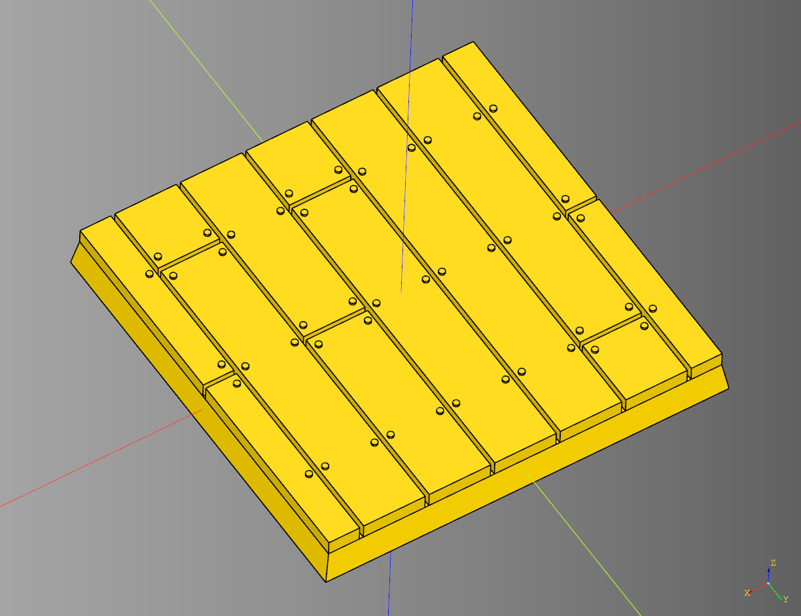

# Minibase

Collection is minibase shapes with magnet cutouts. 
The code for these is very simple most of these are just a loft operation.

- [Minibase](#minibase)
  - [make\_magnet\_outline](#make_magnet_outline)
    - [parameters](#parameters)
  - [Basic Bases](#basic-bases)
    - [Circle](#circle)
      - [parameters](#parameters-1)
    - [Ellipse](#ellipse)
      - [parameters](#parameters-2)
    - [Hexagon](#hexagon)
      - [parameters](#parameters-3)
    - [Rectangle](#rectangle)
      - [parameters](#parameters-4)
    - [Slot](#slot)
      - [parameters](#parameters-5)
  - [Irregular Bases](#irregular-bases)
    - [Circle Irregular](#circle-irregular)
      - [parameters](#parameters-6)
    - [Ellipse Irregular](#ellipse-irregular)
      - [parameters](#parameters-7)
    - [Hexagon Irregular](#hexagon-irregular)
      - [parameters](#parameters-8)
    - [Rectangle Irregular](#rectangle-irregular)
      - [parameters](#parameters-9)
    - [Slot Irregular](#slot-irregular)
      - [parameters](#parameters-10)
  - [Point Grid Bases](#point-grid-bases)
    - [Point Grid Base](#point-grid-base)
      - [parameters](#parameters-11)
      - [blueprints](#blueprints)
    - [Basalt Base](#basalt-base)
      - [parameters](#parameters-12)
  - [Ruin Stone Base](#ruin-stone-base)
    - [parameters](#parameters-13)
  - [Uneven Bases](#uneven-bases)
    - [Circle Uneven](#circle-uneven)
      - [parameters](#parameters-14)
    - [Ellipse Uneven](#ellipse-uneven)
      - [parameters](#parameters-15)
    - [Hexagon Uneven](#hexagon-uneven)
      - [parameters](#parameters-16)
    - [Rectangle Uneven](#rectangle-uneven)
      - [parameters](#parameters-17)
    - [Slot Uneven](#slot-uneven)
      - [parameters](#parameters-18)
  - [Wood Bases](#wood-bases)
    - [Circle Wood](#circle-wood)
      - [parameters](#parameters-19)
    - [Ellipse Wood](#ellipse-wood)
      - [parameters](#parameters-20)
    - [Hexagon Wood](#hexagon-wood)
      - [parameters](#parameters-21)
    - [Rectangle Wood](#rectangle-wood)
      - [parameters](#parameters-22)
    - [Slot Wood](#slot-wood)
      - [parameters](#parameters-23)


---

## make_magnet_outline
Utility function for making the magnet cutouts for the bases.

### parameters
* shape_height: float 
* magnet_diameter: float
* magnet_height: float

<br />

* [source](../src/cqterrain/minibase/make_magnet_outline.py)

---

## Basic Bases


* [example](../example/minibase/minibase_group.py)
* [stl](../stl/minibase_group.stl)

---

### Circle
#### parameters
* diameter: float
* height: float
* taper: float
* render_magnet: bool
* magnet_diameter: float
* magnet_height: float

``` python
result = circle(
    diameter = 25, 
    height = 3, 
    taper = -1,
    render_magnet = True, 
    magnet_diameter = 3, 
    magnet_height = 2
)
```

<br />

* [source](../src/cqterrain/minibase/circle.py)
* [example](../example/minibase/circle.py)
* [stl](../stl/minibase_circle.stl)

---

### Ellipse
#### parameters
* x_diameter: float
* y_diameter: float
* height: float
* taper: float
* render_magnet: bool
* magnet_diameter: float
* magnet_height: float

``` python
result = ellipse(
    x_diameter=52, 
    y_diameter=90, 
    height=3, 
    taper=-1,
    render_magnet = True,  
    magnet_diameter=3, 
    magnet_height=2
)
```

<br />

* [source](../src/cqterrain/minibase/ellipse.py)
* [example](../example/minibase/ellipse.py)
* [stl](../stl/minibase_ellipse.stl)

---

### Hexagon
#### parameters
* diameter: float
* height: float
* taper: float
* render_magnet: bool
* magnet_diameter: float
* magnet_height: float

``` python
result = hexagon(
    diameter = 25,
    height = 3, 
    taper = -1,
    render_magnet = True,  
    magnet_diameter = 3, 
    magnet_height = 2
)
```

<br />

* [source](../src/cqterrain/minibase/hexagon.py)
* [example](../example/minibase/hexagon.py)
* [stl](../stl/minibase_hexagon.stl)

---

### Rectangle
#### parameters
* length: float
* width: float
* height: float
* taper: float
* render_magnet: bool
* magnet_diameter: float
* magnet_height: float

``` python
result = rectangle(
    length = 25, 
    width = 25, 
    height = 3, 
    taper = -1,
    render_magnet = True,  
    magnet_diameter = 3, 
    magnet_height = 2
)
```

<br />

* [source](../src/cqterrain/minibase/rectangle.py)
* [example](../example/minibase/rectangle.py)
* [stl](../stl/minibase_rectangle.stl)

---

### Slot
#### parameters
* length: float 
* width: float 
* height: float 
* taper: float 
* render_magnet: bool
* magnet_diameter: float 
* magnet_height: float

``` python
result = slot(
    length = 24, 
    width = 50, 
    height = 3, 
    taper = -1,
    render_magnet = True,  
    magnet_diameter = 3, 
    magnet_height = 2
)
```

<br />

* [source](../src/cqterrain/minibase/slot.py)
* [example](../example/minibase/slot.py)
* [stl](../stl/minibase_slot.stl)
  
---

## Irregular Bases

<br />

---

### Circle Irregular

#### parameters
* diameter: float
* base_height: float
* taper: float
* render_magnet: bool 
* magnet_diameter: float
* magnet_height
* min_height: float
* max_height: float
* overlap: float
* col_size: float
* row_size: float
* max_columns: int
* max_rows: int
* passes_count: int
* seed: str
* tile_styles: list[Callable[[float, float, float],cq.Workplane]]
* debug: bool

``` python
import cadquery as cq
from cqterrain.minibase import circle_irregular

def custom_item(length, width, height):
    return (
        cq.Workplane("XY")
        .box(length-.3, width-.3, height)
        .chamfer(0.5)
    )

ex_base = circle_irregular(
    diameter = 40, 
    base_height = 3, 
    taper = -1,
    render_magnet = True,  
    magnet_diameter = 3, 
    magnet_height = 2,
    min_height = 1,
    max_height = 3.5,
    overlap = 20,
    col_size = 5,
    row_size = 8,
    max_columns = 2,
    max_rows = 2,
    passes_count = 3000,
    seed = "seed",
    tile_styles = [custom_item],
    debug = False
)

show_object(ex_base)
```

<br />

* [source](../src/cqterrain/minibase/circle_irregular.py)
* [example](../example/minibase/circle_irregular.py)
* [stl](../stl/minibase_circle_irregular.stl)

---

### Ellipse Irregular

#### parameters
* x_diameter: float
* y_diameter: float
* base_height: float
* taper: float
* render_magnet: bool 
* magnet_diameter: float
* magnet_height
* min_height: float
* max_height: float
* overlap: float
* col_size: float
* row_size: float
* max_columns: int
* max_rows: int
* passes_count: int
* seed: str
* tile_styles: list[Callable[[float, float, float],cq.Workplane]]
* debug: bool


``` python
import cadquery as cq
from cqterrain.minibase import ellipse_irregular

def custom_item(length, width, height):
    return (
        cq.Workplane("XY")
        .box(length-.3, width-.3, height)
        .chamfer(0.5)
    )

ex_base = ellipse_irregular(
    x_diameter = 52, 
    y_diameter = 90, 
    base_height = 3, 
    taper = -1,
    render_magnet = True,  
    magnet_diameter = 3, 
    magnet_height = 2,
    min_height = 1,
    max_height = 3.5,
    overlap = 20,
    col_size = 5,
    row_size = 8,
    max_columns = 2,
    max_rows = 2,
    passes_count = 3000,
    seed = "seed",
    tile_styles = [custom_item],
    debug = False
)

show_object(ex_base)
```

<br />

* [source](../src/cqterrain/minibase/ellipse_irregular.py)
* [example](../example/minibase/ellipse_irregular.py)
* [stl](../stl/minibase_ellipse_irregular.stl)

---

### Hexagon Irregular

#### parameters
* diameter: float
* base_height: float
* taper: float
* render_magnet: bool 
* magnet_diameter: float
* magnet_height
* min_height: float
* max_height: float
* overlap: float
* col_size: float
* row_size: float
* max_columns: int
* max_rows: int
* passes_count: int
* seed: str
* tile_styles: list[Callable[[float, float, float],cq.Workplane]]
* debug: bool


``` python
import cadquery as cq
from cqterrain.minibase import hexagon_irregular

def custom_item(length, width, height):
    return (
        cq.Workplane("XY")
        .box(length-.3, width-.3, height)
        .chamfer(0.5)
    )

ex_base = hexagon_irregular(
    diameter = 40,
    base_height = 3, 
    taper = -1,
    render_magnet = True,  
    magnet_diameter = 3, 
    magnet_height = 2,
    min_height = 1,
    max_height = 3.5,
    overlap = 20,
    col_size = 5,
    row_size = 8,
    max_columns = 2,
    max_rows = 2,
    passes_count = 3000,
    seed = "seed",
    tile_styles = [custom_item],
    debug = False
)

show_object(ex_base)
```

<br />

* [source](../src/cqterrain/minibase/hexagon_irregular.py)
* [example](../example/minibase/hexagon_irregular.py)
* [stl](../stl/minibase_hexagon_irregular.stl)

---

### Rectangle Irregular

#### parameters
* length: float
* base_height: float
* taper: float
* render_magnet: bool 
* magnet_diameter: float
* magnet_height
* min_height: float
* max_height: float
* overlap: float
* col_size: float
* row_size: float
* max_columns: int
* max_rows: int
* passes_count: int
* seed: str
* tile_styles: list[Callable[[float, float, float],cq.Workplane]]
* debug: bool


``` python
import cadquery as cq
from cqterrain.minibase import rectangle_irregular

def custom_item(length, width, height):
    return (
        cq.Workplane("XY")
        .box(length-.3, width-.3, height)
        .chamfer(0.5)
    )

ex_base = rectangle_irregular(
    length = 40,
    width = 40,
    base_height = 3, 
    taper = -1,
    render_magnet = True,  
    magnet_diameter = 3, 
    magnet_height = 2,
    min_height = 1,
    max_height = 3.5,
    overlap = 20,
    col_size = 5,
    row_size = 8,
    max_columns = 2,
    max_rows = 2,
    passes_count = 3000,
    seed = "seed",
    tile_styles = [custom_item],
    debug = False
)

show_object(ex_base)
```

<br />

* [source](../src/cqterrain/minibase/rectangle_irregular.py)
* [example](../example/minibase/rectangle_irregular.py)
* [stl](../stl/minibase_rectangle_irregular.stl)

---

### Slot Irregular

#### parameters
* length: float
* base_height: float
* taper: float
* render_magnet: bool 
* magnet_diameter: float
* magnet_height
* min_height: float
* max_height: float
* overlap: float
* col_size: float
* row_size: float
* max_columns: int
* max_rows: int
* passes_count: int
* seed: str
* tile_styles: list[Callable[[float, float, float],cq.Workplane]]
* debug: bool


``` python
import cadquery as cq
from cqterrain.minibase import slot_irregular

def custom_item(length, width, height):
    return (
        cq.Workplane("XY")
        .box(length-.3, width-.3, height)
        .chamfer(0.5)
    )

ex_base = slot_irregular(
    length = 75,
    width = 30,
    base_height = 3, 
    taper = -1,
    render_magnet = True,  
    magnet_diameter = 3, 
    magnet_height = 2,
    min_height = 1,
    max_height = 3.5,
    overlap = 20,
    col_size = 5,
    row_size = 8,
    max_columns = 2,
    max_rows = 2,
    passes_count = 3000,
    seed = "seed",
    tile_styles = [custom_item],
    debug = False
)

show_object(ex_base)
```

<br />

* [source](../src/cqterrain/minibase/slot_irregular.py)
* [example](../example/minibase/slot_irregular.py)
* [stl](../stl/minibase_slot_irregular.stl)

---

## Point Grid Bases
These are minibases bases on the ModPattern code.

---

### Point Grid Base
Builder class that can generate ruin bases for rectangle, circle, slot, ellipse, hexagon bases.

#### parameters
* length: float
* width: float
* height: float
* diameter: float
* diameter_y: float
* taper: float
* magnet_diameter: float
* magnet_height: float
* render_magnet: bool
* base_type: Literal['rectangle','circle','slot','ellipse','hexagon']
* detail_height: float
* debug: bool

#### blueprints
* bp_grid: [ModPattern](./floor.md#mod-pattern)

``` python
import cadquery as cq
from cqterrain.minibase import PointGridBase

bp_base = PointGridBase()
bp_base.length = 50
bp_base.width = 50
bp_base.diameter = 50
bp_base.base_type = "hexagon"
bp_base.debug = False
bp_base.make()
ex_base = bp_base.build()

show_object(ex_base)
```

<br />

* [source](../src/cqterrain/minibase/PointGridBase.py)
* [example](../example/minibase/point_grid_base.py)
* [stl](../stl/minibase_point_grid_base.stl)

---

### Basalt Base
Point Grid Base derivative

#### parameters
#parameters
* length: float
* width: float
* height: float
* seed: str

#blueprints
* bp_grid: [ModPattern](./floor.md#mod-pattern)

``` python
import cadquery as cq
from cqterrain.minibase import BasaltBase

bp_base = BasaltBase()
bp_base.length = 25
bp_base.width = 25
bp_base.diameter = 25
bp_base.detail_height = 10
bp_base.base_type = "rectangle"
bp_base.debug = False
bp_base.seed = "flower5"
bp_base.make()
ex_base = bp_base.build()

ex_pattern = bp_base.bp_grid.build()

show_object(ex_base)
```

<br />

* [source](../src/cqterrain/minibase/BasaltBase.py)
* [example](../example/minibase/basalt_base.py)
* [stl](../stl/minibase_basalt_base.stl)

---

## Ruin Stone Base

Builder class that can generate ruin bases for rectangle, circle, slot, ellipse, hexagon bases.

### parameters
* length: float
* width: float
* height: float
* diameter: float
* diameter_y: float
* taper: float
* magnet_diameter: float
* magnet_height: float
* render_magnet: bool
* base_type: Literal['rectangle','circle','slot','ellipse','hexagon']
* uneven_height: float
* peak_count: tuple[int,int]|int
* segments: int
* seed: str
* detail_height: float
* overlap: float
* min_height: float
* col_size: float
* row_size: float
* max_columns: int
* max_rows: int
* passes_count: int
* tile_styles: list[Callable[[float, float, float],cq.Workplane]]

``` python
import cadquery as cq
from cqterrain.minibase import RuinStoneBase

def custom_item(length, width, height):
    return (
        cq.Workplane("XY")
        .box(length-.3, width-.3, height)
        .chamfer(0.5)
    )

def custom_item_rotated_y_pos(length, width, height):
    return (
        cq.Workplane("XY")
        .box(length-.3, width-.3, height)
        .chamfer(0.5)
        .rotate((0,1,0),(0,0,0),12)
    )

def custom_item_rotated_y_neg(length, width, height):
    return (
        cq.Workplane("XY")
        .box(length-.3, width-.3, height)
        .chamfer(0.5)
        .rotate((0,1,0),(0,0,0),-12)
    )

bp_base = RuinStoneBase()
bp_base.length = 30
bp_base.width = 25
bp_base.height = 3
bp_base.diameter = 30
bp_base.diameter_y = 30
bp_base.taper = -1
bp_base.magnet_diameter = 3
bp_base.magnet_height = 2
bp_base.render_magnet = True

bp_base.base_type= "circle"

bp_base.uneven_height = 4
bp_base.peak_count = (9,10)
bp_base.segments = 6
bp_base.seed = "seed"
bp_base.detail_height = 3

bp_base.overlap = 20
bp_base.min_height = 1
bp_base.col_size = 5
bp_base.row_size = 8
bp_base.max_columns = 2
bp_base.max_rows = 2
bp_base.passes_count = 3000
bp_base.tile_styles = [
    custom_item,    
    custom_item_rotated_y_pos,
    custom_item_rotated_y_neg
]

bp_base.make()

ex_base = bp_base.build()
show_object(ex_base)
```


* [source](../src/cqterrain/minibase/ruinStoneBase.py)
* [example](../example/minibase/ruin_stone_base.py)
* [stl](../stl/minibase_ruin_stone_base.stl)

---

## Uneven Bases


---

### Circle Uneven

#### parameters
* diameter: float
* base_height: float
* taper: float
* render_magnet: bool  
* magnet_diameter: float 
* magnet_height: float
* detail_height: float
* uneven_height: float
* peak_count: tuple[int,int]|int
* segments: int
* seed: str

``` python
import cadquery as cq
from cqterrain.minibase import circle_uneven

ex_base = circle_uneven(
    diameter = 45,
    base_height = 3,
    taper = -1,
    render_magnet = True,  
    magnet_diameter = 3, 
    magnet_height = 2,
    detail_height = 3,
    uneven_height = 4,
    peak_count = (9,10),
    segments = 6,
    seed="red"
)

show_object(ex_base)
```

<br />

* [source](../src/cqterrain/minibase/circle_uneven.py)
* [example](../example/minibase/circle_uneven.py)
* [stl](../stl/minibase_circle_uneven.stl)

---

### Ellipse Uneven

#### parameters
* length: float
* width: float
* base_height: float
* taper: float
* render_magnet: bool  
* magnet_diameter: float 
* magnet_height: float
* detail_height: float
* uneven_height: float
* peak_count: tuple[int,int]|int
* segments: int
* seed: str

``` python
import cadquery as cq
from cqterrain.minibase import ellipse_uneven

ex_base = ellipse_uneven(
    length = 40,
    width = 40,
    base_height = 3,
    taper = -1,
    render_magnet = True,  
    magnet_diameter = 3, 
    magnet_height = 2,
    detail_height = 3,
    uneven_height = 4,
    peak_count = (9,10),
    segments = 6,
    seed="red"
)

show_object(ex_base)
```

<br />

* [source](../src/cqterrain/minibase/ellipse_uneven.py)
* [example](../example/minibase/ellipse_uneven.py)
* [stl](../stl/minibase_ellipse_uneven.stl)

---

### Hexagon Uneven

#### parameters
* diameter: float
* base_height: float
* taper: float
* render_magnet: bool  
* magnet_diameter: float 
* magnet_height: float
* detail_height: float
* uneven_height: float
* peak_count: tuple[int,int]|int
* segments: int
* seed: str

``` python
import cadquery as cq
from cqterrain.minibase import hexagon_uneven

ex_base = hexagon_uneven(
    diameter = 45,
    base_height = 3,
    taper = -1,
    render_magnet = True,  
    magnet_diameter = 3, 
    magnet_height = 2,
    detail_height = 3,
    uneven_height = 4,
    peak_count = (9,10),
    segments = 6,
    seed="red"
)

show_object(ex_base)
```

<br />

* [source](../src/cqterrain/minibase/hexagon_uneven.py)
* [example](../example/minibase/hexagon_uneven.py)
* [stl](../stl/minibase_hexagon_uneven.stl)

---

### Rectangle Uneven

#### parameters
* length: float
* width: float
* base_height: float
* taper: float
* render_magnet: bool  
* magnet_diameter: float 
* magnet_height: float
* detail_height: float
* uneven_height: float
* peak_count: tuple[int,int]|int
* segments: int
* seed: str

``` python
import cadquery as cq
from cqterrain.minibase import rectangle_uneven

ex_base = rectangle_uneven(
    length = 40,
    width = 40,
    base_height = 3,
    taper = -1,
    render_magnet = True,  
    magnet_diameter = 3, 
    magnet_height = 2,
    detail_height = 3,
    uneven_height = 4,
    peak_count = (9,10),
    segments = 6,
    seed="red"
)

show_object(ex_base)
```

<br />

* [source](../src/cqterrain/minibase/rectangle_uneven.py)
* [example](../example/minibase/rectangle_uneven.py)
* [stl](../stl/minibase_rectangle_uneven.stl)

---

### Slot Uneven

#### parameters
* length: float
* width: float
* base_height: float
* taper: float
* render_magnet: bool  
* magnet_diameter: float 
* magnet_height: float
* detail_height: float
* uneven_height: float
* peak_count: tuple[int,int]|int
* segments: int
* seed: str

``` python
import cadquery as cq
from cqterrain.minibase import slot_uneven

ex_base = slot_uneven(
    length = 75,
    width = 25,
    base_height = 3,
    taper = -1,
    render_magnet = True,  
    magnet_diameter = 3, 
    magnet_height = 2,
    detail_height = 3,
    uneven_height = 4,
    peak_count = (9,10),
    segments = 6,
    seed="red"
)

show_object(ex_base)
```

<br />

* [source](../src/cqterrain/minibase/slot_uneven.py)
* [example](../example/minibase/slot_uneven.py)
* [stl](../stl/minibase_slot_uneven.stl)

---

## Wood Bases

<br />

---

### Circle Wood

#### parameters
* diameter: float
* base_height: float
* taper: float
* render_magnet: bool  
* magnet_diameter: float
* magnet_height: float
* board_height: float
* overlap: float
* seed: str
* joist_space: float
* board_width: float
* board_width_spacer: float
* board_break_width: float
* nail_diameter: float
* nail_overlap_height: float
* joist_width: float
* debug: bool

``` python
import cadquery as cq
from cqterrain.minibase import circle_wood

ex_base = circle_wood(    
    diameter = 40,
    base_height = 3,
    taper = -1,
    render_magnet = True,  
    magnet_diameter = 3, 
    magnet_height = 2,
    board_height = 1,
    overlap = 20,
    seed = "seed",
    joist_space = 12.5,
    board_width = 6.5,
    board_width_spacer = .2,
    board_break_width = .4,
    nail_diameter = .6,
    nail_overlap_height = .4,
    joist_width = 4,
    debug = False
)

show_object(ex_base)
```

<br />

* [source](../src/cqterrain/minibase/circle_wood.py)
* [example](../example/minibase/circle_wood.py)
* [stl](../stl/minibase_circle_wood.stl)

---

### Ellipse Wood

#### parameters
* x_diameter: float
* y_diameter: float
* base_height: float
* taper: float
* render_magnet: bool  
* magnet_diameter: float
* magnet_height: float
* board_height: float
* overlap: float
* seed: str
* joist_space: float
* board_width: float
* board_width_spacer: float
* board_break_width: float
* nail_diameter: float
* nail_overlap_height: float
* joist_width: float
* debug: bool

``` python
import cadquery as cq
from cqterrain.minibase import ellipse_wood

ex_base = ellipse_wood(    
    x_diameter = 52, 
    y_diameter = 90, 
    base_height = 3,
    taper = -1,
    render_magnet = True,  
    magnet_diameter = 3, 
    magnet_height = 2,
    board_height = 1,
    overlap = 20,
    seed = "seed",
    joist_space = 12.5,
    board_width = 6.5,
    board_width_spacer = .2,
    board_break_width = .4,
    nail_diameter = .6,
    nail_overlap_height = .4,
    joist_width = 4,
    debug = False
)

show_object(ex_base)
```

<br />

* [source](../src/cqterrain/minibase/ellipse_wood.py)
* [example](../example/minibase/ellipse_wood.py)
* [stl](../stl/minibase_ellipse_wood.stl)

---

### Hexagon Wood

#### parameters
* diameter: float
* base_height: float
* taper: float
* render_magnet: bool  
* magnet_diameter: float
* magnet_height: float
* board_height: float
* overlap: float
* seed: str
* joist_space: float
* board_width: float
* board_width_spacer: float
* board_break_width: float
* nail_diameter: float
* nail_overlap_height: float
* joist_width: float
* debug: bool

``` python
import cadquery as cq
from cqterrain.minibase import hexagon_wood

ex_base = hexagon_wood(    
    diameter = 40,
    base_height = 3,
    taper = -1,
    render_magnet = True,  
    magnet_diameter = 3, 
    magnet_height = 2,
    board_height = 1,
    overlap = 20,
    seed = "seed",
    joist_space = 12.5,
    board_width = 6.5,
    board_width_spacer = .2,
    board_break_width = .4,
    nail_diameter = .6,
    nail_overlap_height = .4,
    joist_width = 4,
    debug = False
)

show_object(ex_base)
```

<br />

* [source](../src/cqterrain/minibase/hexagon_wood.py)
* [example](../example/minibase/hexagon_wood.py)
* [stl](../stl/minibase_hexagon_wood.stl)

---

### Rectangle Wood

#### parameters
* length: float
* width: float
* base_height: float
* taper: float
* render_magnet: bool  
* magnet_diameter: float
* magnet_height: float
* board_height: float
* overlap: float
* seed: str
* joist_space: float
* board_width: float
* board_width_spacer: float
* board_break_width: float
* nail_diameter: float
* nail_overlap_height: float
* joist_width: float
* debug: bool

``` python
import cadquery as cq
from cqterrain.minibase import rectangle_wood

ex_base = rectangle_wood(
    length = 40,
    width = 40,
    base_height = 3,
    taper = -1,
    render_magnet = True,  
    magnet_diameter = 3, 
    magnet_height = 2,
    board_height = 1,
    overlap = 20,
    seed = "seed",
    joist_space = 12.5,
    board_width = 6.5,
    board_width_spacer = .2,
    board_break_width = .4,
    nail_diameter = .6,
    nail_overlap_height = .4,
    joist_width = 4,
    debug = False
)

show_object(ex_base)
```

<br />

* [source](../src/cqterrain/minibase/rectangle_wood.py)
* [example](../example/minibase/rectangle_wood.py)
* [stl](../stl/minibase_rectangle_wood.stl)

---

### Slot Wood

#### parameters
* length: float
* width: float
* base_height: float
* taper: float
* render_magnet: bool  
* magnet_diameter: float
* magnet_height: float
* board_height: float
* overlap: float
* seed: str
* joist_space: float
* board_width: float
* board_width_spacer: float
* board_break_width: float
* nail_diameter: float
* nail_overlap_height: float
* joist_width: float
* debug: bool

``` python
import cadquery as cq
from cqterrain.minibase import slot_wood

ex_base = slot_wood(
    length = 75,
    width = 30,
    base_height = 3,
    taper = -1,
    render_magnet = True,  
    magnet_diameter = 3, 
    magnet_height = 2,
    board_height = 1,
    overlap = 20,
    seed = "seed",
    joist_space = 12.5,
    board_width = 6.5,
    board_width_spacer = .2,
    board_break_width = .4,
    nail_diameter = .6,
    nail_overlap_height = .4,
    joist_width = 4,
    debug = False
)

show_object(ex_base)
```

<br />

* [source](../src/cqterrain/minibase/slot_wood.py)
* [example](../example/minibase/slot_wood.py)
* [stl](../stl/minibase_slot_wood.stl)

---