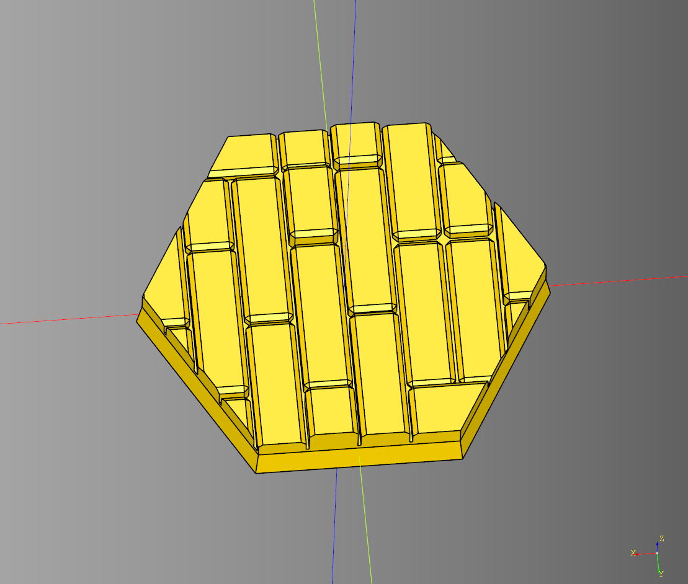

# Minibase

Collection is minibase shapes with magnet cutouts. 
The code for these is very simple most of these are just a loft operation.

- [Minibase](#minibase)
  - [Basic Bases](#basic-bases)
  - [Circle](#circle)
    - [Parameters](#parameters)
  - [Ellipse](#ellipse)
    - [Parameters](#parameters-1)
  - [Hexagon](#hexagon)
    - [Parameters](#parameters-2)
  - [make\_magnet\_outline](#make_magnet_outline)
    - [Parameters](#parameters-3)
  - [Rectangle](#rectangle)
    - [Parameters](#parameters-4)
  - [Slot](#slot)
    - [Parameters](#parameters-5)
  - [Uneven Bases](#uneven-bases)
  - [Circle Uneven](#circle-uneven)
    - [Parameters](#parameters-6)
  - [Ellipse Uneven](#ellipse-uneven)
    - [Parameters](#parameters-7)
  - [Hexagon Uneven](#hexagon-uneven)
    - [Parameters](#parameters-8)
  - [Rectangle Uneven](#rectangle-uneven)
    - [Parameters](#parameters-9)
  - [Slot Uneven](#slot-uneven)
    - [Parameters](#parameters-10)
  - [Wood Bases](#wood-bases)
  - [Circle Wood](#circle-wood)
    - [Parameters](#parameters-11)
  - [Ellipse Wood](#ellipse-wood)
    - [Parameters](#parameters-12)
  - [Hexagon Wood](#hexagon-wood)
    - [Parameters](#parameters-13)
  - [Rectangle Wood](#rectangle-wood)
    - [Parameters](#parameters-14)
  - [Slot Wood](#slot-wood)
    - [Parameters](#parameters-15)
  - [Irregular Bases](#irregular-bases)
  - [Circle Irregular](#circle-irregular)
    - [Parameters](#parameters-16)
  - [Ellipse Irregular](#ellipse-irregular)
    - [Parameters](#parameters-17)
  - [Hexagon Irregular](#hexagon-irregular)
    - [Parameters](#parameters-18)
  - [Rectangle Irregular](#rectangle-irregular)
    - [Parameters](#parameters-19)
  - [Slot Irregular](#slot-irregular)
    - [Parameters](#parameters-20)


---

## Basic Bases


* [example](../example/minibase/minibase_group.py)
* [stl](../stl/minibase_group.stl)

---

## Circle
### Parameters
* diameter: float
* height: float
* taper: float
* render_magnet: bool
* magnet_diameter: float
* magnet_height: float

``` python
result = circle(
    diameter = 25, 
    height = 3, 
    taper = -1,
    render_magnet = True, 
    magnet_diameter = 3, 
    magnet_height = 2
)
```

<br />

* [source](../src/cqterrain/minibase/circle.py)
* [example](../example/minibase/circle.py)
* [stl](../stl/minibase_circle.stl)

---

## Ellipse
### Parameters
* x_diameter: float
* y_diameter: float
* height: float
* taper: float
* render_magnet: bool
* magnet_diameter: float
* magnet_height: float

``` python
result = ellipse(
    x_diameter=52, 
    y_diameter=90, 
    height=3, 
    taper=-1,
    render_magnet = True,  
    magnet_diameter=3, 
    magnet_height=2
)
```

<br />

* [source](../src/cqterrain/minibase/ellipse.py)
* [example](../example/minibase/ellipse.py)
* [stl](../stl/minibase_ellipse.stl)

---

## Hexagon
### Parameters
* diameter: float
* height: float
* taper: float
* render_magnet: bool
* magnet_diameter: float
* magnet_height: float

``` python
result = hexagon(
    diameter = 25,
    height = 3, 
    taper = -1,
    render_magnet = True,  
    magnet_diameter = 3, 
    magnet_height = 2
)
```

<br />

* [source](../src/cqterrain/minibase/hexagon.py)
* [example](../example/minibase/hexagon.py)
* [stl](../stl/minibase_hexagon.stl)

---

## make_magnet_outline
Utility function for making the magnet cutouts for the bases.

### Parameters
* shape_height: float 
* magnet_diameter: float
* magnet_height: float

---

## Rectangle
### Parameters
* length: float
* width: float
* height: float
* taper: float
* render_magnet: bool
* magnet_diameter: float
* magnet_height: float

``` python
result = rectangle(
    length = 25, 
    width = 25, 
    height = 3, 
    taper = -1,
    render_magnet = True,  
    magnet_diameter = 3, 
    magnet_height = 2
)
```

<br />

* [source](../src/cqterrain/minibase/rectangle.py)
* [example](../example/minibase/rectangle.py)
* [stl](../stl/minibase_rectangle.stl)

---

## Slot
### Parameters
* length: float 
* width: float 
* height: float 
* taper: float 
* render_magnet: bool
* magnet_diameter: float 
* magnet_height: float

``` python
result = slot(
    length = 24, 
    width = 50, 
    height = 3, 
    taper = -1,
    render_magnet = True,  
    magnet_diameter = 3, 
    magnet_height = 2
)
```

<br />

* [source](../src/cqterrain/minibase/slot.py)
* [example](../example/minibase/slot.py)
* [stl](../stl/minibase_slot.stl)
  
---

## Uneven Bases


* [example](../example/minibase/minibase_group_uneven.py)
* [stl](../stl/minibase_group_uneven.stl)

---

## Circle Uneven

### Parameters
* diameter: float
* base_height: float
* taper: float
* render_magnet: bool  
* magnet_diameter: float 
* magnet_height: float
* detail_height: float
* uneven_height: float
* peak_count: tuple[int,int]|int
* segments: int
* seed: str

``` python
import cadquery as cq
from cqterrain.minibase import circle_uneven

ex_base = circle_uneven(
    diameter = 45,
    base_height = 3,
    taper = -1,
    render_magnet = True,  
    magnet_diameter = 3, 
    magnet_height = 2,
    detail_height = 3,
    uneven_height = 4,
    peak_count = (9,10),
    segments = 6,
    seed="red"
)

show_object(ex_base)
```

<br />

* [source](../src/cqterrain/minibase/circle_uneven.py)
* [example](../example/minibase/circle_uneven.py)
* [stl](../stl/minibase_circle_uneven.stl)

---

## Ellipse Uneven

### Parameters
* length: float
* width: float
* base_height: float
* taper: float
* render_magnet: bool  
* magnet_diameter: float 
* magnet_height: float
* detail_height: float
* uneven_height: float
* peak_count: tuple[int,int]|int
* segments: int
* seed: str

``` python
import cadquery as cq
from cqterrain.minibase import ellipse_uneven

ex_base = ellipse_uneven(
    length = 40,
    width = 40,
    base_height = 3,
    taper = -1,
    render_magnet = True,  
    magnet_diameter = 3, 
    magnet_height = 2,
    detail_height = 3,
    uneven_height = 4,
    peak_count = (9,10),
    segments = 6,
    seed="red"
)

show_object(ex_base)
```

<br />

* [source](../src/cqterrain/minibase/ellipse_uneven.py)
* [example](../example/minibase/ellipse_uneven.py)
* [stl](../stl/minibase_ellipse_uneven.stl)

---

## Hexagon Uneven

### Parameters
* diameter: float
* base_height: float
* taper: float
* render_magnet: bool  
* magnet_diameter: float 
* magnet_height: float
* detail_height: float
* uneven_height: float
* peak_count: tuple[int,int]|int
* segments: int
* seed: str

``` python
import cadquery as cq
from cqterrain.minibase import hexagon_uneven

ex_base = hexagon_uneven(
    diameter = 45,
    base_height = 3,
    taper = -1,
    render_magnet = True,  
    magnet_diameter = 3, 
    magnet_height = 2,
    detail_height = 3,
    uneven_height = 4,
    peak_count = (9,10),
    segments = 6,
    seed="red"
)

show_object(ex_base)
```

<br />

* [source](../src/cqterrain/minibase/hexagon_uneven.py)
* [example](../example/minibase/hexagon_uneven.py)
* [stl](../stl/minibase_hexagon_uneven.stl)

---

## Rectangle Uneven

### Parameters
* length: float
* width: float
* base_height: float
* taper: float
* render_magnet: bool  
* magnet_diameter: float 
* magnet_height: float
* detail_height: float
* uneven_height: float
* peak_count: tuple[int,int]|int
* segments: int
* seed: str

``` python
import cadquery as cq
from cqterrain.minibase import rectangle_uneven

ex_base = rectangle_uneven(
    length = 40,
    width = 40,
    base_height = 3,
    taper = -1,
    render_magnet = True,  
    magnet_diameter = 3, 
    magnet_height = 2,
    detail_height = 3,
    uneven_height = 4,
    peak_count = (9,10),
    segments = 6,
    seed="red"
)

show_object(ex_base)
```

<br />

* [source](../src/cqterrain/minibase/rectangle_uneven.py)
* [example](../example/minibase/rectangle_uneven.py)
* [stl](../stl/minibase_rectangle_uneven.stl)

---

## Slot Uneven

### Parameters
* length: float
* width: float
* base_height: float
* taper: float
* render_magnet: bool  
* magnet_diameter: float 
* magnet_height: float
* detail_height: float
* uneven_height: float
* peak_count: tuple[int,int]|int
* segments: int
* seed: str

``` python
import cadquery as cq
from cqterrain.minibase import slot_uneven

ex_base = slot_uneven(
    length = 75,
    width = 25,
    base_height = 3,
    taper = -1,
    render_magnet = True,  
    magnet_diameter = 3, 
    magnet_height = 2,
    detail_height = 3,
    uneven_height = 4,
    peak_count = (9,10),
    segments = 6,
    seed="red"
)

show_object(ex_base)
```

<br />

* [source](../src/cqterrain/minibase/slot_uneven.py)
* [example](../example/minibase/slot_uneven.py)
* [stl](../stl/minibase_slot_uneven.stl)

---

## Wood Bases

<br />

---

## Circle Wood

### Parameters
* diameter: float
* base_height: float
* taper: float
* render_magnet: bool  
* magnet_diameter: float
* magnet_height: float
* board_height: float
* overlap: float
* seed: str
* joist_space: float
* board_width: float
* board_width_spacer: float
* board_break_width: float
* nail_diameter: float
* nail_overlap_height: float
* joist_width: float
* debug: bool

``` python
import cadquery as cq
from cqterrain.minibase import circle_wood

ex_base = circle_wood(    
    diameter = 40,
    base_height = 3,
    taper = -1,
    render_magnet = True,  
    magnet_diameter = 3, 
    magnet_height = 2,
    board_height = 1,
    overlap = 20,
    seed = "seed",
    joist_space = 12.5,
    board_width = 6.5,
    board_width_spacer = .2,
    board_break_width = .4,
    nail_diameter = .6,
    nail_overlap_height = .4,
    joist_width = 4,
    debug = False
)

show_object(ex_base)
```

<br />

* [source](../src/cqterrain/minibase/circle_wood.py)
* [example](../example/minibase/circle_wood.py)
* [stl](../stl/minibase_circle_wood.stl)

---

## Ellipse Wood

### Parameters
* x_diameter: float
* y_diameter: float
* base_height: float
* taper: float
* render_magnet: bool  
* magnet_diameter: float
* magnet_height: float
* board_height: float
* overlap: float
* seed: str
* joist_space: float
* board_width: float
* board_width_spacer: float
* board_break_width: float
* nail_diameter: float
* nail_overlap_height: float
* joist_width: float
* debug: bool

``` python
import cadquery as cq
from cqterrain.minibase import ellipse_wood

ex_base = ellipse_wood(    
    x_diameter = 52, 
    y_diameter = 90, 
    base_height = 3,
    taper = -1,
    render_magnet = True,  
    magnet_diameter = 3, 
    magnet_height = 2,
    board_height = 1,
    overlap = 20,
    seed = "seed",
    joist_space = 12.5,
    board_width = 6.5,
    board_width_spacer = .2,
    board_break_width = .4,
    nail_diameter = .6,
    nail_overlap_height = .4,
    joist_width = 4,
    debug = False
)

show_object(ex_base)
```

<br />

* [source](../src/cqterrain/minibase/ellipse_wood.py)
* [example](../example/minibase/ellipse_wood.py)
* [stl](../stl/minibase_ellipse_wood.stl)

---

## Hexagon Wood

### Parameters
* diameter: float
* base_height: float
* taper: float
* render_magnet: bool  
* magnet_diameter: float
* magnet_height: float
* board_height: float
* overlap: float
* seed: str
* joist_space: float
* board_width: float
* board_width_spacer: float
* board_break_width: float
* nail_diameter: float
* nail_overlap_height: float
* joist_width: float
* debug: bool

``` python
import cadquery as cq
from cqterrain.minibase import hexagon_wood

ex_base = hexagon_wood(    
    diameter = 40,
    base_height = 3,
    taper = -1,
    render_magnet = True,  
    magnet_diameter = 3, 
    magnet_height = 2,
    board_height = 1,
    overlap = 20,
    seed = "seed",
    joist_space = 12.5,
    board_width = 6.5,
    board_width_spacer = .2,
    board_break_width = .4,
    nail_diameter = .6,
    nail_overlap_height = .4,
    joist_width = 4,
    debug = False
)

show_object(ex_base)
```

<br />

* [source](../src/cqterrain/minibase/hexagon_wood.py)
* [example](../example/minibase/hexagon_wood.py)
* [stl](../stl/minibase_hexagon_wood.stl)

---

## Rectangle Wood

### Parameters
* length: float
* width: float
* base_height: float
* taper: float
* render_magnet: bool  
* magnet_diameter: float
* magnet_height: float
* board_height: float
* overlap: float
* seed: str
* joist_space: float
* board_width: float
* board_width_spacer: float
* board_break_width: float
* nail_diameter: float
* nail_overlap_height: float
* joist_width: float
* debug: bool

``` python
import cadquery as cq
from cqterrain.minibase import rectangle_wood

ex_base = rectangle_wood(
    length = 40,
    width = 40,
    base_height = 3,
    taper = -1,
    render_magnet = True,  
    magnet_diameter = 3, 
    magnet_height = 2,
    board_height = 1,
    overlap = 20,
    seed = "seed",
    joist_space = 12.5,
    board_width = 6.5,
    board_width_spacer = .2,
    board_break_width = .4,
    nail_diameter = .6,
    nail_overlap_height = .4,
    joist_width = 4,
    debug = False
)

show_object(ex_base)
```

<br />

* [source](../src/cqterrain/minibase/rectangle_wood.py)
* [example](../example/minibase/rectangle_wood.py)
* [stl](../stl/minibase_rectangle_wood.stl)

---

## Slot Wood

### Parameters
* length: float
* width: float
* base_height: float
* taper: float
* render_magnet: bool  
* magnet_diameter: float
* magnet_height: float
* board_height: float
* overlap: float
* seed: str
* joist_space: float
* board_width: float
* board_width_spacer: float
* board_break_width: float
* nail_diameter: float
* nail_overlap_height: float
* joist_width: float
* debug: bool

``` python
import cadquery as cq
from cqterrain.minibase import slot_wood

ex_base = slot_wood(
    length = 75,
    width = 30,
    base_height = 3,
    taper = -1,
    render_magnet = True,  
    magnet_diameter = 3, 
    magnet_height = 2,
    board_height = 1,
    overlap = 20,
    seed = "seed",
    joist_space = 12.5,
    board_width = 6.5,
    board_width_spacer = .2,
    board_break_width = .4,
    nail_diameter = .6,
    nail_overlap_height = .4,
    joist_width = 4,
    debug = False
)

show_object(ex_base)
```

<br />

* [source](../src/cqterrain/minibase/slot_wood.py)
* [example](../example/minibase/slot_wood.py)
* [stl](../stl/minibase_slot_wood.stl)

---


## Irregular Bases

<br />

---

## Circle Irregular

### Parameters
* diameter: float
* base_height: float
* taper: float
* render_magnet: bool 
* magnet_diameter: float
* magnet_height
* min_height: float
* max_height: float
* overlap: float
* col_size: float
* row_size: float
* max_columns: int
* max_rows: int
* passes_count: int
* seed: str
* tile_styles: list
* debug: bool

``` python
import cadquery as cq
from cqterrain.minibase import circle_irregular

def custom_item(length, width, height):
    return (
        cq.Workplane("XY")
        .box(length-.3, width-.3, height)
        .chamfer(0.5)
    )

ex_base = circle_irregular(
    diameter = 40, 
    base_height = 3, 
    taper = -1,
    render_magnet = True,  
    magnet_diameter = 3, 
    magnet_height = 2,
    min_height = 1,
    max_height = 3.5,
    overlap = 20,
    col_size = 5,
    row_size = 8,
    max_columns = 2,
    max_rows = 2,
    passes_count = 3000,
    seed = "seed",
    tile_styles = [custom_item],
    debug = False
)

show_object(ex_base)
```

<br />

* [source](../src/cqterrain/minibase/circle_irregular.py)
* [example](../example/minibase/circle_irregular.py)
* [stl](../stl/minibase_circle_irregular.stl)

---

## Ellipse Irregular

### Parameters
* x_diameter: float
* y_diameter: float
* base_height: float
* taper: float
* render_magnet: bool 
* magnet_diameter: float
* magnet_height
* min_height: float
* max_height: float
* overlap: float
* col_size: float
* row_size: float
* max_columns: int
* max_rows: int
* passes_count: int
* seed: str
* tile_styles: list
* debug: bool


``` python

```

<br />

* [source](../src/cqterrain/minibase/ellipse_irregular.py)
* [example](../example/minibase/ellipse_irregular.py)
* [stl](../stl/minibase_ellipse_irregular.stl)

---

## Hexagon Irregular

### Parameters
* diameter: float
* base_height: float
* taper: float
* render_magnet: bool 
* magnet_diameter: float
* magnet_height
* min_height: float
* max_height: float
* overlap: float
* col_size: float
* row_size: float
* max_columns: int
* max_rows: int
* passes_count: int
* seed: str
* tile_styles: list
* debug: bool


``` python
import cadquery as cq
from cqterrain.minibase import hexagon_irregular

def custom_item(length, width, height):
    return (
        cq.Workplane("XY")
        .box(length-.3, width-.3, height)
        .chamfer(0.5)
    )

ex_base = hexagon_irregular(
    diameter = 40,
    base_height = 3, 
    taper = -1,
    render_magnet = True,  
    magnet_diameter = 3, 
    magnet_height = 2,
    min_height = 1,
    max_height = 3.5,
    overlap = 20,
    col_size = 5,
    row_size = 8,
    max_columns = 2,
    max_rows = 2,
    passes_count = 3000,
    seed = "seed",
    tile_styles = [custom_item],
    debug = False
)

show_object(ex_base)
```

<br />

* [source](../src/cqterrain/minibase/hexagon_irregular.py)
* [example](../example/minibase/hexagon_irregular.py)
* [stl](../stl/minibase_hexagon_irregular.stl)

---

## Rectangle Irregular

### Parameters
* length: float
* base_height: float
* taper: float
* render_magnet: bool 
* magnet_diameter: float
* magnet_height
* min_height: float
* max_height: float
* overlap: float
* col_size: float
* row_size: float
* max_columns: int
* max_rows: int
* passes_count: int
* seed: str
* tile_styles: list
* debug: bool


``` python
import cadquery as cq
from cqterrain.minibase import rectangle_irregular

def custom_item(length, width, height):
    return (
        cq.Workplane("XY")
        .box(length-.3, width-.3, height)
        .chamfer(0.5)
    )

ex_base = rectangle_irregular(
    length = 40,
    width = 40,
    base_height = 3, 
    taper = -1,
    render_magnet = True,  
    magnet_diameter = 3, 
    magnet_height = 2,
    min_height = 1,
    max_height = 3.5,
    overlap = 20,
    col_size = 5,
    row_size = 8,
    max_columns = 2,
    max_rows = 2,
    passes_count = 3000,
    seed = "seed",
    tile_styles = [custom_item],
    debug = False
)

show_object(ex_base)
```

<br />

* [source](../src/cqterrain/minibase/rectangle_irregular.py)
* [example](../example/minibase/rectangle_irregular.py)
* [stl](../stl/minibase_rectangle_irregular.stl)

---

## Slot Irregular

### Parameters
* length: float
* base_height: float
* taper: float
* render_magnet: bool 
* magnet_diameter: float
* magnet_height
* min_height: float
* max_height: float
* overlap: float
* col_size: float
* row_size: float
* max_columns: int
* max_rows: int
* passes_count: int
* seed: str
* tile_styles: list
* debug: bool


``` python
import cadquery as cq
from cqterrain.minibase import slot_irregular

def custom_item(length, width, height):
    return (
        cq.Workplane("XY")
        .box(length-.3, width-.3, height)
        .chamfer(0.5)
    )

ex_base = slot_irregular(
    length = 75,
    width = 30,
    base_height = 3, 
    taper = -1,
    render_magnet = True,  
    magnet_diameter = 3, 
    magnet_height = 2,
    min_height = 1,
    max_height = 3.5,
    overlap = 20,
    col_size = 5,
    row_size = 8,
    max_columns = 2,
    max_rows = 2,
    passes_count = 3000,
    seed = "seed",
    tile_styles = [custom_item],
    debug = False
)

show_object(ex_base)
```

<br />

* [source](../src/cqterrain/minibase/slot_irregular.py)
* [example](../example/minibase/slot_irregular.py)
* [stl](../stl/minibase_slot_irregular.stl)

---