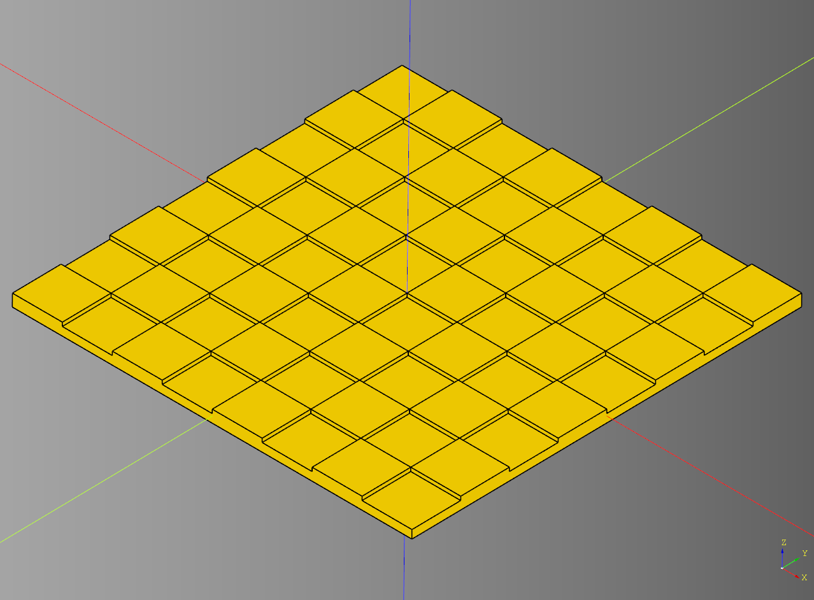
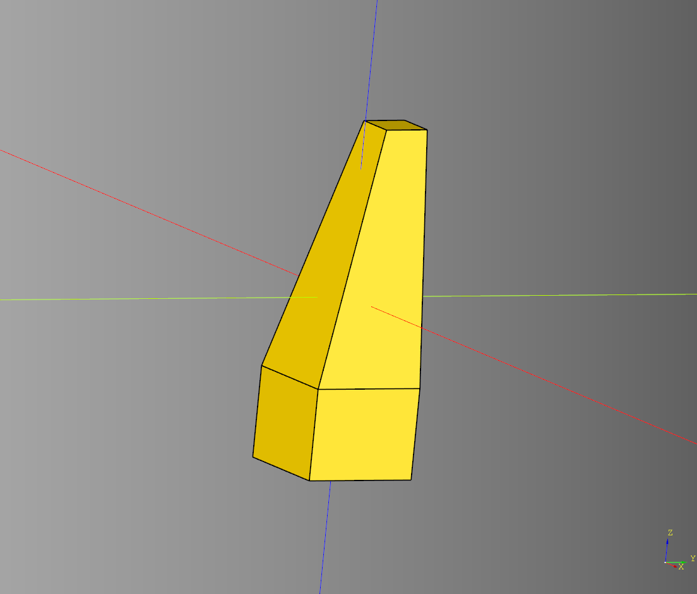

# Miscellaneous

## Board
### parameters
* length: float
* width: float
* height: float
* x_count: int
* y_count: int
* shell: float
* height_offset: float

``` python
board_bp = Board()
board_bp.length = 260
board_bp.width = 260
board_bp.height = 8
board_bp.x_count = 8
board_bp.y_count = 8
board_bp.shell = 1.5
board_bp.height_offset = 2.5
```



* [source](../src/cqterrain/board.py)
* [example](../example/board.py)
* [stl](../stl/board_ex_full.stl)

---

## Ladder
### parameters
* length: float
* width: float
* height: float
* rail_width: float
* rung_height: float
* rung_width: float 
* rung_padding: float
* make_rung: Callable[[float,float,float],cq.Workplane]
* make_rail: Callable[[float,float,float],cq.Workplane]

``` python
    bp_ladder = Ladder()
    bp_ladder.length = 25
    bp_ladder.width = 4
    bp_ladder.height = 50
    bp_ladder.rail_width = 2
    bp_ladder.rung_height = 2
    bp_ladder.rung_width = 2
    bp_ladder.rung_padding = 6

    bp_ladder.make()
    result = bp_ladder.build()
```


* [source](../src/cqterrain/ladder.py)
* [example](../example/ladder.py)
* [stl](../stl/ladder.stl)

---

## Obelisk

### parameters
* base_width: float
* base_height: float
* inset_width: float
* inset_height: float
* mid_width: float
* mid_height: float
* top_width: float
* top_height: float
* height: float
* faces: int
* intersect: bool

``` python
dwarven = obelisk(
    base_width=30,
    base_height=5,
    inset_width=25,
    mid_width=25,
    mid_height=5,
    height=105,
    faces=6,
    intersect=True
)
```


* [source](../src/cqterrain/obelisk.py)
* [example](../example/obelisk.py)
* [stl](../stl/obelisk.stl)
* [Streamlit app](https://obeliskterrain.streamlit.app/)

---

## Support

### parameters
* length: float 
* width: float 
* height: float 
* inner_height: float 
* inner_length: float 
* inner_width: float 
* top_offset: float

``` python
result = support(
    length = 10, 
    width = 10, 
    height = 30, 
    inner_height = 8, 
    inner_length = 4, 
    inner_width = 4, 
    top_offset = 0
)
```



* [source](../src/cqterrain/support.py)
* [example](../example/support.py)
* [stl](../stl/support.stl)
