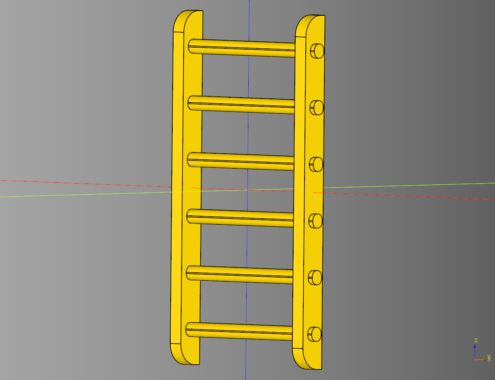

# Miscellaneous

## Door
### parameters
* length: float 
* width: float 
* frame_length: float 
* frame_height: float 
* inner_width: float 
* height: float 
* x_offset: float

``` python
    bp_door = Door()
    bp_door.length = 25
    bp_door.width = 8
    bp_door.frame_length = 3 
    bp_door.frame_height = 4
    bp_door.inner_width = 3
    bp_door.height  = 40
    bp_door.x_offset = 0

    bp_door.make()
    result = bp_door.build()
```


* [source](../src/cqterrain/door.py)
* [example](../example/door.py)
* [stl](../stl/door.stl)

## Ladder
### parameters
* length: float
* width: float
* height: float
* rail_width: float
* rung_height: float
* rung_width: float 
* rung_padding: float
* make_rung: Callable[[float,float,float],cq.Workplane]
* make_rail: Callable[[float,float,float],cq.Workplane]

``` python
    bp_ladder = Ladder()
    bp_ladder.length = 25
    bp_ladder.width = 4
    bp_ladder.height = 50
    bp_ladder.rail_width = 2
    bp_ladder.rung_height = 2
    bp_ladder.rung_width = 2
    bp_ladder.rung_padding = 6

    bp_ladder.make()
    result = bp_ladder.build()
```



* [source](../src/cqterrain/ladder.py)
* [example](../example/ladder.py)
* [stl](../stl/ladder.stl)

## Obelisk


### parameters
* base_width: float
* base_height: float
* inset_width: float
* inset_height: float
* mid_width: float
* mid_height: float
* top_width: float
* top_height: float
* height: float
* faces: int
* intersect: bool

``` python
dwarven = obelisk(
    base_width=30,
    base_height=5,
    inset_width=25,
    mid_width=25,
    mid_height=5,
    height=105,
    faces=6,
    intersect=True
)
```


* [source](../src/cqterrain/obelisk.py)
* [example](../example/obelisk.py)
* [stl](../stl/obelisk.stl)
* [Streamlit app](https://obeliskterrain.streamlit.app/)

## stone.make_stones

Create a sparse pattern of the given parts. 
This method of generation should be relatively performant.

### parameters
* parts: list[cq.Workplane]
* dim: list[float]
* rows: int
* columns: int
* seed: str

``` python
tile = cq.Workplane("XY").box(5,5,2).chamfer(0.8)
tile2 = cq.Workplane("XY").box(4,4,2).fillet(.5)
tile3 = cq.Workplane("XY").box(3,6,2).chamfer(0.5)
tiles = stone.make_stones(
    [
        tile, 
        tile2, 
        tile3
    ], 
    [6,6,2], 
    columns = 10, 
    rows = 3,
    seed = "test4"
)
```


* [source](../src/cqterrain/stone.py)
* [example](../example/stones.py)
* [stl](../stl/stones.stl)
