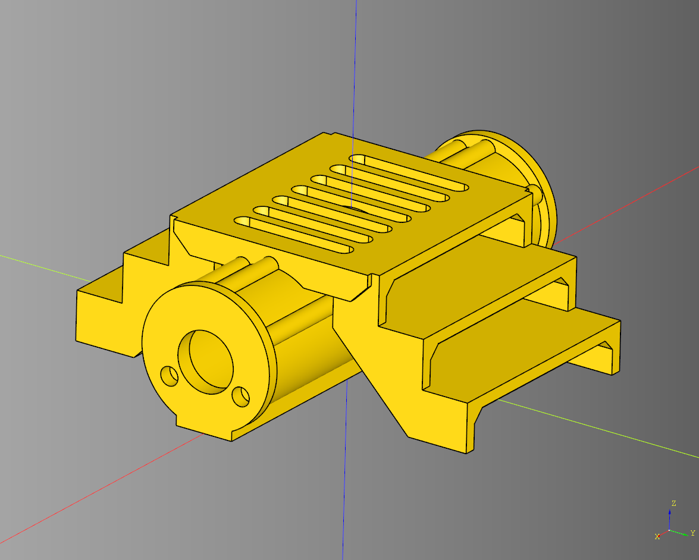

# Pipe

- [Pipe](#pipe)
  - [Corrugated Straight](#corrugated-straight)
    - [Parameters](#parameters)
  - [Pipe Curve](#pipe-curve)
    - [Parameters](#parameters-1)
  - [Pipe End](#pipe-end)
    - [Parameters](#parameters-2)
  - [Pipe Hatch](#pipe-hatch)
    - [Parameters](#parameters-3)
  - [Pipe Platform](#pipe-platform)
    - [Parameters](#parameters-4)
  - [Pipe Straight](#pipe-straight)
    - [Parameters](#parameters-5)

---

## Corrugated Straight
### Parameters
* length: float
* radius: float
* inner_radius: float
* segment_length: float
* space: float

``` python
import cadquery as cq
from cqterrain import pipe

result = pipe.corrugated_straight(
    length = 50,
    radius = 4,
    inner_radius = 3,
    segment_length = 6,
    space = 4
)
show_object(result)
```

<br />

* [source](../src/cqterrain/pipe/corrugated.py)
* [example](../example/pipe/pipe_corrugated.py)
* [stl](../stl/pipe_corrugated.stl)

---

## Pipe Curve

### Parameters
* radius: float 
* rotation_angle: float


``` python
import cadquery as cq
from cqterrain import pipe

curve1, curve2 =  pipe.curve(
    radius = 75, 
    rotation_angle = -30
)

show_object(curve1)
show_object(curve2)
```

<br />

* [source](../src/cqterrain/pipe/curve.py)
* [example](../example/pipe/pipeCurve.py)
* [stl](../stl/pipe_curve_left.stl)
* [stl](../stl/pipe_curve_right.stl)

---
## Pipe End

### Parameters

``` python
import cadquery as cq
from cqterrain import pipe

end_cap = pipe.end()


show_object(end_cap)
```

<br />

* [source](../src/cqterrain/pipe/end.py)
* [example](../example/pipe/pipeEnd.py)
* [stl](../stl/pipe_end.stl)

---

## Pipe Hatch

### Parameters
* connector: cq.Workplane 
* radius: float
* height: float
* bolt_number: int 
* bolt_radius: float
* bolt_height: float
* bolt_padding: float
* center_radius: float
* center_height: float
* center_cut_height: float

``` python
import cadquery as cq
from cqterrain import pipe
from cqterrain.barrier import (
    cut_magnets
)

con_height = 4
con = pipe.connector(
    length = con_height, 
    radius = 11.5, 
    face_height = 23
)

h_ex = pipe.hatch(
    con,
    height=con_height
).rotate((0,1,0),(0,0,0),-90).translate((0,0,12)).rotate((0,0,1),(0,0,0),180)

hatch_magnets = cut_magnets(
        h_ex,
        y_offset = 0,
        z_lift = 6,
        x_plus_cut = True,
        x_minus_cut = False,
        debug=False
    )

show_object(hatch_magnets.rotate((0,0,1),(0,0,0),180))
```

<br />

* [source](../src/cqterrain/pipe/hatch.py)
* [example](../example/pipe/pipeHatch.py)
* [stl](../stl/pipe_hatch.stl)

---
## Pipe Platform

### Parameters
* top_length: float 
* stair_y_distance: float
* straight_pipe: cq.Workplane|None
* render_hollow: bool
* render_through_hole: bool

``` python
import cadquery as cq
from cqterrain import pipe

ex_platform = pipe.platform(
    top_length = 42, 
    stair_y_distance = 23,
    straight_pipe= None,
    render_hollow = True,
    render_through_hole = True
)

show_object(ex_platform)
```

<br />

* [source](../src/cqterrain/pipe/platform.py)
* [example](../example/pipe/pipePlatform.py)
* [stl](../stl/pipe_platform_pipe.stl)

---

## Pipe Straight

### Parameters
* length: float 
* connector_length: float
* connector_radius: float
* render_hollow: bool
* hollow_padding: float
* hollow_radius_padding: float
* render_through_hole: bool
* through_radius: float
* debug_magnets: bool

``` python
import cadquery as cq
from cqterrain import pipe

pipe_line = pipe.straight(
    length = 75, 
    connector_length=2, 
    connector_radius = 11.5,
    render_hollow=False,
    render_through_hole=False
)

show_object(pipe_line)
```

<br />

* [source](../src/cqterrain/pipe/straight.py)
* [example](../example/pipe/pipeStraight.py)
* [stl](../stl/pipe_straight.stl)

---