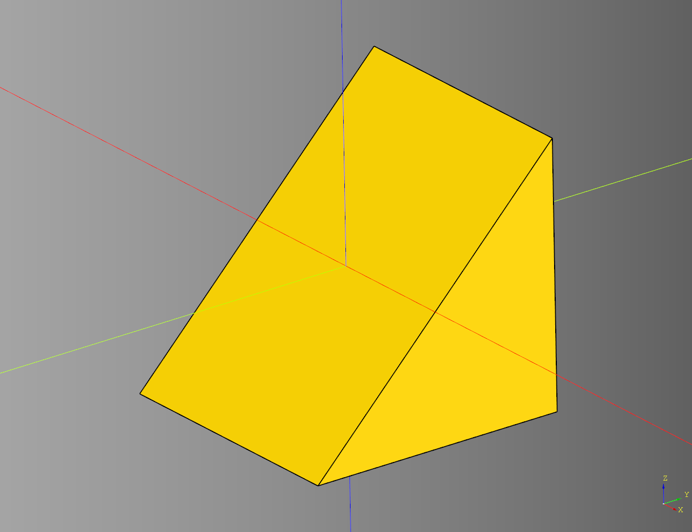
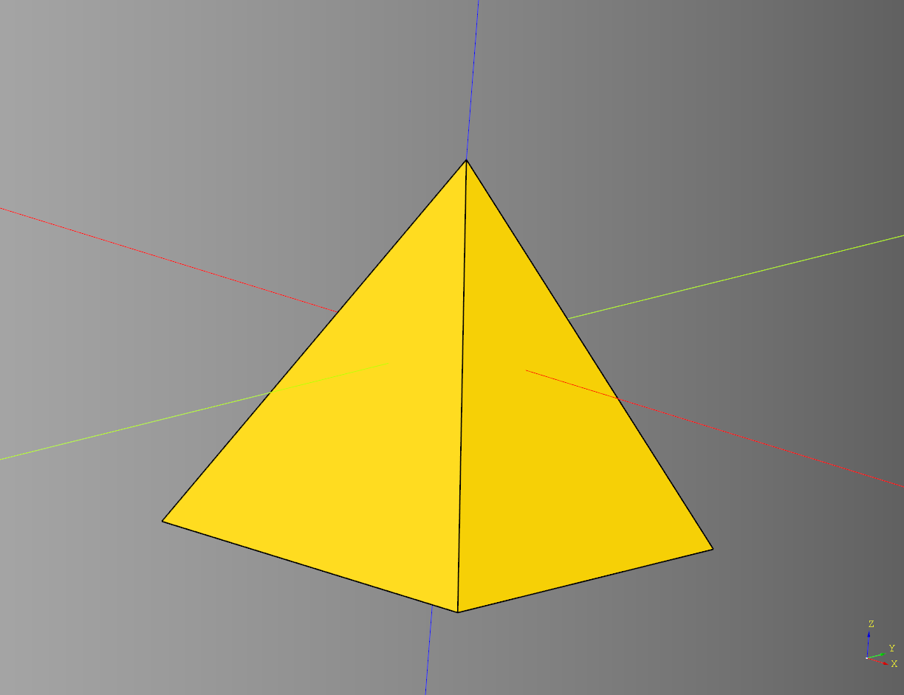
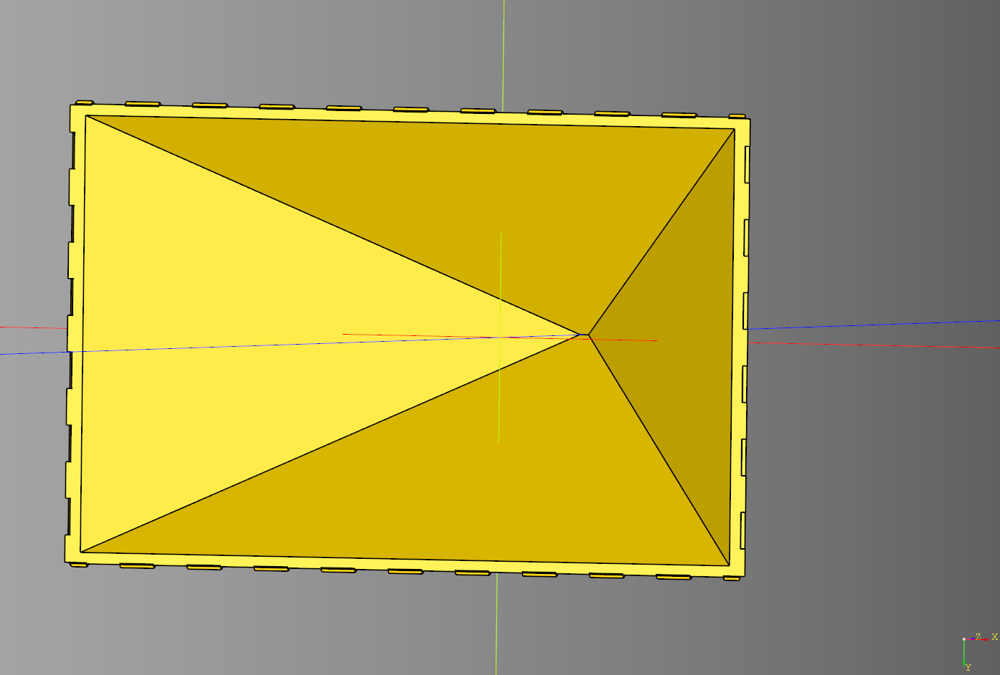
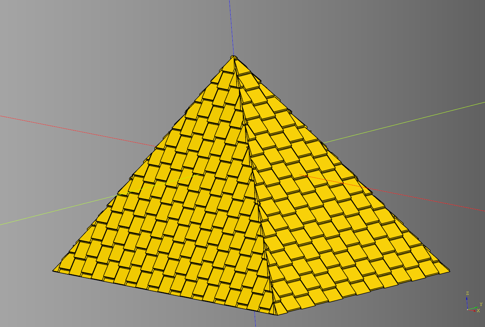

# Roof

- [Roof](#roof)
  - [Angle](#angle)
    - [parameters](#parameters)
    - [returns](#returns)
  - [Gable](#gable)
    - [parameters](#parameters-1)
  - [Hip](#hip)
    - [parameters](#parameters-2)
  - [Shell](#shell)
    - [parameters](#parameters-3)
  - [Tiles](#tiles)
    - [parameters](#parameters-4)


---

## Angle

utility function finds the hypotenuse of a right triangle.

### parameters
* length: float 
* height: float

### returns
* float - the hypotenuse

* [source](../src/cqterrain/roof/angle.py)

## Gable
### parameters
* length:float 
* width:float 
* height:float

``` python
result = roof.gable(
    length = 40, 
    width = 40, 
    height = 40
)
```

<br />

* [source](../src/cqterrain/roof/gable.py)
* [example](../example/roof/gable.py)
* [stl](../stl/roof_gable.stl)

## Hip

### parameters
* length: float
* width: float
* top: float
* left: float
* right: float
* height: float

``` python
result = roof.hip(
    length = 40, 
    width = 40, 
    top = 0, 
    left = 0, 
    right = 0, 
    height = 40
)
```

<br />

* [source](../src/cqterrain/roof/hip.py)
* [example](../example/roof/hip.py)
* [stl](../stl/roof_hip.stl)

## Shell

Helper function for making a shell of the given part.

### parameters
* part: cq.Workplane 
* face: str 
* width: float

``` python
result = roof.shell(roof_ex, "-Z", -1)
```

<br />

* [source](../src/cqterrain/roof/shell.py)

## Tiles

Helper function for repeating the given tile along the slope of a face.
**Note** this method runs slow. Ideally apply this via a feature flag that can be toggled on when needed.

### parameters
* tile: cq.Workplane
* face: cq.Workplane
* x: float
* height: float
* t_length: float
* t_width: float
* angle: float 
* odd_col_push: list 
* rows: int
* debug: bool
* intersect: bool

``` python
tiles = roof.tiles(
    tile, 
    face_x, 
    length, 
    height, 
    t_length, 
    t_width, 
    angle_x, 
    rows=tile_rows, 
    odd_col_push=[1,0]
)
```

<br />

* [source](../src/cqterrain/roof/tiles.py)
* [example](../example/roof/roof.py)
* [stl](../stl/roof.stl)
