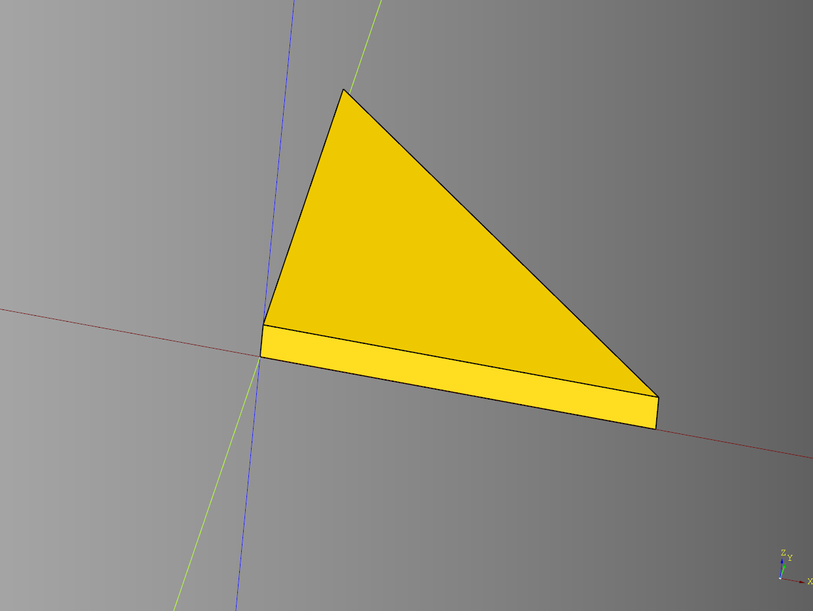
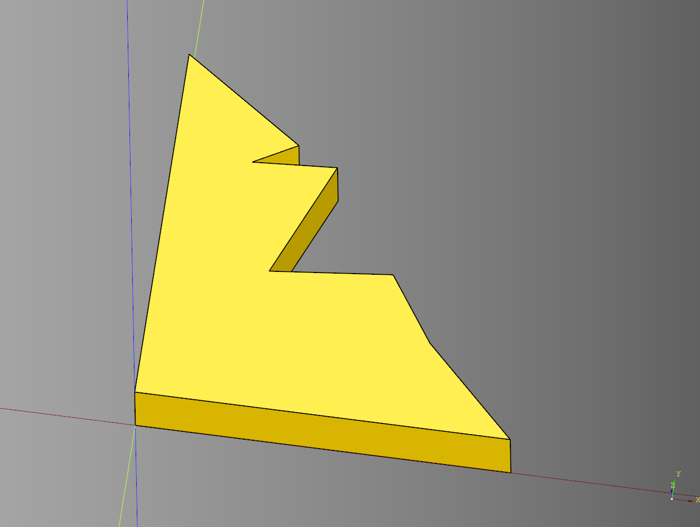
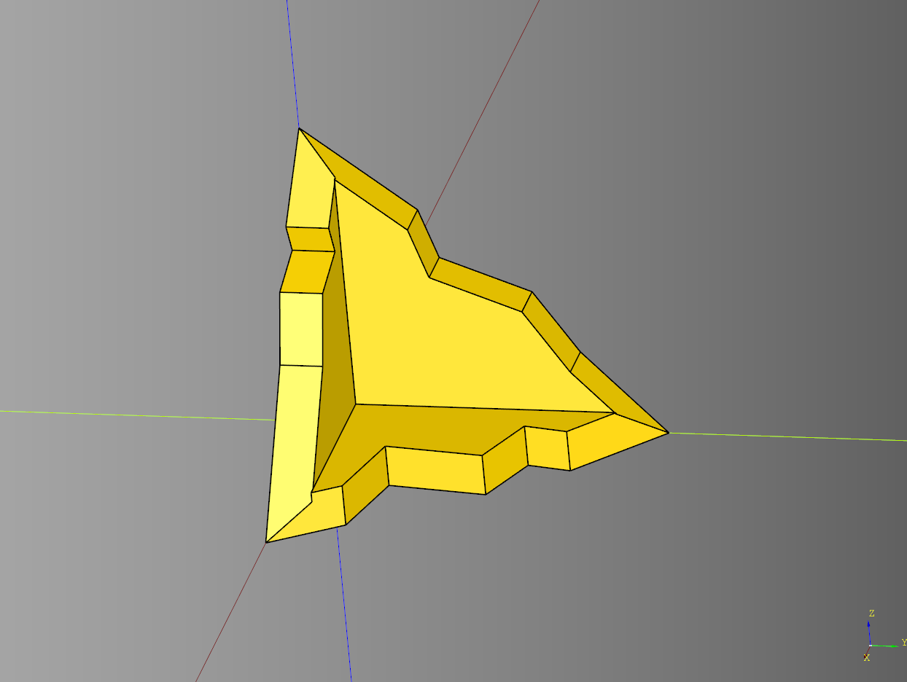
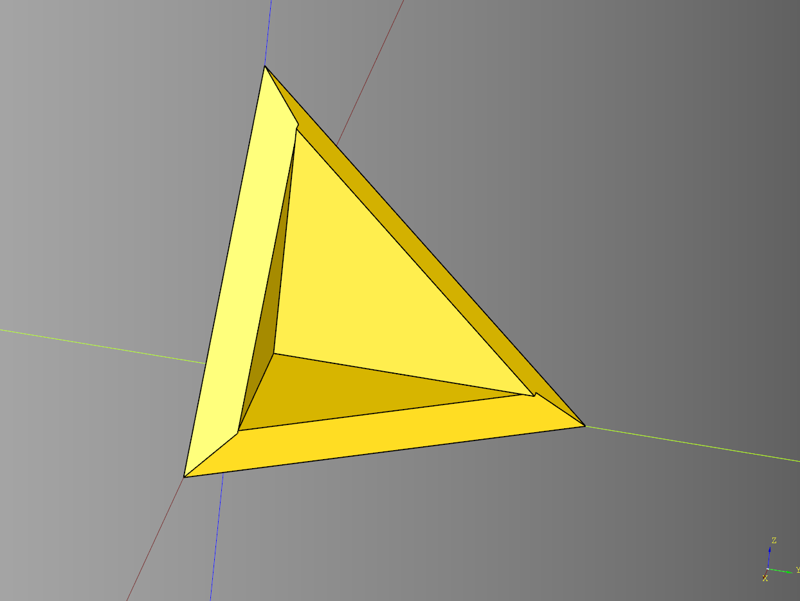

# Ruin 

---

## Corner

### parameters
* length: float
* width: float
* height: float

``` python
import cadquery as cq
from cqterrain.ruin import corner

result = corner(
    length=50, 
    width=50, 
    height=5  
)

show_object(result)
```



* [source](../src/cqterrain/ruin/corner.py)
* [example](../example/ruin/corner.py)
* [stl](../stl/ruin_corner.stl)

---

## Ruin Corner

### parameters
* length: float
* width: float
* height: float
* points: int
* adjustments: list[tuple[float,float]]
* debug: bool

``` python
import cadquery as cq
from cqterrain.ruin import ruin_corner

result = ruin_corner(
    length = 50, 
    width = 50, 
    height = 10, 
    points = 7,
    adjustments = [(10,-5),(-2,-2),(3,5),(-10,-5),(0,3)],
    debug = False
)

show_object(result)
```



* [source](../src/cqterrain/ruin/ruin_corner.py)
* [example](../example/ruin/ruin_corner.py)
* [stl](../stl/ruin_ruin_corner.stl)

---

## Ruin Three Wall Corner

### parameters
* length: float
* width: float
* height: float
* wall_width: float
* base_points: int
* base_adjustments: list[tuple[float,float]]
* x_points: int = 3,
* x_adjustments: list[tuple[float,float]]
* y_points: int = 4,
* y_adjustments: list[tuple[float,float]]

``` python
import cadquery as cq
from cqterrain.ruin import ruin_three_wall_corner

ex_three_wall_corner = ruin_three_wall_corner(
    length = 60, 
    width = 80, 
    height = 75, 
    wall_width = 10,
    base_points = 5,
    base_adjustments = [(10,-5),(-2,-2),(3,5),(-10,-5),(0,3)],
    x_points = 6,
    x_adjustments = [(10,-5),(-2,-2),(3,5)],
    y_points = 4,
    y_adjustments = [(10,-5),(-2,-2),(3,5),(-3,5)]
)

show_object(ex_three_wall_corner)
```



* [source](../src/cqterrain/ruin/ruin_three_wall_corner.py)
* [example](../example/ruin/ruin_three_wall_corner.py)
* [stl](../stl/ruin_ruin_three_wall_corner.stl)

---

## Three Wall Corner

### parameters 
* length: float
* width: float
* height: float 
* wall_width: float

``` python
import cadquery as cq
from cqterrain.ruin import three_wall_corner

ex_three_wall_corner = three_wall_corner(
    length = 60, 
    width = 80, 
    height = 75, 
    wall_width = 10
)

show_object(ex_three_wall_corner)
```



* [source](../src/cqterrain/ruin/three_wall_corner.py)
* [example](../example/ruin/three_wall_corner.py)
* [stl](../stl/ruin_three_wall_corner.stl)

---
