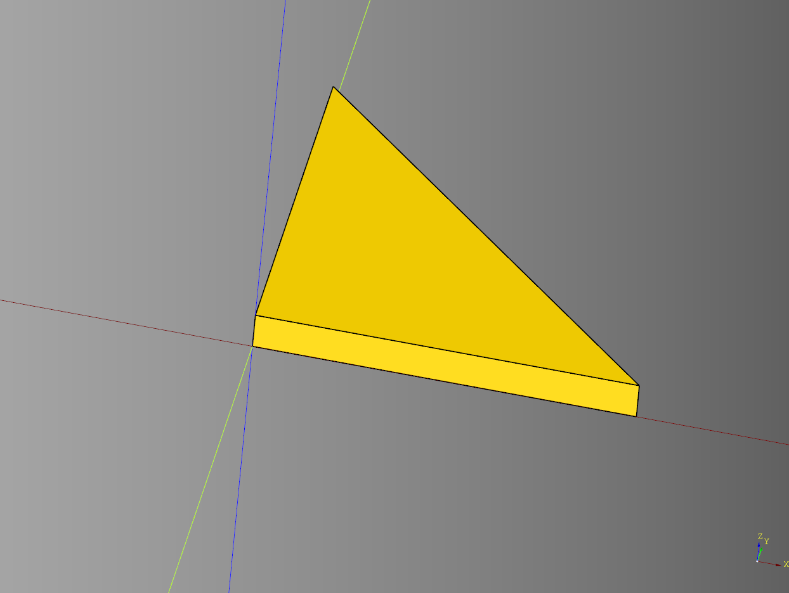
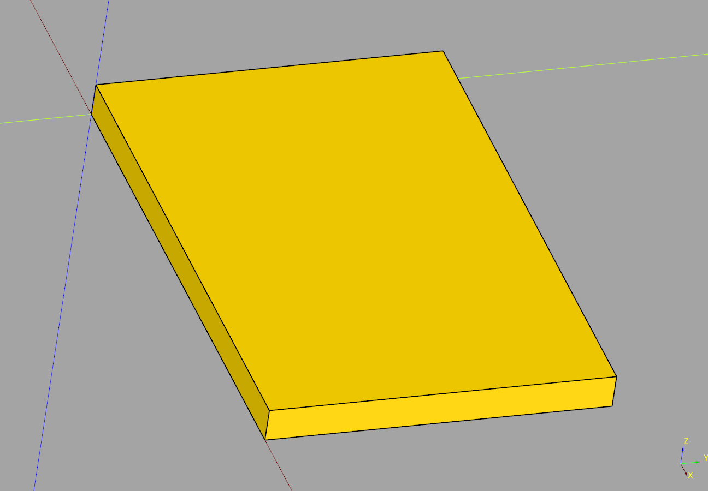
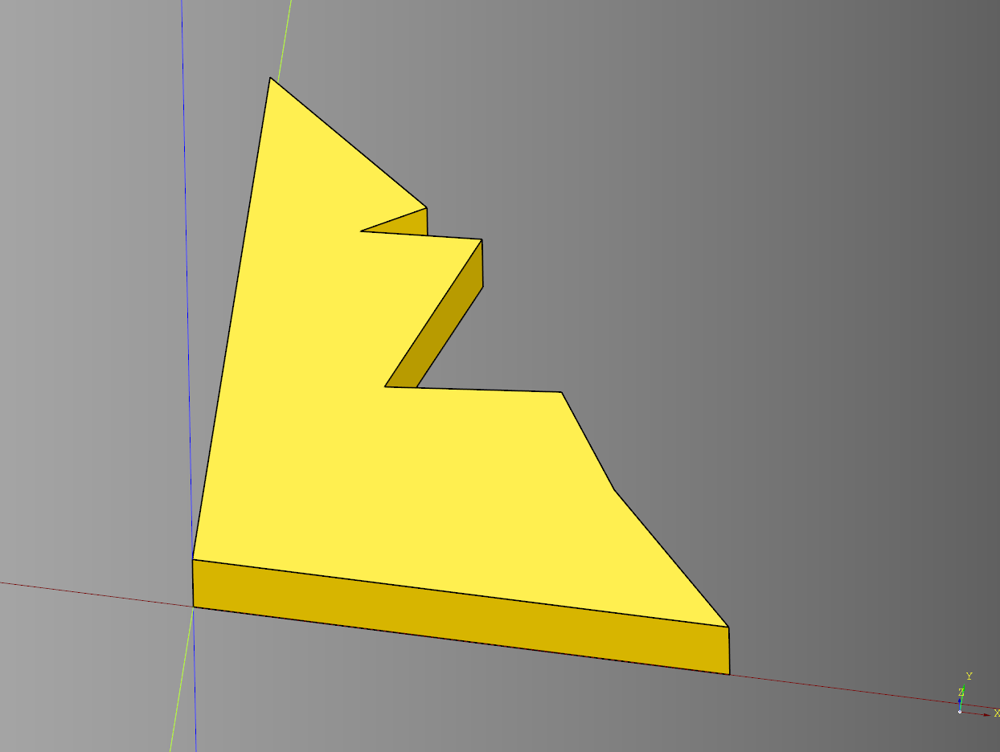
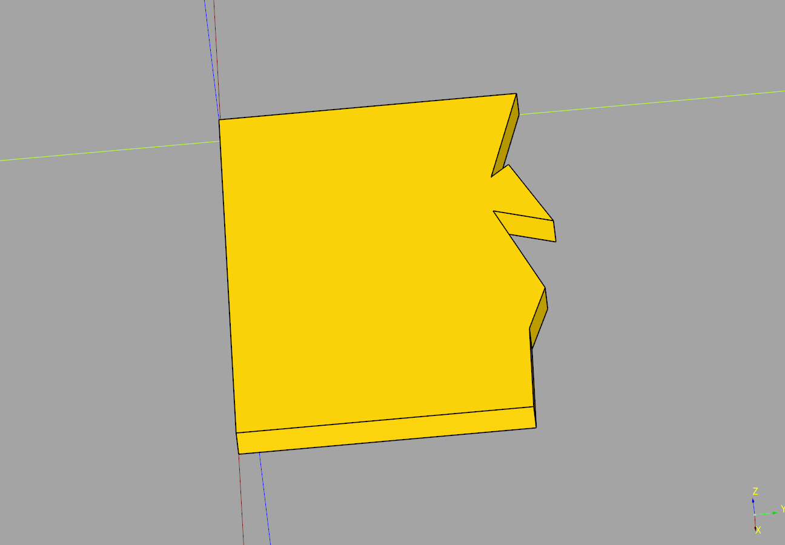
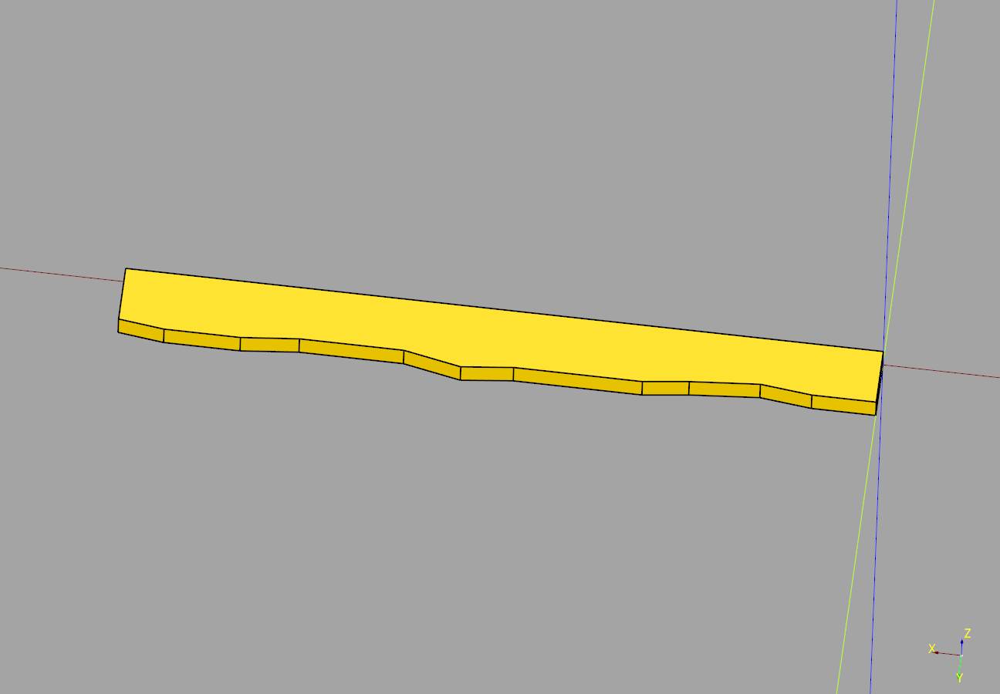
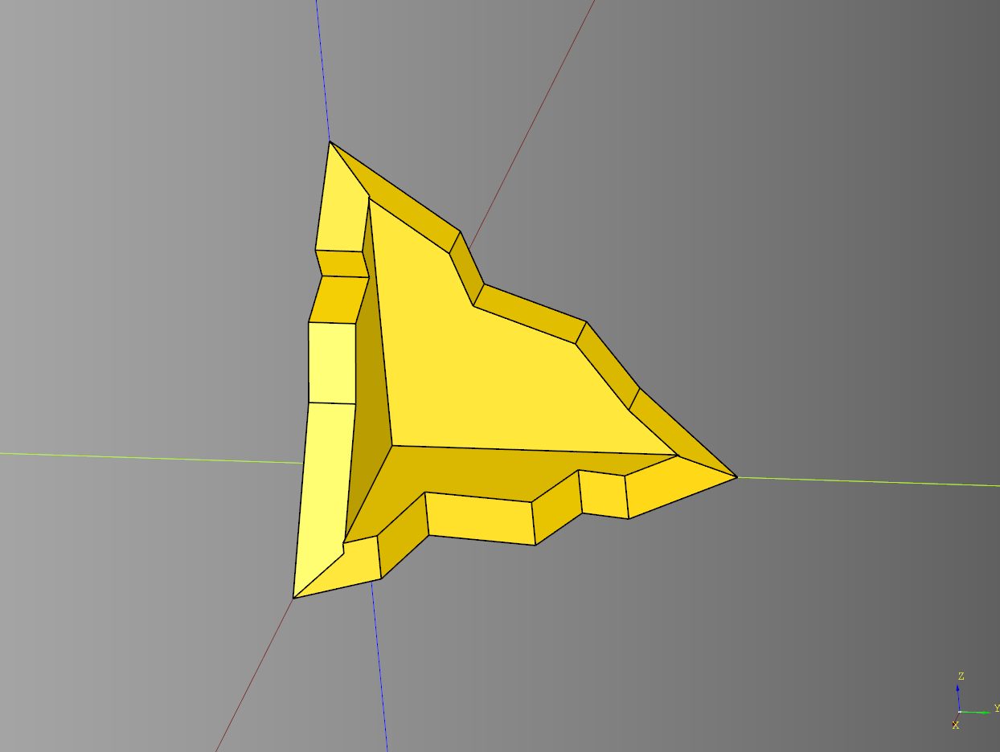
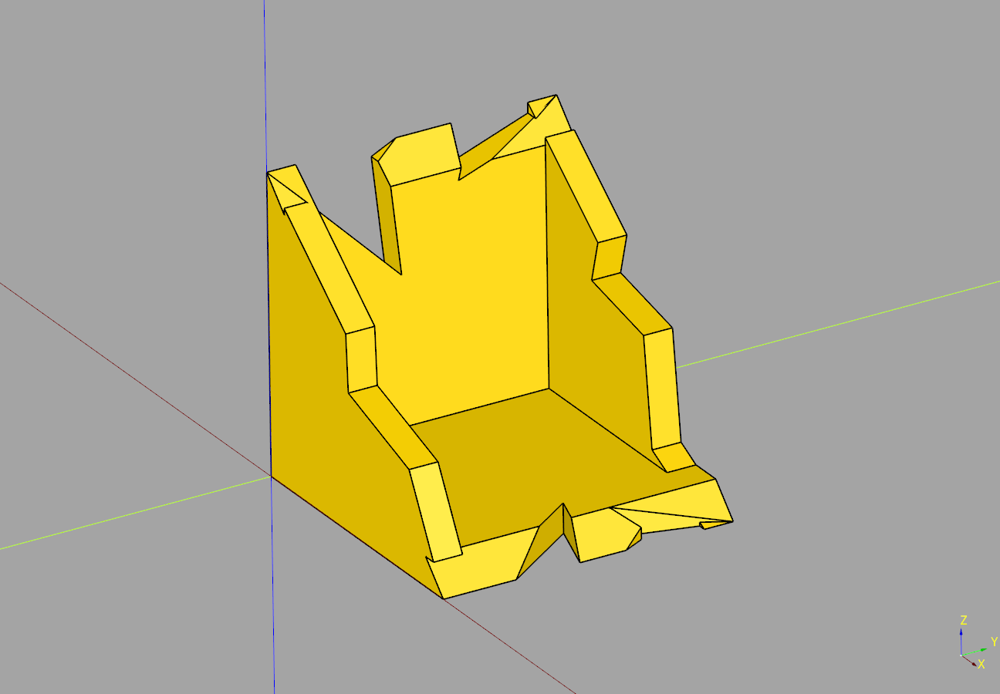
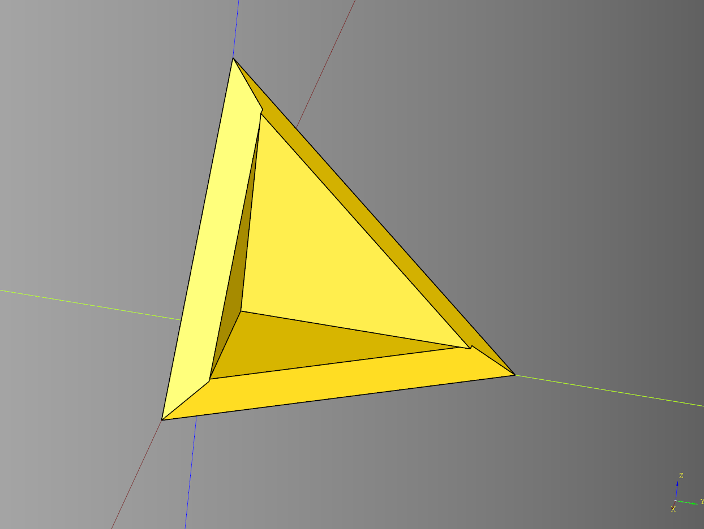
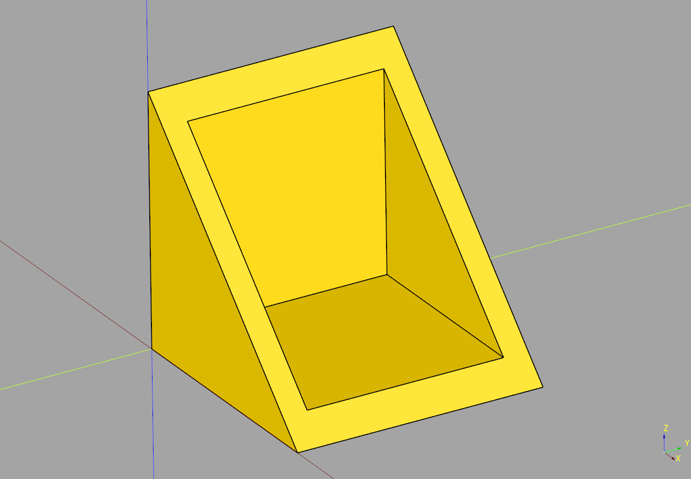

# Ruin 

---

## Index
* [Corner](#corner)
* [Rectangle](#rectangle)
* [Ruin Corner](#ruin-corner)
* [Ruin Rectangle](#ruin-rectangle)
* [Ruin Rectangle Random](#ruin-rectangle_random)
* [Ruin Three Wall Corner](#ruin-three-wall-corner)
* [Ruin Three Wall Section](#ruin-three-wall-section)
* [Three Wall Corner](#three-wall-corner)
* [Three Wall Section](#three-wall-section)

---

## Corner

### parameters
* length: float
* width: float
* height: float

``` python
import cadquery as cq
from cqterrain.ruin import corner

result = corner(
    length=50, 
    width=50, 
    height=5  
)

show_object(result)
```



* [source](../src/cqterrain/ruin/corner.py)
* [example](../example/ruin/corner.py)
* [stl](../stl/ruin_corner.stl)

---

## Rectangle

### parameters
* length: float 
* width: float 
* height: float

``` python
import cadquery as cq
from cqterrain.ruin import rectangle

ex_base = rectangle(
    length = 75, 
    width = 50, 
    height = 5    
)

show_object(ex_base)
```



* [source](../src/cqterrain/ruin/rectangle.py)
* [example](../example/ruin/rectangle.py)
* [stl](../stl/ruin_rectangle.stl)

---

## Ruin Corner

### parameters
* length: float
* width: float
* height: float
* points: int
* adjustments: list[tuple[float,float]]
* debug: bool

``` python
import cadquery as cq
from cqterrain.ruin import ruin_corner

result = ruin_corner(
    length = 50, 
    width = 50, 
    height = 10, 
    points = 7,
    adjustments = [(10,-5),(-2,-2),(3,5),(-10,-5),(0,3)],
    debug = False
)

show_object(result)
```



* [source](../src/cqterrain/ruin/ruin_corner.py)
* [example](../example/ruin/ruin_corner.py)
* [stl](../stl/ruin_ruin_corner.stl)

---

## Ruin Rectangle

### parameters
* length: float
* width: float
* height: float
* points: int
* adjustments: list[tuple[float,float]] - example: [(10,-5),(-2,-2),(3,5),(-10,-5),(0,3)]
* debug: bool

``` python
import cadquery as cq
from cqterrain.ruin import ruin_rectangle

ex_ruin = ruin_rectangle(
    length = 75, 
    width = 50, 
    height = 5,
    points = 7,
    adjustments = [(10,-5),(-2,-2),(3,5),(-10,-5),(0,3)],
    debug = False
)

show_object(ex_ruin)
```



* [source](../src/cqterrain/ruin/ruin_rectangle.py)
* [example](../example/ruin/ruin_rectangle.py)
* [stl](../stl/ruin_ruin_rectangle.stl)

---

## Ruin Rectangle Random

### parameters
* length: float 
* width: float 
* height: float|None
* points: int
* debug: bool
* shift: tuple[float, float, float]
* seed: str

``` python
import cadquery as cq
from cqterrain.ruin import ruin_rectangle_random

ex_ruin = ruin_rectangle_random(
    length = 125, 
    width = 10, 
    height = 4,
    points = 12,
    debug=False,
    shift = (-1,2,1),
    seed = "test"
)

show_object(ex_ruin)
```



* [source](../src/cqterrain/ruin/ruin_rectangle_random.py)
* [example](../example/ruin/ruin_rectangle_random.py)
* [stl](../stl/ruin_rectangle_random.stl)

---

## Ruin Three Wall Corner

### parameters
* length: float
* width: float
* height: float
* wall_width: float
* base_points: int
* base_adjustments: list[tuple[float,float]]
* x_points: int = 3,
* x_adjustments: list[tuple[float,float]]
* y_points: int = 4,
* y_adjustments: list[tuple[float,float]]

``` python
import cadquery as cq
from cqterrain.ruin import ruin_three_wall_corner

ex_three_wall_corner = ruin_three_wall_corner(
    length = 60, 
    width = 80, 
    height = 75, 
    wall_width = 10,
    base_points = 5,
    base_adjustments = [(10,-5),(-2,-2),(3,5),(-10,-5),(0,3)],
    x_points = 6,
    x_adjustments = [(10,-5),(-2,-2),(3,5)],
    y_points = 4,
    y_adjustments = [(10,-5),(-2,-2),(3,5),(-3,5)]
)

show_object(ex_three_wall_corner)
```



* [source](../src/cqterrain/ruin/ruin_three_wall_corner.py)
* [example](../example/ruin/ruin_three_wall_corner.py)
* [stl](../stl/ruin_ruin_three_wall_corner.stl)

---

## Ruin Three Wall Section

### parameters
* length: float 
* width: float 
* height: float 
* wall_width: float
* base_points: int
* base_adjustments: list[tuple[float,float]] - example:[(10,-5),(-2,-2),(3,5),(-10,-10),(0,3)],
* x_points: int = 3,
* x_adjustments: list[tuple[float,float]]
* x_points_two: int
* x_adjustments_two: list[tuple[float,float]]
* y_points: int
* y_adjustments: list[tuple[float,float]]
* debug: bool

``` python
import cadquery as cq
from cqterrain.ruin import ruin_three_wall_section

ex_ruin = ruin_three_wall_section(
    length = 50, 
    width = 50, 
    height = 50, 
    wall_width = 5,
    base_points = 5,
    base_adjustments = [(10,-5),(-2,-2),(3,5),(-10,-10),(0,3)],
    x_points = 3,
    x_adjustments = [(10,-5),(-2,-2),(3,5),(-10,-5),(0,3)],
    x_points_two = 4,
    x_adjustments_two = [(10,-5),(-2,-2),(3,5),(-5,-3),(0,3)],
    y_points = 4,
    y_adjustments = [(10,-20),(-2,-2),(3,5),(-10,-7),(0,3)],
    debug = False
)

show_object(ex_ruin)
```



* [source](../src/cqterrain/ruin/ruin_three_wall_section.py)
* [example](../example/ruin/ruin_three_wall_section.py)
* [stl](../stl/ruin_ruin_three_wall_section.stl)

---

## Three Wall Corner

### parameters 
* length: float
* width: float
* height: float 
* wall_width: float

``` python
import cadquery as cq
from cqterrain.ruin import three_wall_corner

ex_three_wall_corner = three_wall_corner(
    length = 60, 
    width = 80, 
    height = 75, 
    wall_width = 10
)

show_object(ex_three_wall_corner)
```



* [source](../src/cqterrain/ruin/three_wall_corner.py)
* [example](../example/ruin/three_wall_corner.py)
* [stl](../stl/ruin_three_wall_corner.stl)

---

## Three Wall Section
### parameters
* length: float 
* width: float 
* height: float 
* wall_width: float

``` python
import cadquery as cq
from cqterrain.ruin import three_wall_section

ex_base = three_wall_section(
    length = 50, 
    width = 50, 
    height = 50, 
    wall_width = 5  
)

show_object(ex_base)
```



* [source](../src/cqterrain/ruin/three_wall_section.py)
* [example](../example/ruin/three_wall_section.py)
* [stl](../stl/ruin_ruin_three_wall_section.stl)

---
