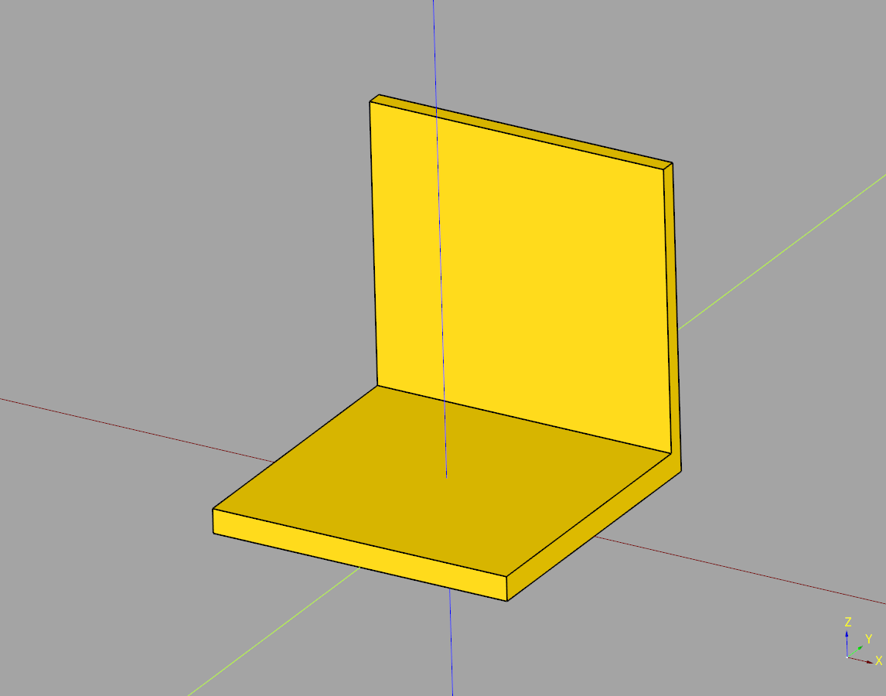

# Segment Documentation

## index
* [Base Segment](#base-segment)

## Base Segment
super basic segment class that inherits from caqueryhelper Base

## parameters
* length:float
* width:float
* height:float
* floor_height:float
* wall_width:float

``` python
import cadquery as cq
from cqterrain.segment import BaseSegment

bp_segment = BaseSegment()

bp_segment.length = 75
bp_segment.width = 75
bp_segment.height = 75
bp_segment.floor_height = 6
bp_segment.wall_width = 4

bp_segment.make()

ex_segment = bp_segment.build()

show_object(ex_segment)
```



* [source](../src/cqterrain/segment/BaseSegment.py)
* [example](../example/segment/base_segment.py)
* [stl](../stl/segment_base_segment.stl)
