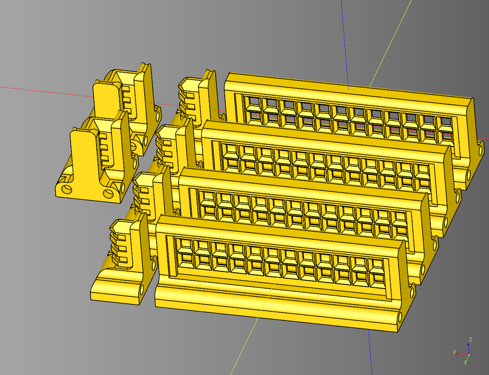
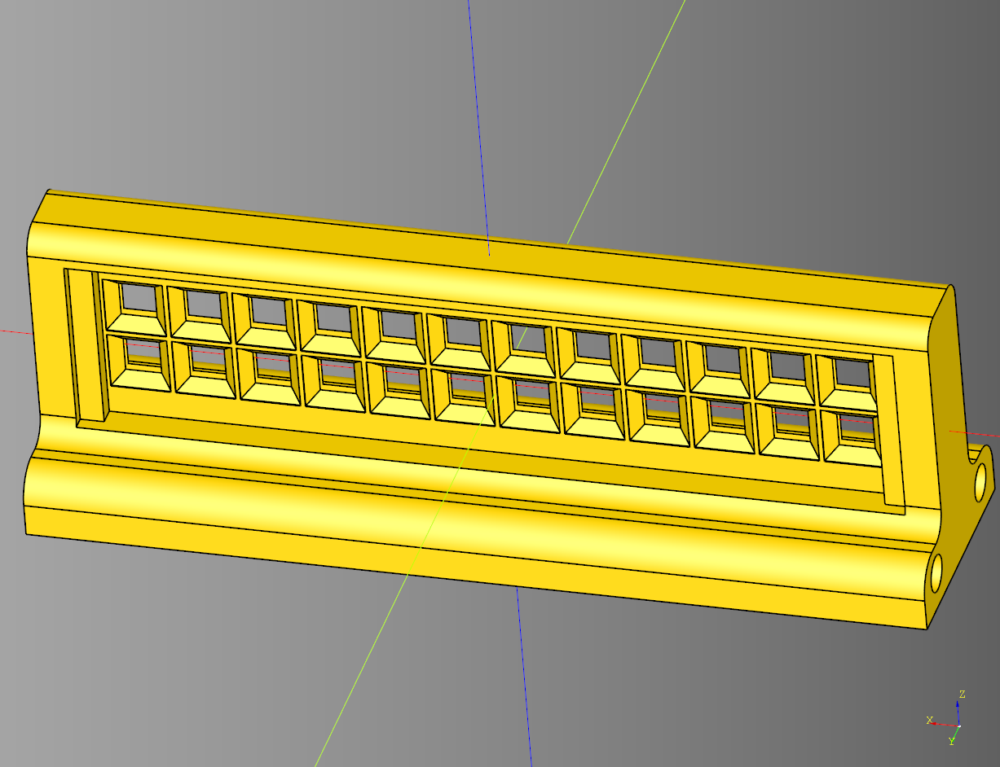

# Shieldwall Documentation

Sheildwall scatter terrain documentation.


---

## Arch Set
Helper class to generate a sert of walls that are gothic in style. 
Inherits off of [Set](#set).

### parameteres
#### Set parameteres
* straight_count: int
* padding: float
* height: float
* base_height: float
* magnet_padding_x: float
* corner_count: int
* end_cap_count: int
* end_cap_length: float

### blueprints
#### Set blueprints 
* straight_bp: [BaseWall](#base-wall) = [Straight](#straight)()
* end_bp: [BaseWall](#base-wall) = [EndCap](#end-cap)()
* corner_bp: [BaseWall](#base-wall) = [CornerConnector](#corner-connector)()

#### Arch Set blueprints 
* shape_bp: Base = [ArchShape](#arch-shape)()
* mesh_bp: Base = [GothicMesh](#gothic-mesh)()

```python
import cadquery as cq
from cqterrain.shieldwall import ArchSet

arch_set_bp = ArchSet()
arch_set_bp.height=25
arch_set_bp.straight_count = 4
arch_set_bp.straight_bp.mesh_width = 6

arch_set_bp.end_bp.render_greeble = False
arch_set_bp.corner_bp.render_greeble = False
arch_set_bp.make()
arch_set = arch_set_bp.build()

show_object(arch_set)
```


* [source](../src/cqterrain/shieldwall/ArchSet.py)
* [example](../example/shieldwall/archset.py)
* [stl](../stl/shieldwall_arch_set.stl)

---

## Arch Shape

Inherits from [BaseShape](#base-shape). This is just the archpointed code from cadqueryhelper with the orientation modified. 

### parameters
* length: float
* width: float
* base_height: float
* middle_width_inset: float

```python
import cadquery as cq
from cqterrain.shieldwall import ArchShape

bp_shape = ArchShape()
bp_shape.length = 25
bp_shape.width = 20
bp_shape.base_height = 5
bp_shape.middle_width_inset = -6

bp_shape.make()

result = bp_shape.build().extrude(1)

show_object(result)
```


* [source](../src/cqterrain/shieldwall/ArchShape.py)
* [example](../example/shieldwall/arch_shape.py)
* [stl](../stl/shieldwall_arch_shape.stl)

---

## Base Cut

Removed from the bottom of the shieldwall components.

### parameters
* length: float
* width: float
* height: float
* angle: float

```python
import cadquery as cq
from cqterrain.shieldwall import BaseCut

bp_base_cut = BaseCut()
bp_base_cut.length = 75
bp_base_cut.width = 10
bp_base_cut.height = 4
bp_base_cut.angle = 30

bp_base_cut.make()

result = bp_base_cut.build()

show_object(result)
```


* [source](../src/cqterrain/shieldwall/BaseCut.py)
* [example](../example/shieldwall/base_cut.py)
* [stl](../stl/shieldwall_base_cut.stl)
  
---

## Base Greeble
Psuedo Interface defines the minimal properties available for anything that inherits off of BaseGreeble.

### parameters
* length: float
* width: float
* height: float
* grill_padding_left: float

### shapes
* body: cq.Workplane|None
* grill_set: cq.Workplane|None
* grill_set_internal: cq.Workplane|None

<em></em>
* [source](../src/cqterrain/shieldwall/BaseGreeble.py)


---
## Base Magnets
Psuedo Interface defines the minimal properties available for anything that inherits off of BaseMagnets.

### parameters
* distance: float
* pip_height: float
* pip_radius: float

### shapes
* pips: cq.Workplane|None

<em></em>
* [source](../src/cqterrain/shieldwall/BaseMagnets.py)

---

## Base Mesh
Psuedo Interface defines the minimal properties available for anything that inherits off of BaseMesh.

### parameters
* length: float
* width: float
*  height: float

### shapes
* tile: cq.Workplane|None

<em></em>
* [source](../src/cqterrain/shieldwall/BaseMesh.py)

---

## Base Shape
Psuedo Interface defines the minimal properties available for anything that inherits off of BaseShape.

### parameters
* length: float
* width: float
* base_height: float
* middle_width_inset: float

<em></em>
* [source](../src/cqterrain/shieldwall/BaseShape.py)


---

### Base Wall
Psuedo Interface defines the minimal properties available for anything that inherits off of BaseStraight.

### pamareters
* length: float
* height: float
* width: float
* height: float
* base_height: float
* magnet_padding_x: float
* mesh_width: float
* render_greeble: bool

### blueprints
* shape_bp: [BaseShape](#base-shape)
* mesh_bp: [BaseMesh](#base-mesh)
* magnets_bp: [BaseMagnets](#base-magnets)
* base_cut_bp: [BaseCut](#base-cut)

<em></em>
* [source](../src/cqterrain/shieldwall/BaseWall.py)
---

### Cap Greeble
Inherits from [BaseGreeble](#base-greeble).

### parameters
* length: float
* width: float
* height: float
* top_fillet: float
* side_fillet: float
* operation: Literal['chamfer', 'fillet'] = 'chamfer'
* render_grill: bool
* grill_height: float
* grill_padding_top: float
* grill_padding_left: float
* grill_margin: float

### shapes
* body: cq.Workplane|None
* grill: cq.Workplane|None
* grill_internal: cq.Workplane|None
* grill_set: cq.Workplane|None
* grill_set_internal: cq.Workplane|None

``` python
import cadquery as cq
from cqterrain.shieldwall import CapGreeble

bp_cap = CapGreeble()

bp_cap.length = 20
bp_cap.width = 8
bp_cap.height = 30
bp_cap.top_fillet = 2.9
bp_cap.side_fillet = 2.5
bp_cap.operation = 'chamfer'

bp_cap.render_grill = True
bp_cap.grill_height = 2
bp_cap.grill_padding_top = 1
bp_cap.grill_padding_left = 2
bp_cap.grill_margin = .5

bp_cap.make()

result = bp_cap.build()

show_object(result)
```


* [source](../src/cqterrain/shieldwall/CapGreeble.py)
* [example](../example/shieldwall/cap_greeble.py)
* [stl](../stl/shieldwall_cap_greeble.stl)

---

## Corner Connector

Extrudes two copies of the shape_bp at a 90 degree angle. Inherits from [BaseWall](#base-wall)

### properties
* length: float
* width: float
* height: float
* base_height: float
* render_magnets: bool
* magnet_padding: float
* magnet_padding_x: float
* side_margin: float
* side_height: float
* top_height: float
* cut_width: float
* middle_width_inset: float
* render_greeble: bool
* greeble_padding_y: float
        
### blueprints
* shape_bp: [BaseShape](#base-shape) = [ShieldShape](#shield-shape)()
* greeble_bp: [BaseGreeble](#base-greeble) = [CapGreeble](#cap-greeble)()
* magnets_bp: [BaseMagnets](#base-magnets) = [Magnets](#magnets)()
        
### shapes
* shape: cq.Workplane|None
* connector: cq.Workplane|None
* end_cap: cq.Workplane|None
* greeble: cq.Workplane|None

```python
import cadquery as cq
from cqterrain.shieldwall import CornerConnector

corner_bp = CornerConnector()
corner_bp.length = 20
corner_bp.width = 20
corner_bp.height = 25

corner_bp.base_height = 5.6

corner_bp.render_magnets = True
corner_bp.magnet_padding = 1
corner_bp.magnet_padding_x = 2

corner_bp.side_margin = -2
corner_bp.side_height = 1
corner_bp.top_height = 2

corner_bp.cut_width = 3
corner_bp.middle_width_inset = -6

corner_bp.render_greeble = True
corner_bp.greeble_padding_y = 1

corner_bp.make()
corner_ex = corner_bp.build()
corner_ex_assembly = corner_bp.build_assembly()

show_object(corner_ex)
```


* [source](../src/cqterrain/shieldwall/CornerConnector.py)
* [example](../example/shieldwall/corner_connector.py)
* [stl](../stl/shieldwall_corner_connector.stl)

---

## Curve Basic

### parameters
* width: float
* height: float
* base_height: float
* x_radius: float
* y_radius: float - ellipse stretch
* angle: float
* rotation_angle: float
* render_magnets: bool
* magnet_padding: float
* magnet_padding_x: float

### blueprints
* shape_bp: [BaseShape](#base-shape) = [ShieldShape](#shield-shape)()
* magnets_bp: [BaseMagnets](#base-magnets) = [Magnets](#magnets)()

### shapes
* wall: cq.Workplane|None

```python
import cadquery as cq
from cqterrain.shieldwall import CurveBasic, ShieldShape, Magnets


wall_bp = CurveBasic()
wall_bp.width = 20
wall_bp.height = 25
wall_bp.base_height = 5.6

wall_bp.x_radius = 75
wall_bp.y_radius = 75 #ellipse stretch
wall_bp.angle = 270
wall_bp.rotation_angle = 0

wall_bp.render_magnets = True
wall_bp.magnet_padding = 1
wall_bp.magnet_padding_x = 2

# blueprints
wall_bp.shape_bp = ShieldShape()
wall_bp.magnets_bp = Magnets()


wall_bp.make()
wall_ex = wall_bp.build()

show_object(wall_ex)
```


### Examples

#### Curve Basic Arch
```python
import cadquery as cq
from cqterrain.shieldwall import CurveBasic, ArchShape


wall_bp = CurveBasic()
wall_bp.shape_bp = ArchShape()

#90 degrees
wall_bp.angle = 270
wall_bp.rotation_angle=0

#45 degrees
#wall_bp.angle = 315
#wall_bp.rotation_angle=-45

#60 degrees
#wall_bp.angle = 300
#wall_bp.rotation_angle=-30


wall_bp.make()
wall_ex = wall_bp.build()

show_object(wall_ex)
```


* [source](../src/cqterrain/shieldwall/CurveBasic.py)
* [example](../example/shieldwall/curve_basic.py)
* [example arch](../example/shieldwall/curve_basic_arch.py)
* [stl](../stl/shieldwall_curve_basic.stl)
* [stl arch](../stl/shieldwall_curve_basic_arch.stl)

---

## End Cap
Inherits off of [BaseWall](#base-wall).

### parameters
* length: float
* width: float
* height: float
* base_height: float
* side_margin: float
* side_height: float
* top_height: float
* cut_width: float
* middle_width_inset: float
* render_greeble: bool
* greeble_padding_y: float
* render_magnets: bool
* magnet_padding: float
* magnet_padding_x: float

### blueprints
* shape_bp: [BaseShape](#base-shape) = [ShieldShape](#shield-shape)()
* greeble_bp: [BaseGreeble](#base-greeble) = [CapGreeble](#cap-greeble)()
* magnets_bp: [BaseMagnets](#base-magnets) = [Magnets](#magnets)()

### shapes
* end_cap: cq.Workplane|None
* greeble: cq.Workplane|None

```python
import cadquery as cq
from cqterrain.shieldwall import EndCap

cap_bp =  EndCap()
cap_bp.length = 15
cap_bp.width = 20
cap_bp.height = 25
cap_bp.base_height = 5.6
cap_bp.side_margin = -2
cap_bp.side_height = 1
cap_bp.top_height = 2

cap_bp.cut_width = 3
cap_bp.middle_width_inset = -6

cap_bp.render_greeble = True
cap_bp.greeble_padding_y = 1

cap_bp.render_magnets = True
cap_bp.magnet_padding = 1
cap_bp.magnet_padding_x = 2


cap_bp.make()
cap_ex = cap_bp.build()
cap_ex_assembly = cap_bp.build_assembly()

show_object(cap_ex)
```


* [source](../src/cqterrain/shieldwall/EndCap.py)
* [example](../example/shieldwall/end_cap.py)
* [stl](../stl/shieldwall_end_cap.stl)

---

## Gothic Mesh
Inherits from [Mesh](#mesh).

### parameters

#### Mesh parameters
* length: float
* width: float
* height: float
* tile_length: float
* tile_width: float
* tile_padding: float
* tile_chamfer: float

### Gothic Mesh parameters
* arch_frame_width: float
* side_length: float|None

```python
import cadquery as cq
from cqterrain.shieldwall import GothicMesh

gothic_bp = GothicMesh()
gothic_bp.length = 75
gothic_bp.width = 3
gothic_bp.height = 25
gothic_bp.tile_width = 5
gothic_bp.tile_chamfer = 1.4
gothic_bp.tile_length = 10
gothic_bp.tile_padding = 0
gothic_bp.arch_frame_width = 1.5
gothic_bp.side_length = None

gothic_bp.make()
gothic_ex = gothic_bp.build()

show_object(gothic_ex)
```


* [source](../src/cqterrain/shieldwall/GothicMesh.py)
* [example](../example/shieldwall/gothic_mesh.py)
* [stl](../stl/shieldwall_gothic_mesh.stl)

---

## Hex Mesh
Inherits from [Mesh](#mesh).

### parameters
* length: float
* width: float
* height: float
* tile_length: float
* tile_width: float
* tile_padding: float
* tile_chamfer: float

```python
import cadquery as cq
from cqterrain.shieldwall import HexMesh

mesh_bp = HexMesh()
mesh_bp.length = 75
mesh_bp.width = 3
mesh_bp.height = 50
mesh_bp.tile_length =10
mesh_bp.tile_width = 10
mesh_bp.tile_padding = .0
mesh_bp.tile_chamfer = 0.5
mesh_bp.make()
mesh_ex = mesh_bp.build()

show_object(mesh_ex)
```


* [source](../src/cqterrain/shieldwall/HexMesh.py)
* [example](../example/shieldwall/hex_mesh.py)
* [stl](../stl/shieldwall_hex_mesh.stl)

---

## Hex Set
Inherits from [Set](#set).

### parameters
* straight_count: int
* padding: float
* height: float
* base_height: float
* magnet_padding_x: float
* corner_count: int
* end_cap_count: int
* end_cap_length: float

```python
import cadquery as cq
from cqterrain.shieldwall import HexSet

hex_set_bp = HexSet()
hex_set_bp.base_height = 5.6

hex_set_bp.straight_count = 1
hex_set_bp.corner_count = 1
hex_set_bp.end_cap_count = 1

hex_set_bp.make()
hex_set = hex_set_bp.build()

show_object(hex_set)
```


* [source](../src/cqterrain/shieldwall/HexSet.py)
* [example](../example/shieldwall/hex_set.py)
* [stl](../stl/shieldwall_hex_set.stl)
  
---

## Hex Straight
Inherits from [Straight](#straight).

### Parameters
* length: float
* width: float
* height: float
* base_height: float
* render_magnets: bool
* magnet_padding: float
* magnet_padding_x: float
* cut_padding_x: float
* cut_padding_z: float
* post_length: float
* post_padding_y: float
* mesh_width: float
* cut_width: float
* key_margin: float
* render_base_cut: bool
* base_cut_height: float|None
* base_cut_width: float|None

```python
import cadquery as cq
from cqterrain.shieldwall import HexStraight

hex_bp = HexStraight()
hex_bp.length = 75
hex_bp.width = 20
hex_bp.height = 25
hex_bp.base_height = 5.6
hex_bp.render_magnets = True
hex_bp.magnet_padding = 1
hex_bp.magnet_padding_x = 2
hex_bp.cut_padding_x = 3
hex_bp.cut_padding_z = 3
hex_bp.post_length = 2
hex_bp.post_padding_y = 1
hex_bp.cut_width = .8
hex_bp.key_margin = 0.2
hex_bp.render_base_cut = True
hex_bp.base_cut_height = None
hex_bp.base_cut_width = None
hex_bp.mesh_width = 4
hex_bp.make()

result = hex_bp.build()

show_object(result)
```


* [source](../src/cqterrain/shieldwall/HexStraight.py)
* [example](../example/shieldwall/hex_straight.py)
* [stl](../stl/shieldwall_hex_straight.stl)

---
## Magnets
Inherits from [BaseMagnets](#base-magnets).

### parameters
* distance: float
* pip_height: float
* pip_radius: float
  
```python
import cadquery as cq
from cqterrain.shieldwall import Magnets

magnet_bp = Magnets()

magnet_bp.distance = 12.9
magnet_bp.pip_height = 2.4
magnet_bp.pip_radius = 1.56

magnet_bp.make()
magnet_ex = magnet_bp.build()

show_object(magnet_ex)
```


* [source](../src/cqterrain/shieldwall/Magnets.py)
* [example](../example/shieldwall/magnets.py)
* [stl](../stl/shieldwall_magnets.stl)

---

## Mesh
Inherits from [BaseMesh](#base-mesh).

### parameters
* length:float
* width:float
* height:float
* tile_length:float
* tile_width:float
* tile_padding:float
* tile_chamfer:float

### shapes
* tile:cq.Workplane|None
* tiles:cq.Workplane|None
* outline:cq.Workplane|None

```python
import cadquery as cq
from cqterrain.shieldwall import Mesh

mesh_bp = Mesh()

mesh_bp.length = 75
mesh_bp.width = 3
mesh_bp.height = 25

mesh_bp.tile_length = 5
mesh_bp.tile_width = 5
mesh_bp.tile_padding = 0.2
mesh_bp.tile_chamfer = 1.4

mesh_bp.make()
mesh_ex = mesh_bp.build()

show_object(mesh_ex)
```


* [source](../src/cqterrain/shieldwall/Mesh.py)
* [example](../example/shieldwall/mesh.py)
* [stl](../stl/shieldwall_mesh.stl)

---

## Set
orchestration class that creates a build plate of shieldwalls.

### parameters
* straight_count: int
* padding: float
* height: float
* base_height: float
* magnet_padding_x: float
* corner_count: int
* end_cap_count: int
* end_cap_length: float

### blueprints
* shape_bp: [BaseShape](#base-shape) = [ShieldShape](#shield-shape)()
* mesh_bp: [BaseMesh](#base-mesh) = [Mesh](#mesh)()
* straight_bp: [BaseWall](#base-wall) = [Straight](#straight)()
* end_bp: [BaseWall](#base-wall) = [EndCap](#end-cap)()
* corner_bp: [BaseWall](#base-wall) = [CornerConnector](#corner-connector)()

```python
import cadquery as cq
from cqterrain.shieldwall import Set

set_bp = Set()

set_bp.straight_count = 4
set_bp.padding = 5
set_bp.height = 25

set_bp.base_height = 5.6
set_bp.magnet_padding_x = 2

set_bp.corner_count = 2

set_bp.end_cap_count = 4
set_bp.end_cap_length = 15

set_bp.make()
set_ex = set_bp.build()

show_object(set_ex)
```



* [source](../src/cqterrain/shieldwall/Set.py)
* [example](../example/shieldwall/set.py)
* [stl](../stl/shieldwall_set.stl)

---

## Shield Shape
Helper class to generate a shield shape. 
Inherits off of [BaseShape](#base-shape). The actual shape generation method of this classwas re-written multiple times because mirroring in cadquery can be unpredictable. 

### parameters
* length: float
* width: float
* base_height: float
* middle_width_inset: float
* travel_distance: float
* shape_method: Callable[[float, float, float, float, float], cq.Workplane]

### shapes
* shape: cq.Workplane|None

```python
import cadquery as cq
from cqterrain.shieldwall import  ShieldShape

shape_bp = ShieldShape()

shape_bp.length = 20
shape_bp.width = 20
shape_bp.base_height = 5.6
shape_bp.middle_width_inset = -6
shape_bp.travel_distance = 2

shape_bp.make()

shape_ex = shape_bp.build().extrude(2)
show_object(shape_ex)
```


* [source](../src/cqterrain/shieldwall/ShieldShape.py)
* [example](../example/shieldwall/shield_shape.py)
* [stl](../stl/shieldwall_shield_shape.stl)

---

## Straight
Inherits from [BaseWall](#base-wall).

### parameters
* length: float
* width: float
* height: float
* base_height: float
* render_magnets: bool
* magnet_padding: float
* magnet_padding_x: float
* cut_padding_x: float
* cut_padding_z: float
* post_length: float
* post_padding_y: float
* mesh_width: float
* cut_width: float
* key_margin: float
* render_base_cut: bool
* base_cut_height: float|None
* base_cut_width: float|None

### blueprints
* shape_bp: [BaseShape](#base-shape) = [ShieldShape](#shield-shape)()
* mesh_bp: [BaseMesh](#base-mesh) = [Mesh](#mesh)()
* magnets_bp: [BaseMagnets](#base-magnets) = [Magnets](#magnets)()
* base_cut_bp: [BaseCut](#base-cut) = [BaseCut](#base-cut)()

### shapes
* shape: cq.Workplane|None
* outline: cq.Workplane|None
* post: cq.Workplane|None
* key_cut: cq.Workplane|None
* key_template: cq.Workplane|None

```python
import cadquery as cq
from cqterrain.shieldwall import Straight, HexMesh

straight_bp = Straight()
straight_bp.length = 75
straight_bp.width = 20
straight_bp.height = 25

straight_bp.base_height = 5.6

straight_bp.render_magnets = True
straight_bp.magnet_padding= 1
straight_bp.magnet_padding_x = 2

straight_bp.cut_padding_x = 3
straight_bp.cut_padding_z = 3

straight_bp.post_length= 2
straight_bp.post_padding_y = 1
straight_bp.mesh_width = 3

straight_bp.cut_width= .8
straight_bp.key_margin = 0.2

straight_bp.render_base_cut= True
straight_bp.base_cut_height = None
straight_bp.base_cut_width= None

straight_bp.make()
straight_ex = straight_bp.build()

show_object(straight_ex)
```



* [source](../src/cqterrain/shieldwall/Straight.py)
* [example](../example/shieldwall/straight.py)
* [stl](../stl/shieldwall_straight.stl)

---

### Straight Basic
Inherits from [BaseWall](#base-wall).

### parameters
* length = 75
* width = 20
* height = 20
* base_height = 5.6
* render_magnets = True
* magnet_padding = 1
* magnet_padding_x=2

### blueprints
* shape_bp: [BaseShape](#base-shape) = [ShieldShape](#shield-shape)()
* magnets_bp: [BaseMagnets](#base-magnets) = [Magnets](#magnets)()

```python
import cadquery as cq
from cqterrain.shieldwall import StraightBasic

straight_bp = StraightBasic()

straight_bp.length = 75
straight_bp.width = 20
straight_bp.height = 20
straight_bp.base_height = 5.6
straight_bp.render_magnets = True
straight_bp.magnet_padding = 1
straight_bp.magnet_padding_x = 2

straight_bp.make()
straight_ex = straight_bp.build()

show_object(straight_ex)
```


* [source](../src/cqterrain/shieldwall/StraightBasic.py)
* [example](../example/shieldwall/straight_basic.py)
* [stl](../stl/shieldwall_straight_basic.stl)


