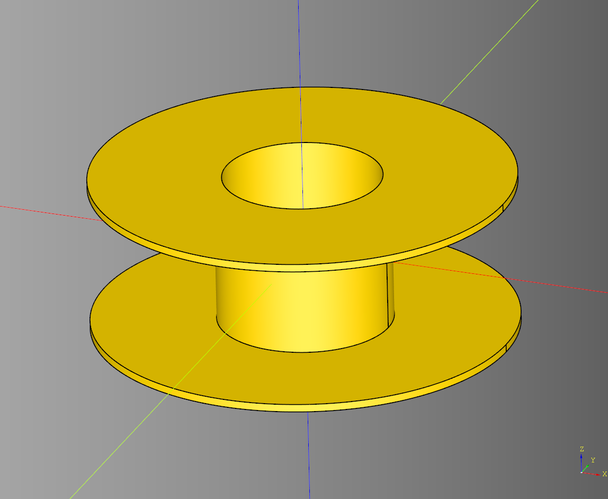
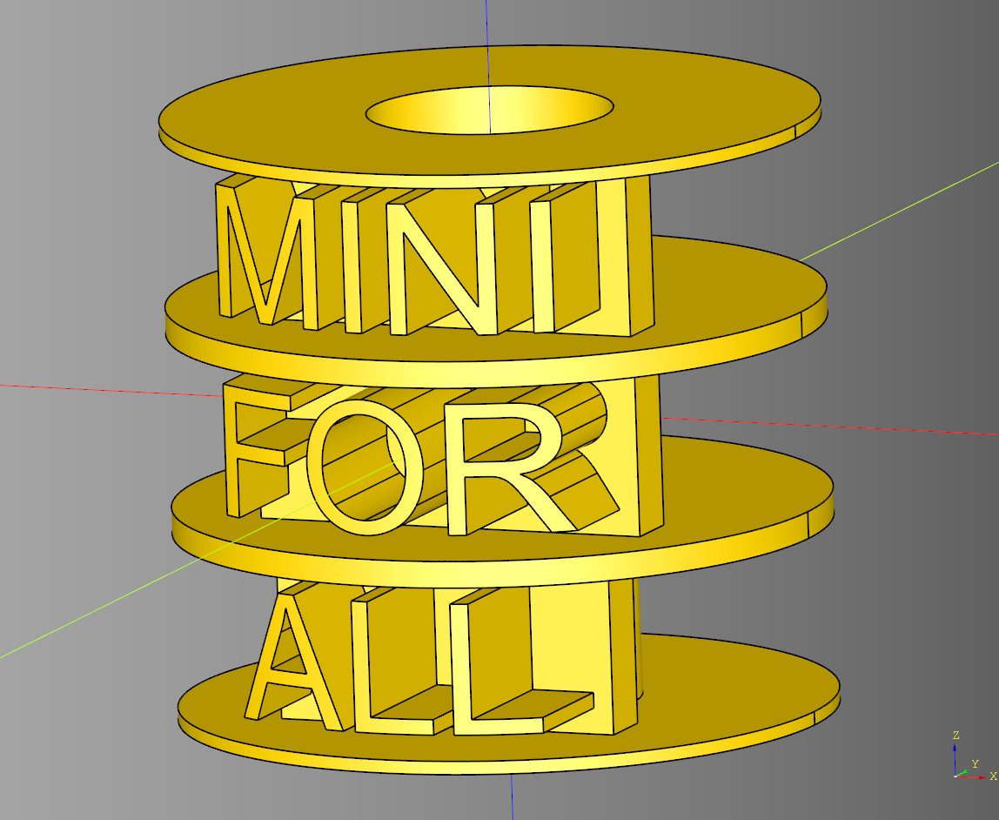

# Spool Documentation

- [Spool Documentation](#spool-documentation)
  - [spool](#spool)
    - [parameters](#parameters)
    - [build\_no\_center](#build_no_center)
  - [SpoolLogoStack](#spoollogostack)
    - [parameters](#parameters-1)
  - [blueprints](#blueprints)


---

## spool
Builder class for making a spool. Inherits from Base.

### parameters
* height: float
* radius: float
* cut_radius: float
* wall_width: float
* internal_wall_width: float
* internal_z_translate: float

``` python
import cadquery as cq
from cqterrain.spool import Spool

bp = Spool()
bp.height = 60
bp.radius = 80
bp.wall_width = 3
bp.cut_radius = 30
bp.internal_wall_width = 3
bp.internal_z_translate = 0
bp.make()
ex = bp.build()

show_object(ex)
```




### build_no_center
``` python
import cadquery as cq
from cqterrain.spool import Spool

bp = Spool()
bp.height = 100
bp.radius = 100
bp.wall_width = 3
bp.cut_radius = 40
bp.internal_wall_width = 4
#bp.internal_z_translate = -3
bp.make()
ex = bp.build_no_center()

show_object(ex)
```


* [source](../src/cqterrain/spool/Spool.py)
* [example](../example/spool/spool.py)
* [example no center](../example/spool/spool_no_center.py)
* [stl](../stl/spool.stl)
* [stl no center](../stl/spool_no_center.stl)

---

## SpoolLogoStack
Build for making a Spool with text on it. Inherits from Base.

### parameters
* spool_height: float
* spool_radius: float
* spool_wall_width: float
* spool_cut_radius: float
* spool_internal_wall_width: float
* logo_text: str
* font_size: float
* font_width: float
* font_center_offset: float
* word_offset: list[float]|None
* render_spool: bool
        
## blueprints
* bp_spool: Spool

``` python
import cadquery as cq
from cqterrain.spool import SpoolLogoStack

bp_spool_stack = SpoolLogoStack()
bp_spool_stack.font_size = 55
bp_spool_stack.font_width = 55
bp_spool_stack.font_center_offset = -10
bp_spool_stack.logo_text = "MINI FOR ALL"
bp_spool_stack.word_offset = [0,3,4]
bp_spool_stack.render_spool = True
bp_spool_stack.make()
spool_logo_ex = bp_spool_stack.build()

show_object(spool_logo_ex)
```



* [source](../src/cqterrain/spool/SpoolLogoStack.py)
* [example](../example/spool/spoolLogoStack.py)
* [stl](../stl/spool_Logo_2.stl)
  
---
