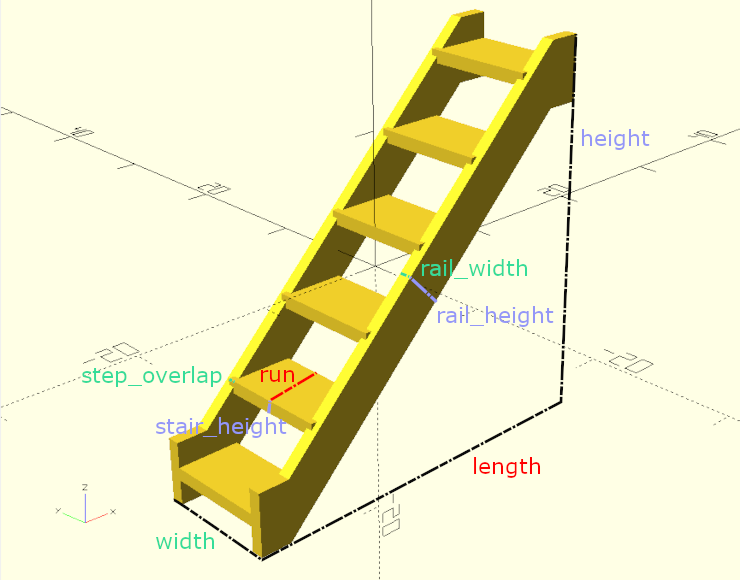
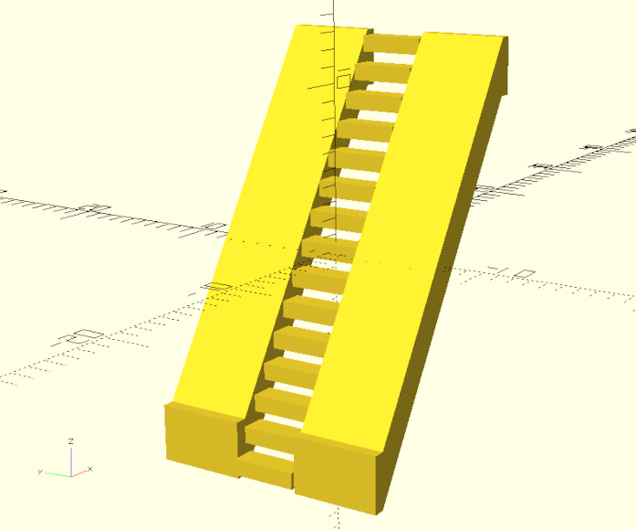
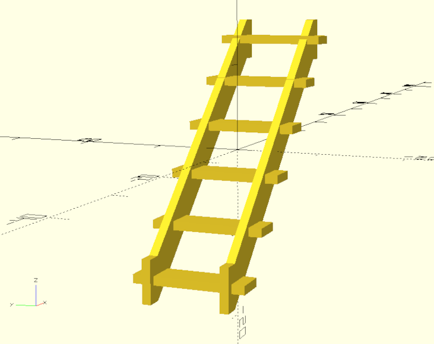

# Stairs Documentation

## Example Usage
``` python
import cadquery as cq # Main cadquery library.
from cqterrain import stairs #Import stair generator code.

# Make an instance of the stairs shape with the following parameters.
ex = stairs(
    length = 30,
    width = 10,
    height = 30,
    run = 5,
    stair_length_offset = 0,
    stair_height = 1,
    stair_height_offset = 0,
    rail_width = 1,
    rail_height = 5
)

# Add the stairs to a workplane.
workspace = cq.Workplane('XY')
workspace.add(ex)

# Write to stl file.
cq.exporters.export(workspace,'out/stairs.stl')

# Print metadata to console for debugging
if ex.metadata:
    print(ex.metadata)
```

The code above:
* Imports the required libraries.
* Generates a shape using the defined settings.
* Exports the shape to a file.
* Prints the shapes metadata to the console.

## Parameters
* length
* width
* height
* run
* stair_length_offset
* stair_height
* stair_height_offset
* rail_width
* rail_height
* step_overlap

#### Annotation


# Notes
* By default *step_overlap* is half of *rail_width* unless specified.
* *stair_length_offset* is added or removed invisible space to *run*
* *stair_height_offset* is added or removed invisible space to *stair_height*


---
# Examples

## Default

``` python
ex = stairs(
    length = 30,
    width = 10,
    height = 30,
    run = 5,
    stair_length_offset = 0,
    stair_height = 1,
    rail_width = 1,
    rail_height = 5
)
```


## Ladder

``` python
ex = stairs(
    length = 10,
    width = 10,
    heigh t= 40,
    run = 1,
    stair_length_offset = 0,
    stair_height = 1,
    rail_width = 1,
    rail_height = 3
)
```


## Grand

``` python
ex = stairs(
    length = 60,
    width = 20,
    height = 30,
    run = 6,
    stair_length_offset = 0,
    stair_height = 3,
    rail_width = 3,
    rail_height = 15
)
```


## Small

``` python
ex = stairs(
    length = 10,
    width = 5,
    height = 10,
    run = 2,
    stair_length_offset = 1,
    stair_height = 1,
    rail_width = 1,
    rail_height = 1
)
```


## Futuristic

``` python
ex = stairs(
    length =15,
    width = 15,
    height = 25,
    run = 1.5,
    stair_length_offset = -0.5,
    stair_height = 1,
    rail_width = 5.5,
    rail_height = 3.5,
    step_overlap = 0
)
```



## Overlap

``` python
ex = stairs(
    length = 30,
    width = 10,
    height = 30,
    run = 3.5,
    stair_length_offset = 1.5,
    stair_height = 1,
    rail_width = 1,
    rail_height = 5,
    step_overlap = 2.5
)
```


