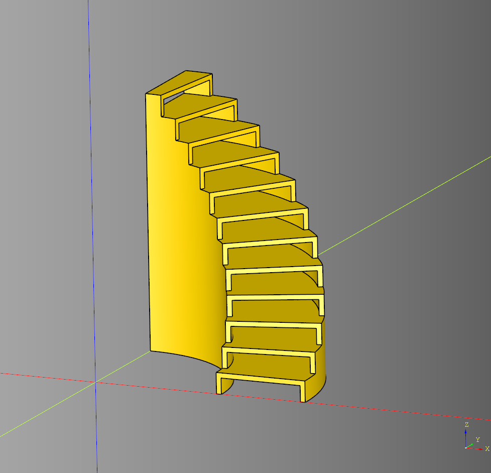
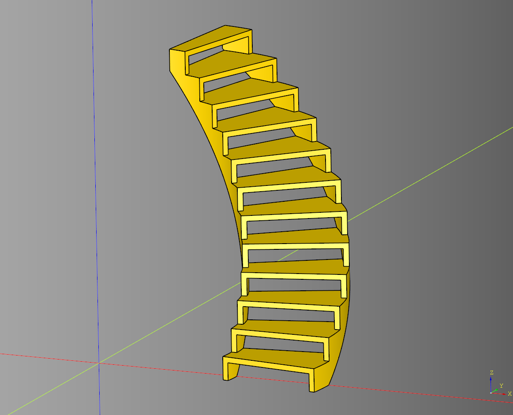
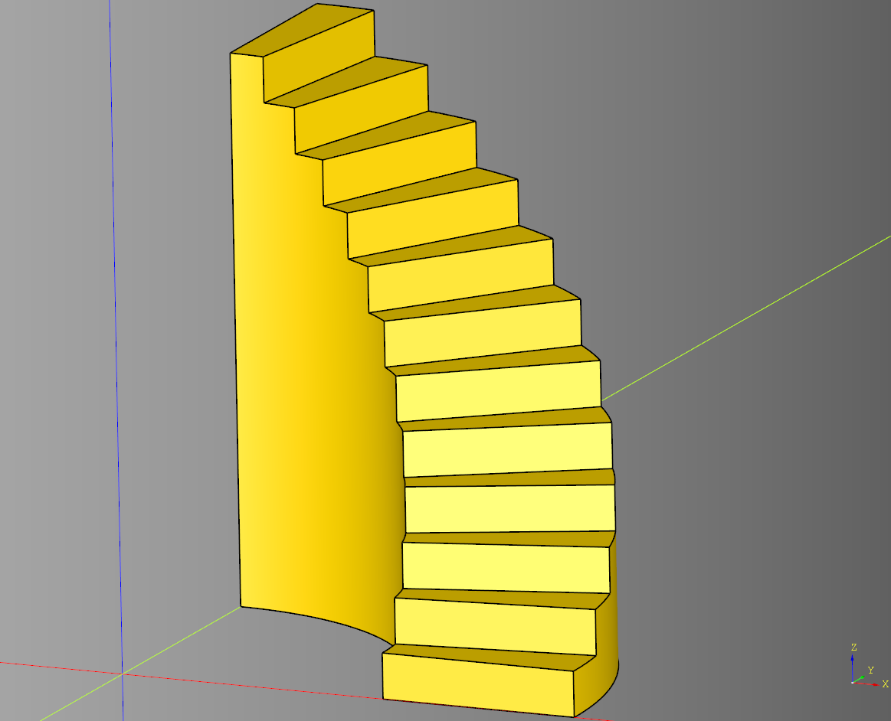
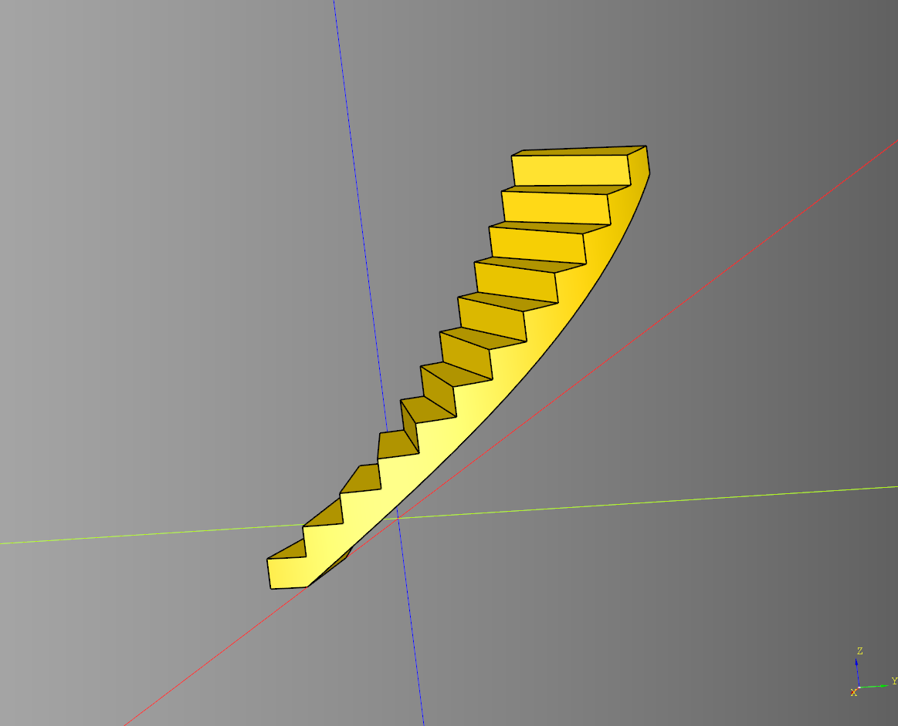
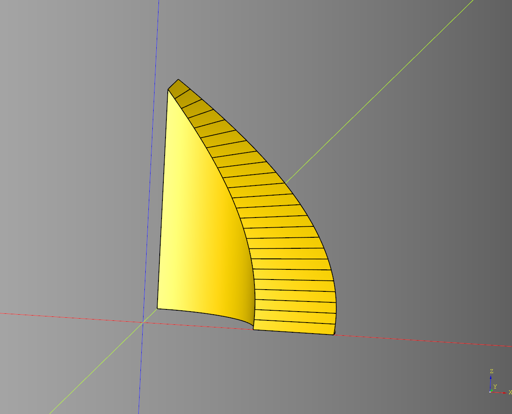
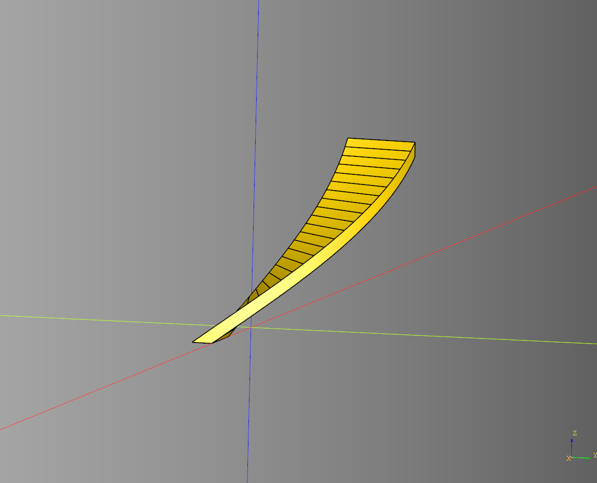
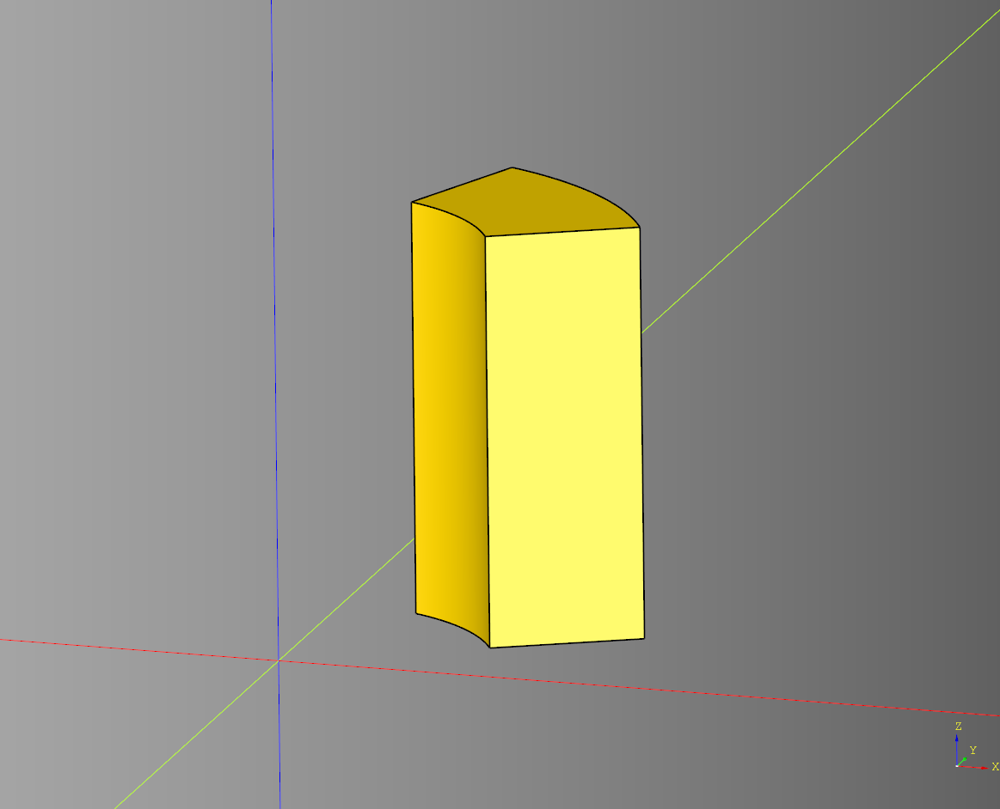

# Stairs Documentation

## Stairs

### parameters
* length
* width
* height
* run
* stair_length_offset
* stair_height
* stair_height_offset
* rail_width
* rail_height
* step_overlap

``` python
import cadquery as cq # Main cadquery library.
from cqterrain.stairs import stairs #Import stair generator code.

# Make an instance of the stairs shape with the following parameters.
ex = stairs(
    length = 30,
    width = 10,
    height = 30,
    run = 5,
    stair_length_offset = 0,
    stair_height = 1,
    stair_height_offset = 0,
    rail_width = 1,
    rail_height = 5
)

# Add the stairs to a workplane.
workspace = cq.Workplane('XY')
workspace.add(ex)

# Write to stl file.
cq.exporters.export(workspace,'stl/stairs.stl')

# Print metadata to console for debugging
if ex.metadata:
    print(ex.metadata)
```

The code above:
* Imports the required libraries.
* Generates a shape using the defined settings.
* Exports the shape to a file.
* Prints the shapes metadata to the console.


# Notes
* By default *step_overlap* is half of *rail_width* unless specified.
* *stair_length_offset* is added or removed invisible space to *run*
* *stair_height_offset* is added or removed invisible space to *stair_height*

<br />


* [source](../src/cqterrain/stairs/stairs.py)
* [example](../example/stairs/stairs.py)
* [stl](../stl/stairs.stl)


---
# Examples

## Default

``` python
ex = stairs(
    length = 30,
    width = 10,
    height = 30,
    run = 5,
    stair_length_offset = 0,
    stair_height = 1,
    rail_width = 1,
    rail_height = 5
)
```


## Ladder

``` python
ex = stairs(
    length = 10,
    width = 10,
    heigh t= 40,
    run = 1,
    stair_length_offset = 0,
    stair_height = 1,
    rail_width = 1,
    rail_height = 3
)
```


## Grand

``` python
ex = stairs(
    length = 60,
    width = 20,
    height = 30,
    run = 6,
    stair_length_offset = 0,
    stair_height = 3,
    rail_width = 3,
    rail_height = 15
)
```


## Small

``` python
ex = stairs(
    length = 10,
    width = 5,
    height = 10,
    run = 2,
    stair_length_offset = 1,
    stair_height = 1,
    rail_width = 1,
    rail_height = 1
)
```


## Futuristic

``` python
ex = stairs(
    length =15,
    width = 15,
    height = 25,
    run = 1.5,
    stair_length_offset = -0.5,
    stair_height = 1,
    rail_width = 5.5,
    rail_height = 3.5,
    step_overlap = 0
)
```


## Overlap

``` python
ex = stairs(
    length = 30,
    width = 10,
    height = 30,
    run = 3.5,
    stair_length_offset = 1.5,
    stair_height = 1,
    rail_width = 1,
    rail_height = 5,
    step_overlap = 2.5
)
```


---

## Round

## Greebled Stairs

### parameters
* height: float
* inner_diameter: float
* diameter: float
* stair_height: float|None
* stair_count: int|None
* inside_margin: float
* debug: bool

``` python
import cadquery as cq
from cqterrain.stairs.round import greebled_stairs

stairs = greebled_stairs(
    stair_count = 12,
    height = 75,
    inner_diameter = 75,
    diameter = 75 + 55, 
    debug = False
).translate((0,0,(75)/2))
show_object(stairs)
```



* [source](../src/cqterrain/stairs/round/greebled_stairs.py)
* [example](../example/stairs/round/greebled_stairs.py)
* [stl](../stl/stairs_round_greebled_stairs.stl)


### Combined with ramp example

``` python
import cadquery as cq
from cqterrain.stairs.round import ramp, greebled_stairs

stairs = greebled_stairs(
    stair_count = 12,
    height = 75,
    inner_diameter = 75,
    diameter = 75 + 55, 
    debug = False
).translate((0,0,(75)/2))

round_ramp = ramp(
    stair_count = 12*2,
    height = 75,
    inner_diameter = 75,
    diameter = 75 + 55,
    distance_overlap = 0.5,
    debug = False
).translate((0,0,(75)/2))

stairs = stairs.rotate((0,0,1),(0,0,0),7) 

combined_stairs = stairs.cut(round_ramp)

show_object(combined_stairs)
```



* [example](../example/stairs/round/combined_greebled.py)
* [stl](../stl/stairs_round_combined_greebled.stl)
----

## Plain Stairs

### parameters
* height: float
* inner_diameter: float
* diameter: float
* stair_height: float|None
* stair_count: int|None
* inside_margin: float
* debug: bool

``` python
import cadquery as cq
from cqterrain.stairs.round import plain_stairs

stairs = plain_stairs(
    stair_count = 12,
    height = 75,
    inner_diameter = 75,
    diameter = 75 + 55, 
    debug = False
).translate((0,0,(75)/2))

show_object(stairs)
```



* [source](../src/cqterrain/stairs/round/plain_stairs.py)
* [example](../example/stairs/round/plain_stairs.py)
* [stl](../stl/stairs_round_plain_stairs.stl)

### Combined with ramp example

``` python
import cadquery as cq
from cqterrain.stairs.round import ramp, plain_stairs

stairs = plain_stairs(
    stair_count = 12,
    height = 75,
    inner_diameter = 75,
    diameter = 75 + 55, 
    debug = False
).translate((0,0,(75)/2))

round_ramp = ramp(
    stair_count = 12*2,
    height = 75,
    inner_diameter = 75,
    diameter = 75 + 55,
    distance_overlap = 0.5,
    debug = False
).translate((0,0,(75)/2))

stairs = stairs.rotate((0,0,1),(0,0,0),7) 

combined_stairs = stairs.cut(round_ramp)

show_object(combined_stairs)
```



* [example](../example/stairs/round/combined_plain.py)
* [stl](../stl/stairs_round_combined_plain.stl)

---

## Ramp

### parameters
* height: float
* inner_diameter: float
* diameter: float
* stair_height: float|None
* stair_count: int|None
* distance_overlap: float
* debug: bool

``` python
import cadquery as cq
from cqterrain.stairs.round import ramp, greebled_stairs

round_ramp = ramp(
    stair_count = 12*2,
    height = 75,
    inner_diameter = 75,
    diameter = 75 + 55,
    distance_overlap = 0.5,
    debug = False
).translate((0,0,(75)/2))

show_object(round_ramp)
```



* [source](../src/cqterrain/stairs/round/ramp.py)
* [example](../example/stairs/round/ramp.py)
* [stl](../stl/stairs_round_ramp.stl)

### Combined with ramp example

``` python
import cadquery as cq
from cqterrain.stairs.round import ramp

round_ramp = ramp(
    stair_count = 12*2,
    height = 75,
    inner_diameter = 75,
    diameter = 75 + 55,
    distance_overlap = 0.5,
    debug = False
).translate((0,0,(75)/2))

cut_ramp = ramp(
    stair_count = 12*2,
    height = 75,
    inner_diameter = 75,
    diameter = 75 + 55,
    distance_overlap = 0.5,
    debug = False
).translate((0,0,(75)/2))

round_ramp = round_ramp.rotate((0,0,1),(0,0,0),7) 

combined_ramp = round_ramp.cut(cut_ramp)

show_object(combined_ramp)
```



* [example](../example/stairs/round/combined_ramp.py)
* [stl](../stl/stairs_round_combined_ramp.stl)

---

## Outline

### parameters
* height: float
* inner_diameter: float
* diameter: float
* rotate: float
* debug: bool

``` python
import cadquery as cq
from cqterrain.stairs.round import outline

outline_ex = outline(
    height = 75,
    inner_diameter = 75,
    diameter = 75 + 55,
    rotate = 50
).rotate((0,0,1),(0,0,0),45/2)

show_object(outline_ex)
```



* [source](../src/cqterrain/stairs/round/outline.py)
* [example](../example/stairs/round/outline.py)
* [stl](../stl/stairs_round_outline.stl)
