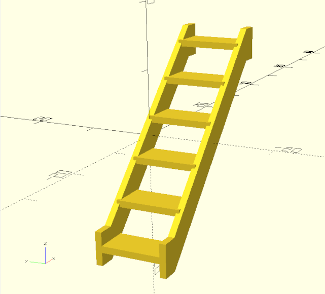
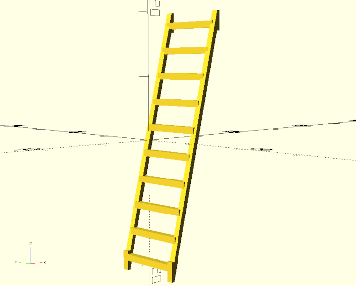
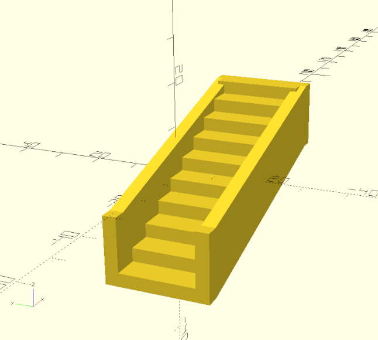
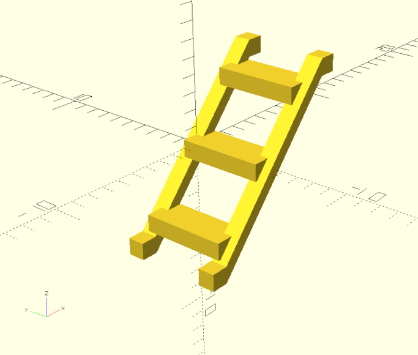

# Stairs Documentation

## Default

``` python
ex = stairs.make_stairs(
    length = 30,
    width = 10,
    height = 30,
    run = 5,
    stair_length_offset = 0,
    stair_height = 1,
    rail_width = 1,
    rail_height = 5
)
```



## Ladder

``` python
ex = stairs.make_stairs(
    length = 10,
    width = 10,
    heigh t= 40,
    run = 1,
    stair_length_offset = 0,
    stair_height = 1,
    rail_width = 1,
    rail_height = 3
)
```



## Grand

``` python
ex = stairs.make_stairs(
    length = 60,
    width = 20,
    height = 30,
    run = 6,
    stair_length_offset = 0,
    stair_height = 3,
    rail_width = 3,
    rail_height = 15
)
```



## Small

``` python
ex = stairs.make_stairs(
    length = 10,
    width = 5,
    height = 10,
    run = 2,
    stair_length_offset = 1,
    stair_height = 1,
    rail_width = 1,
    rail_height = 1
)
```


