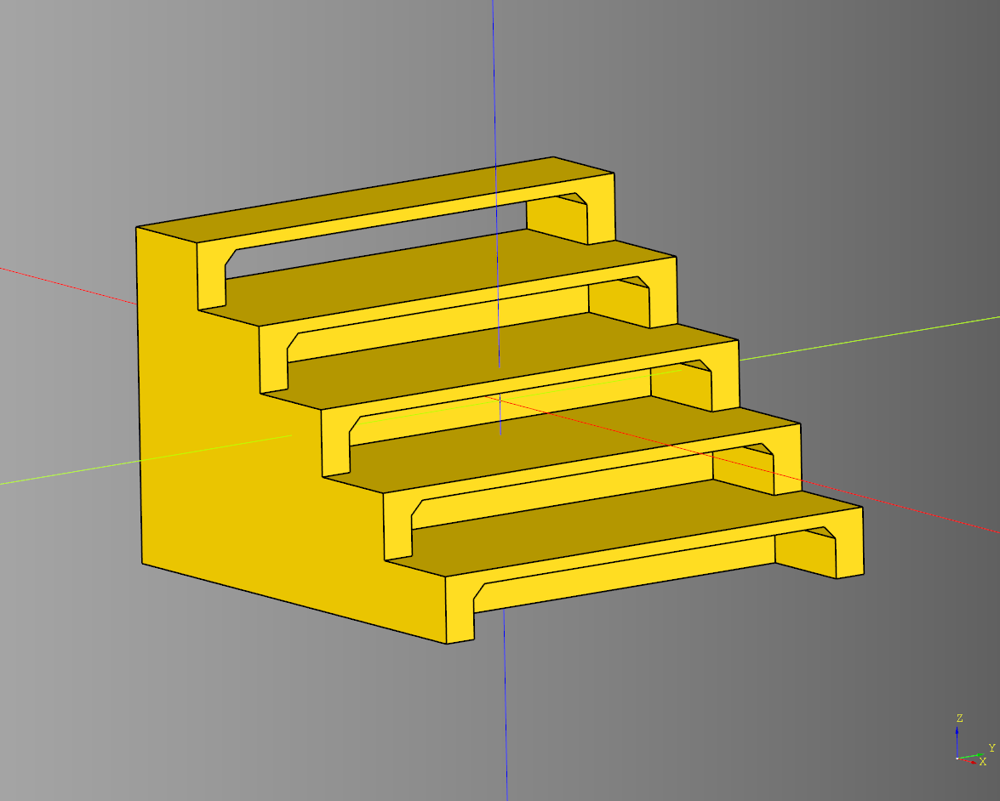

# Stairs Documentation

- [Stairs Documentation](#stairs-documentation)
  - [Stairs](#stairs)
    - [parameters](#parameters)
    - [Notes](#notes)
    - [Examples](#examples)
      - [Default](#default)
      - [Ladder](#ladder)
      - [Grand](#grand)
      - [Small](#small)
      - [Futuristic](#futuristic)
      - [Overlap](#overlap)
  - [Round](#round)
    - [Greebled Stairs](#greebled-stairs)
      - [parameters](#parameters-1)
      - [Combined With Ramp Example](#combined-with-ramp-example)
    - [Plain Stairs](#plain-stairs)
      - [parameters](#parameters-2)
      - [Plain Combined With Ramp Example](#plain-combined-with-ramp-example)
    - [Ramp](#ramp)
      - [parameters](#parameters-3)
      - [Ramp Combined With Ramp Example](#ramp-combined-with-ramp-example)
    - [Outline](#outline)
      - [parameters](#parameters-4)
  - [Industrial Stairs](#industrial-stairs)
    - [parameters](#parameters-5)

---

## Stairs

### parameters
* length: float
* width: float
* height: float
* run: float
* stair_length_offset: float
* stair_height: float
* stair_height_offset: float
* rail_width: float
* rail_height: float
* step_overlap: float|None

``` python
import cadquery as cq # Main cadquery library.
from cqterrain.stairs import stairs #Import stair generator code.

# Make an instance of the stairs shape with the following parameters.
ex = stairs(
    length = 30,
    width = 10,
    height = 30,
    run = 5,
    stair_length_offset = 0,
    stair_height = 1,
    stair_height_offset = 0,
    rail_width = 1,
    rail_height = 5
)

# Add the stairs to a workplane.
result = cq.Workplane('XY').add(ex)

show_object(result)
```

The code above:
* Imports the required libraries.
* Generates a shape using the defined settings.
* Exports the shape to a file.
* Prints the shapes metadata to the console.


### Notes
* By default *step_overlap* is half of *rail_width* unless specified.
* *stair_length_offset* is added or removed invisible space to *run*
* *stair_height_offset* is added or removed invisible space to *stair_height*

<br />


* [source](../src/cqterrain/stairs/stairs.py)
* [example](../example/stairs/stairs.py)
* [stl](../stl/stairs.stl)


---
### Examples

#### Default

``` python
ex = stairs(
    length = 30,
    width = 10,
    height = 30,
    run = 5,
    stair_length_offset = 0,
    stair_height = 1,
    rail_width = 1,
    rail_height = 5
)
```


#### Ladder

``` python
ex = stairs(
    length = 10,
    width = 10,
    height= 40,
    run = 1,
    stair_length_offset = 0,
    stair_height = 1,
    rail_width = 1,
    rail_height = 3
)
```


#### Grand

``` python
ex = stairs(
    length = 60,
    width = 20,
    height = 30,
    run = 6,
    stair_length_offset = 0,
    stair_height = 3,
    rail_width = 3,
    rail_height = 15
)
```


#### Small

``` python
ex = stairs(
    length = 10,
    width = 5,
    height = 10,
    run = 2,
    stair_length_offset = 1,
    stair_height = 1,
    rail_width = 1,
    rail_height = 1
)
```


#### Futuristic

``` python
ex = stairs(
    length =15,
    width = 15,
    height = 25,
    run = 1.5,
    stair_length_offset = -0.5,
    stair_height = 1,
    rail_width = 5.5,
    rail_height = 3.5,
    step_overlap = 0
)
```


#### Overlap

``` python
ex = stairs(
    length = 30,
    width = 10,
    height = 30,
    run = 3.5,
    stair_length_offset = 1.5,
    stair_height = 1,
    rail_width = 1,
    rail_height = 5,
    step_overlap = 2.5
)
```


---

## Round

---

### Greebled Stairs

#### parameters
* height: float
* inner_diameter: float
* diameter: float
* stair_height: float|None
* stair_count: int|None
* inside_margin: float
* debug: bool

``` python
import cadquery as cq
from cqterrain.stairs.round import greebled_stairs

stairs = greebled_stairs(
    stair_count = 12,
    height = 75,
    inner_diameter = 75,
    diameter = 75 + 55, 
    debug = False
).translate((0,0,(75)/2))
show_object(stairs)
```


* [source](../src/cqterrain/stairs/round/greebled_stairs.py)
* [example](../example/stairs/round/greebled_stairs.py)
* [stl](../stl/stairs_round_greebled_stairs.stl)


#### Combined With Ramp Example

``` python
import cadquery as cq
from cqterrain.stairs.round import ramp, greebled_stairs

stairs = greebled_stairs(
    stair_count = 12,
    height = 75,
    inner_diameter = 75,
    diameter = 75 + 55, 
    debug = False
).translate((0,0,(75)/2))

round_ramp = ramp(
    stair_count = 12*2,
    height = 75,
    inner_diameter = 75,
    diameter = 75 + 55,
    distance_overlap = 0.5,
    debug = False
).translate((0,0,(75)/2))

stairs = stairs.rotate((0,0,1),(0,0,0),7) 

combined_stairs = stairs.cut(round_ramp)

show_object(combined_stairs)
```


* [example](../example/stairs/round/combined_greebled.py)
* [stl](../stl/stairs_round_combined_greebled.stl)
----

### Plain Stairs

#### parameters
* height: float
* inner_diameter: float
* diameter: float
* stair_height: float|None
* stair_count: int|None
* inside_margin: float
* debug: bool

``` python
import cadquery as cq
from cqterrain.stairs.round import plain_stairs

stairs = plain_stairs(
    stair_count = 12,
    height = 75,
    inner_diameter = 75,
    diameter = 75 + 55, 
    debug = False
).translate((0,0,(75)/2))

show_object(stairs)
```


* [source](../src/cqterrain/stairs/round/plain_stairs.py)
* [example](../example/stairs/round/plain_stairs.py)
* [stl](../stl/stairs_round_plain_stairs.stl)

#### Plain Combined With Ramp Example

``` python
import cadquery as cq
from cqterrain.stairs.round import ramp, plain_stairs

stairs = plain_stairs(
    stair_count = 12,
    height = 75,
    inner_diameter = 75,
    diameter = 75 + 55, 
    debug = False
).translate((0,0,(75)/2))

round_ramp = ramp(
    stair_count = 12*2,
    height = 75,
    inner_diameter = 75,
    diameter = 75 + 55,
    distance_overlap = 0.5,
    debug = False
).translate((0,0,(75)/2))

stairs = stairs.rotate((0,0,1),(0,0,0),7) 

combined_stairs = stairs.cut(round_ramp)

show_object(combined_stairs)
```


* [example](../example/stairs/round/combined_plain.py)
* [stl](../stl/stairs_round_combined_plain.stl)

---

### Ramp

#### parameters
* height: float
* inner_diameter: float
* diameter: float
* stair_height: float|None
* stair_count: int|None
* distance_overlap: float
* debug: bool

``` python
import cadquery as cq
from cqterrain.stairs.round import ramp, greebled_stairs

round_ramp = ramp(
    stair_count = 12*2,
    height = 75,
    inner_diameter = 75,
    diameter = 75 + 55,
    distance_overlap = 0.5,
    debug = False
).translate((0,0,(75)/2))

show_object(round_ramp)
```


* [source](../src/cqterrain/stairs/round/ramp.py)
* [example](../example/stairs/round/ramp.py)
* [stl](../stl/stairs_round_ramp.stl)

#### Ramp Combined With Ramp Example

``` python
import cadquery as cq
from cqterrain.stairs.round import ramp

round_ramp = ramp(
    stair_count = 12*2,
    height = 75,
    inner_diameter = 75,
    diameter = 75 + 55,
    distance_overlap = 0.5,
    debug = False
).translate((0,0,(75)/2))

cut_ramp = ramp(
    stair_count = 12*2,
    height = 75,
    inner_diameter = 75,
    diameter = 75 + 55,
    distance_overlap = 0.5,
    debug = False
).translate((0,0,(75)/2))

round_ramp = round_ramp.rotate((0,0,1),(0,0,0),7) 

combined_ramp = round_ramp.cut(cut_ramp)

show_object(combined_ramp)
```


* [example](../example/stairs/round/combined_ramp.py)
* [stl](../stl/stairs_round_combined_ramp.stl)

---

### Outline

#### parameters
* height: float
* inner_diameter: float
* diameter: float
* rotate: float
* debug: bool

``` python
import cadquery as cq
from cqterrain.stairs.round import outline

outline_ex = outline(
    height = 75,
    inner_diameter = 75,
    diameter = 75 + 55,
    rotate = 50
).rotate((0,0,1),(0,0,0),45/2)

show_object(outline_ex)
```


* [source](../src/cqterrain/stairs/round/outline.py)
* [example](../example/stairs/round/outline.py)
* [stl](../stl/stairs_round_outline.stl)

---

## Industrial Stairs

### parameters
* length: float
* width: float
* height: float
* stair_count: int
* stair_chamfer: float|None
* render_step_cut: bool
* render_hollow: bool
* cut_padding: float

``` python
import cadquery as cq
from cqterrain.stairs import IndustrialStairs

bp = IndustrialStairs()
bp.length = 75
bp.width = 75
bp.height = 50
bp.stair_count = 5
bp.stair_chamfer = .5
bp.render_step_cut = True
bp.render_hollow = True
bp.cut_padding = 10
bp.make()
ex_stairs = bp.build()

show_object(ex_stairs)
```



* [source](../src/cqterrain/stairs/IndustrialStairs.py)
* [example](../example/stairs/industrial_stairs.py)
* [stl](../stl/stairs_industrial_stairs.stl)
