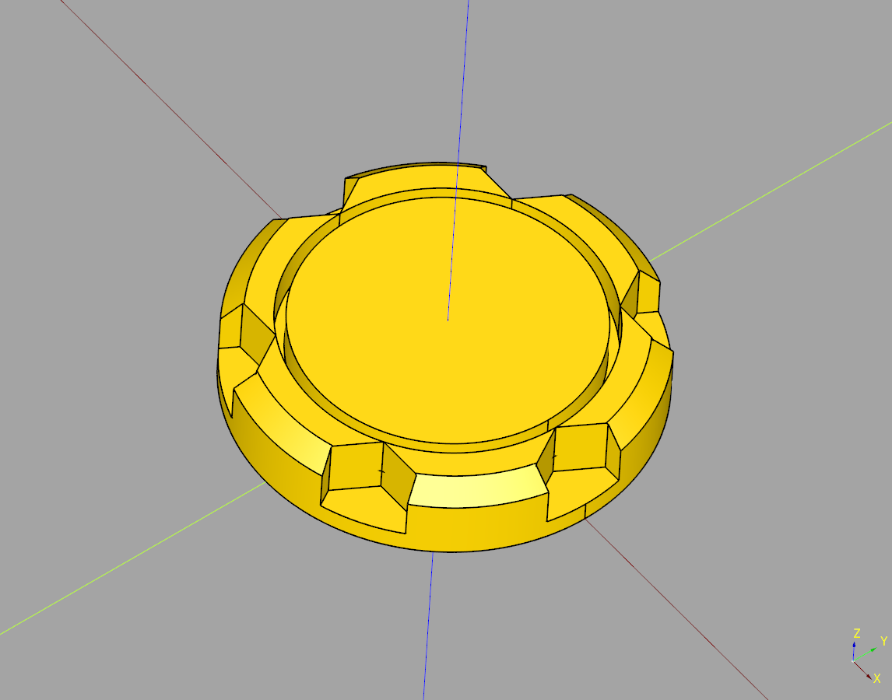
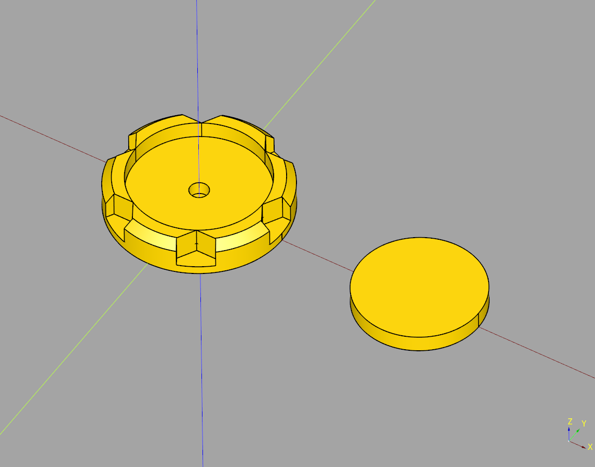
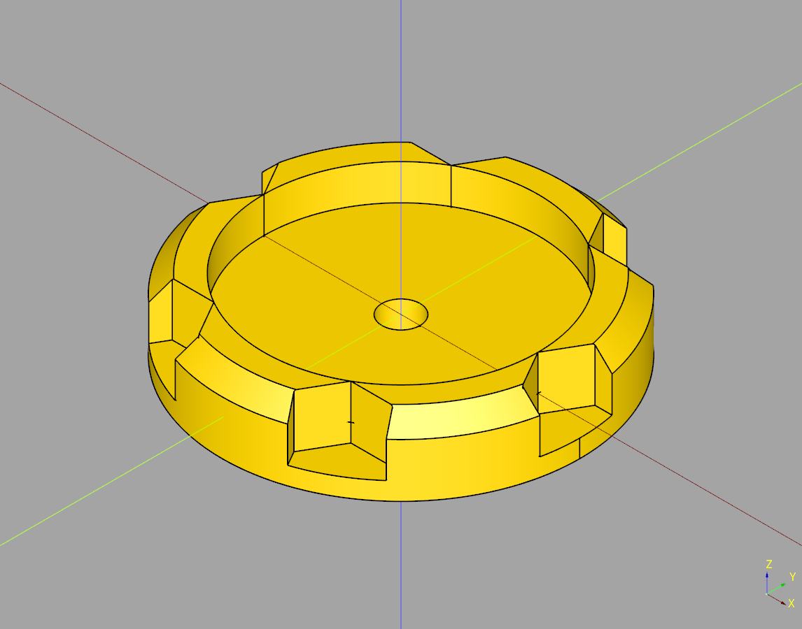
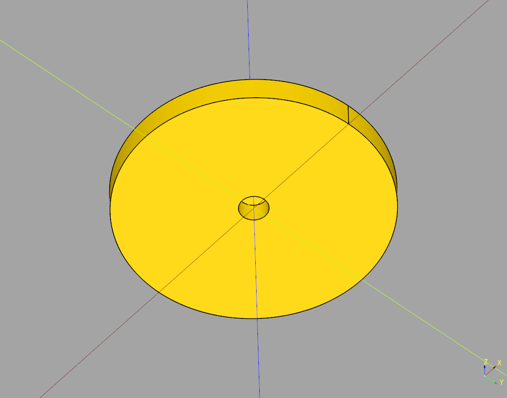
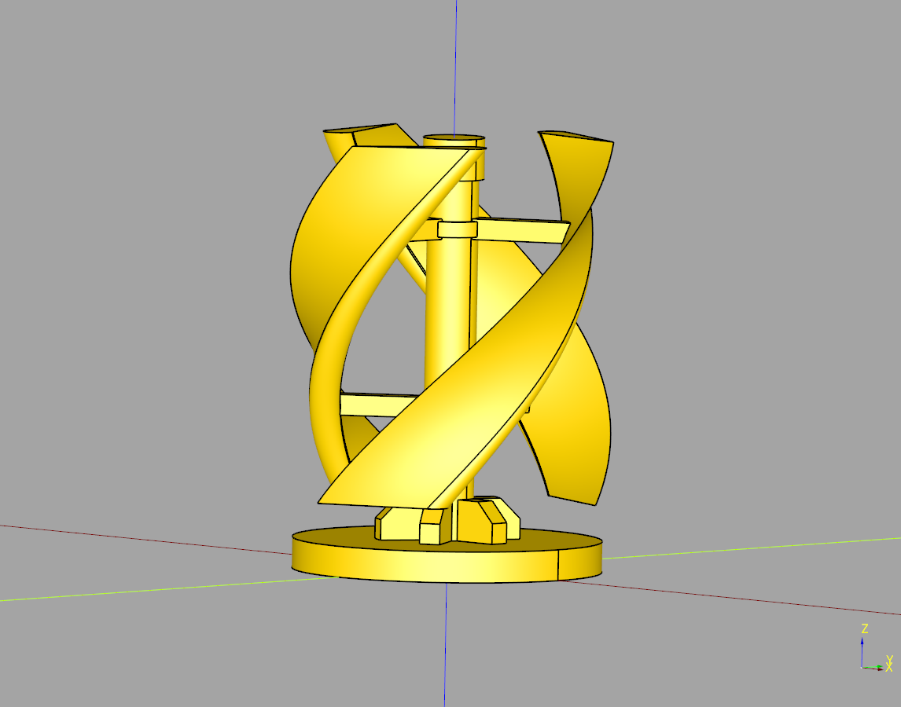

# Swivel Documentation

## index
* [Swivel](#swivel)
* [Swivel Base](#swivel-base)
* [Swivel Top](#swivel-top)
* [Turbine](#turbine)

---

## Swivel
Orchetrator class makes a swivel base and a top.

### parameters
* channel_width: float
* plate_x_translate: float

### blueprints
* bp_base: [SwivelBase](#swivel-base)
* bp_top: [SwivelTop](#swivel-top)


``` python
import cadquery as cq
from cqterrain.swivel import Swivel

bp = Swivel()
bp.channel_width = .8
bp.plate_x_translate = 40

bp.make()
ex_base = bp.build()

show_object(ex_base)
```



* [source](../src/cqterrain/swivel/Swivel.py)
* [example](../example/swivel/swivel.py)
* [stl](../stl/swivel.stl)


### plate example

``` python
import cadquery as cq
from cqterrain.swivel import Swivel

bp = Swivel()
bp.channel_width = .8
bp.plate_x_translate = 40

bp.make()
ex_plate = bp.build_plate()

show_object(ex_plate)
```



* [example](../example/swivel/swivel_plate.py)
* [stl](../stl/swivel_plate.stl)

---

## Swivel Base 

### parameters
* diameter:float = 30
* height:float = 6
* chamfer:float = 1.5
* top_width:float = 2
* channel_width:float = 1
* magnet_diameter:float = 3.2
* magnet_height:float = 2.4
* cut_height:float|None = None
* render_greeble:bool = True
* greeble_count:int = 6

``` python
import cadquery as cq
from cqterrain.swivel import SwivelBase

bp = SwivelBase()

bp.diameter = 30
bp.height = 6
bp.chamfer = 1.5
bp.top_width = 2
bp.channel_width = 1

bp.magnet_diameter = 3.2
bp.magnet_height = 2.4
bp.cut_height = None

bp.render_greeble = True
bp.greeble_count = 6

bp.make()
ex_base = bp.build()

show_object(ex_base)
```



* [source](../src/cqterrain/swivel/SwivelBase.py)
* [example](../example/swivel/swivel_base.py)
* [stl](../stl/swivel_base.stl)

---

## Swivel Top

### parameters
* diameter:float = 30
* height:float = 3
* magnet_diameter:float = 3.2
* magnet_height:float = 2.4

``` python 
import cadquery as cq
from cqterrain.swivel import SwivelTop

bp = SwivelTop()

bp.diameter = 30
bp.height = 3

bp.magnet_diameter = 3.2
bp.magnet_height = 2.4

bp.make()
ex_top = bp.build()

show_object(ex_top)
```



* [source](../src/cqterrain/swivel/SwivelTop.py)
* [example](../example/swivel/swivel_top.py)
* [stl](../stl/swivel_top.stl)


---

## Turbine
Inherits from [Swivel Top](#swivel-top)

## parameters

* mast_height: float
* mast_diameter: float
* cap_diameter: float
* cap_height: float
* blade_count: int
* blade_length: float
* blade_width: float
* blade_rotate: float
* blade_radius: float
* blade_offset: float
* fin_count: int

``` python
import cadquery as cq
from cqterrain.swivel import Turbine

bp = Turbine()

bp.mast_height = 35
bp.mast_diameter = 5

bp.cap_diameter = 6
bp.cap_height = 4

bp.blade_count = 3
bp.blade_length = 10
bp.blade_width = 3
bp.blade_rotate = (90+45)
bp.blade_radius = 12
bp.blade_offset = 0

bp.fin_count = 6

bp.make()
ex_top = bp.build()

show_object(ex_top)
```



* [source](../src/cqterrain/swivel/Turbine.py)
* [example](../example/swivel/turbine.py)
* [stl](../stl/swivel_turbine.stl)


