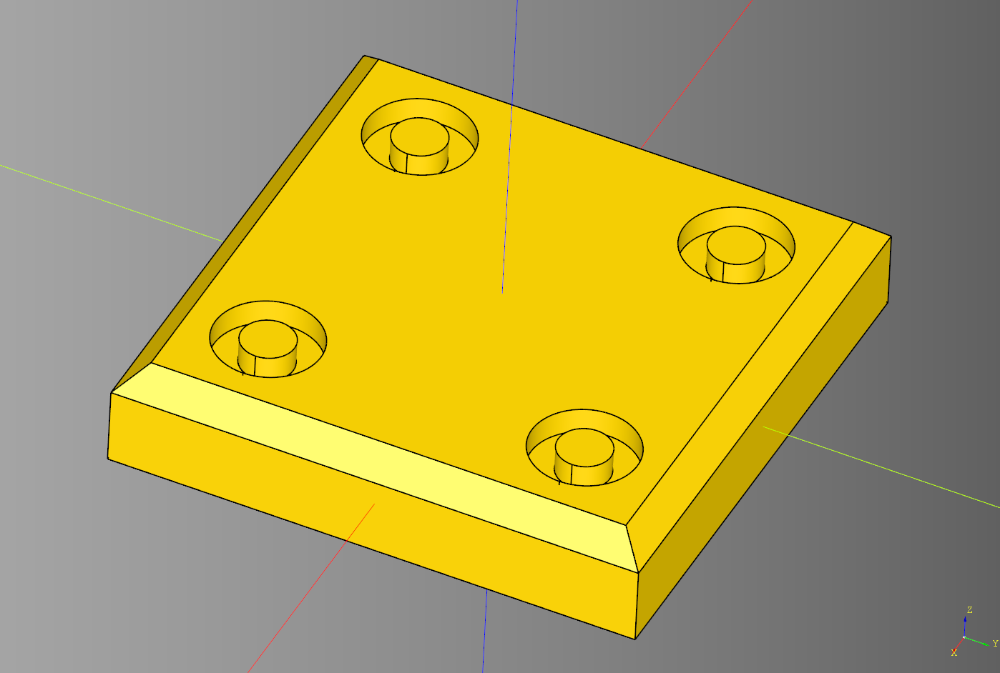

# Tile


- [Tile](#tile)
  - [Apricorn](#apricorn)
    - [Parameters](#parameters)
  - [Basket Weave](#basket-weave)
    - [Parameters](#parameters-1)
  - [Bolt Panel](#bolt-panel)
    - [Parameters](#parameters-2)
  - [Charge](#charge)
    - [Parameters](#parameters-3)
  - [Chamfer Frame](#chamfer-frame)
    - [Parameters](#parameters-4)
  - [Carton](#carton)
    - [Parameters](#parameters-5)
  - [Carton2](#carton2)
    - [Parameters](#parameters-6)
  - [Conduit](#conduit)
    - [Parameters](#parameters-7)
  - [Dwarf Star](#dwarf-star)
    - [Parameters](#parameters-8)
  - [Glyph](#glyph)
    - [Parameters](#parameters-9)
  - [Octagon With Dots](#octagon-with-dots)
    - [Parameters](#parameters-10)
    - [Example](#example)
  - [Plain](#plain)
    - [Parameters](#parameters-11)
  - [Rivet](#rivet)
    - [Parameters](#parameters-12)
  - [Rivet Round](#rivet-round)
    - [Parameters](#parameters-13)
  - [Slot](#slot)
    - [Parameters](#parameters-14)
  - [Slot diagonal](#slot-diagonal)
    - [Parameters](#parameters-15)
  - [Star](#star)
    - [Parameters](#parameters-16)
  - [Truchet Circle](#truchet-circle)
    - [Parameters](#parameters-17)
    - [Randomized grid example](#randomized-grid-example)
  - [Truchet Circle two](#truchet-circle-two)
    - [Parameters](#parameters-18)
  - [Truchet Circle three](#truchet-circle-three)
    - [Parameters](#parameters-19)
  - [Truchet Triangle](#truchet-triangle)
    - [Parameters](#parameters-20)
    - [Randomized Grid Example](#randomized-grid-example-1)
  - [Windmill](#windmill)
    - [Parameters](#parameters-21)


---

## Apricorn
### Parameters
* length
* width
* height
* line_width
* line_depth
* center_radius - if this is falsy determine center_radius based on **width** divided by **width_radius_divisor**
* width_radius_divisor

``` python
result = tile.apricorn(
    length = 30, 
    width = 25, 
    height = 4,
    line_width = 2,
    line_depth = .5,
    center_radius = None,
    width_radius_divisor = 4
)
```

<br />

* [source](../src/cqterrain/tile/apricorn.py)
* [example](../example/tile/apricorn.py)
* [stl](../stl/tile_apricorn.stl)


## Basket Weave
### Parameters
* length - length of a single brick
* width - width of a single brick
* height
* padding - space between bricks

``` python
result = tile.basketweave(
    length = 4,
    width = 2,
    height = 1,
    padding = .5
)
```

<br />

* [source](../src/cqterrain/tile/basketweave.py)
* [example](../example/tile/basketweave.py)
* [stl](../stl/tile_basketweave.stl)

## Bolt Panel
### Parameters
* length 
* width
* height 
* chamfer - appliet to the z face of the tile, can be 0 or None 
* radius_outer - outer radius of the bolt
* radius_internal - internal radius of the bolt
* cut_height - how deep the inset is of the bolt
* padding - distance of the bolts from the corners of the tile

``` python
result = tile.bolt_panel(
    length = 10, 
    width = 10, 
    height = 2, 
    chamfer = .5, 
    radius_outer=1,
    radius_internal=0.5,
    cut_height=0.5,
    padding = 2
)
```

<br />

* [source](../src/cqterrain/tile/boltpanel.py)
* [example](../example/tile/boltPanel.py)
* [stl](../stl/tile_bolt_panel.stl)

## Charge
### Parameters
* length
* width
* height
* line_width
* line_depth
* corner_chamfer
* edge_chamfer
* padding

``` python
result = tile.charge(
    length = 30, 
    width = 25, 
    height = 4,
    line_width = 3,
    line_depth = 1,
    corner_chamfer = 4,
    edge_chamfer = 2,
    padding = 2.5
)
```

<br />

* [source](../src/cqterrain/tile/charge.py)
* [example](../example/tile/charge.py)
* [stl](../stl/tile_charge.stl)


## Chamfer Frame
### Parameters
* length
* width
* height
* chamfer_length
* padding
* frame_width
* internal_height_cut

``` python
result = tile.chamfer_frame(
    length = 10,
    width = 10,
    height = 2,
    chamfer_length = 3,
    padding = .5,
    frame_width = 1.5,
    internal_height_cut = 1
)
```

<br />

* [source](../src/cqterrain/tile/chamferFrame.py)
* [example](../example/tile/chamfer_frame.py)
* [stl](../stl/tile_chamfer_frame.stl)

## Carton
### Parameters
* length
* width
* height
* line_width
* line_depth
* x_divisor
* y_divisor

``` python
result = tile.carton(
    length=60, 
    width=60, 
    height = 4,
    line_width = 3,
    line_depth = 1.5,
    x_divisor = 3,
    y_divisor = 2
)
```

<br />

* [source](../src/cqterrain/tile/carton.py)
* [example](../example/tile/carton.py)
* [stl](../stl/tile_carton.stl)


## Carton2
### Parameters
* length
* width
* height
* line_width
* line_depth
* x_divisor
* y_divisor

``` python
result = tile.carton2(
    length = 30, 
    width = 25, 
    height = 4, 
    line_width = 2, 
    line_depth = 1.5,
    x_divisor = 2,
    y_divisor = 3
)
```

<br />

* [source](../src/cqterrain/tile/carton2.py)
* [example](../example/tile/carton2.py)
* [stl](../stl/tile_carton2.stl)

## Conduit
### Parameters
* length - length of the tile
* width - with of the tile
* height - height of the tile
* frame - size of the frame can be 0
* frame_depth - depth of the frame that the pipe is set into, can be zero
* pipe_count - hard coded pipe count. If falsy the pipes count will be determined by the witdth of the tile and the diameter of the pipe.
* radius - radius of the pipe
* inner_radius - internal radius of the inner pope
* segment_length - size of the pipe segments
* space - space between the pipe segments
* pipe_padding - padding between pipes

``` python
result = tile.conduit(
    length = 25,
    width = 25,
    height = 4,
    frame= 1,
    frame_depth =3,
    pipe_count = None,
    radius = 4,
    inner_radius = 3,
    segment_length = 6,
    space = 4,
    pipe_padding = 1
)
```

<br />

* [source](../src/cqterrain/tile/conduit.py)
* [example](../example/tile/conduit.py)
* [stl](../stl/tile_conduit.stl)

## Dwarf Star
### Parameters
* length: float
* width: float
* height: float
* depth: float
* margin: float
* inner_band_width: float
* inner_track_width: float

``` python
import cadquery as cq
from cqterrain.tile import dwarf_star

result = dwarf_star(
        length = 15,
        width = 15,
        height = 2,
        depth = .6, 
        margin = .6,
        inner_band_width = 1,
        inner_track_width = 1
)
show_object(result)
```

<br />

* [source](../src/cqterrain/tile/dwarfStar.py)
* [example](../example/tile/dwarf_star.py)
* [stl](../stl/tile_dwarf_star.stl)


## Glyph
### Parameters
* length
* width
* height
* padding

``` python
result = tile.glyph(
    length = 4,
    width = 2,
    height = 1,
    padding = .5
)
```

<br />

* [source](../src/cqterrain/tile/glyph.py)
* [example](../example/tile/glyph.py)
* [stl](../stl/tile_glyph.stl)


## Octagon With Dots
### Parameters
* tile_size
* chamfer_size
* mid_tile_size
* spacing

``` python
result = tile.octagon_with_dots_2(
    tile_size = 5,
    chamfer_size = 1.2,
    mid_tile_size = 1.6,
    spacing = .5
)
```

<br />

* [source](../src/cqterrain/tile/octagonWithDots.py)
* [example](../example/tile/octagon_with_dots.py)
* [stl](../stl/tile_octagon_with_dots.stl)

### Example
<br />

## Plain
Placeholder example tile 
### Parameters
* length
* width
* height
* padding

``` python
result = tile.plain(
    length = 10,
    width = 10,
    height = 2,
    padding = 1
)
```

<br />

* [source](../src/cqterrain/tile/plain.py)
* [example](../example/tile/plain.py)
* [stl](../stl/tile_plain.stl)

## Rivet
### Parameters
* length
* width
* height
* padding
* internal_padding
* rivet_height
* rivet_radius

``` python
result = tile.rivet(
    length = 10,
    width = 10,
    height = 2,
    padding = 1,
    internal_padding = 2.5,
    rivet_height = 2.5,
    rivet_radius = .5
)
```

<br />

* [source](../src/cqterrain/tile/rivet.py)
* [example](../example/tile/rivet.py)
* [stl](../stl/tile_rivet.stl)

## Rivet Round
### Parameters
* radius 
* height
* rivet_height
* rivet_radius
* padding
* rivet_count

``` python
result = tile.rivet_round(
    radius = 10, 
    height = 2,
    rivet_height = 0.5,
    rivet_radius = .5,
    padding = 1,
    rivet_count = 5
)
```

<br />

* [source](../src/cqterrain/tile/rivetRound.py)
* [example](../example/tile/rivetRound.py)
* [stl](../stl/tile_rivet_round.stl)

## Slot
### Parameters
* length
* width
* height
* padding
* slot_length_padding
* slot_width_offset
* slot_width
* slot_height

``` python
result = tile.slot(
    length = 10,
    width = 10,
    height = 2,
    padding = 1,
    slot_length_padding = 3,
    slot_width_offset = 1.5,
    slot_width = 1,
    slot_height = 0.5
)
```

<br />

* [source](../src/cqterrain/tile/slot.py)
* [example](../example/tile/slot.py)
* [stl](../stl/tile_slot.stl)

## Slot diagonal
### Parameters
* tile_size
* height
* slot_width
* slot_height
* slot_length_padding
* slot_width_padding
* slot_width_padding_modifier

``` python
result = tile.slot_diagonal(
    tile_size = 21,
    height = 2,
    slot_width = 2,
    slot_height = 2,
    slot_length_padding = 7,
    slot_width_padding = 2,
    slot_width_padding_modifier = .25
)
```

<br />

* [source](../src/cqterrain/tile/slotDiagonal.py)
* [example](../example/tile/slot_diagonal.py)
* [stl](../stl/tile_slot_diagonal.stl)

## Star
### Parameters
* length
* width
* height
* points
* outer_radius
* inner_radius
* padding

``` python
result = tile.star(
    length = 10,
    width = 10,
    height = 1,
    points = 4,
    outer_radius = 5,
    inner_radius = 3,
    padding = .5
)
```

<br />

* [source](../src/cqterrain/tile/star.py)
* [example](../example/tile/star.py)
* [stl](../stl/tile_star.stl)

## Truchet Circle

### Parameters
* length: float
* width: float
* height: float
* radius: float
* base_height: float
* shift_design: float - Hack to deal with non square tiles

``` python
import cadquery as cq
from cqterrain.tile import truchet_circle

result = truchet_circle(
    length = 10,
    width = 10,
    height = 4,
    radius = 1.5, 
    base_height = 2,
    shift_design=0
)
```

<br />

* [source](../src/cqterrain/tile/truchet_circle.py)
* [example](../example/tile/truchet_circle.py)
* [stl](../stl/tile_truchet_circle.stl)

### Randomized grid example

``` python
import cadquery as cq
from cqterrain.tile import truchet_circle
from cadqueryhelper import randomized_rotation_grid

example_tile = truchet_circle(
    length=20,
    width=20,
    height=4,
    radius=2, 
    base_height=2.5,
    shift_design=3
)
show_object(example_tile)

#---------------------
random_grid = randomized_rotation_grid(
    example_tile,
    x_spacing=20,
    y_spacing=20,
    x_count=10,
    y_count=10,
    seed='truchet'
)
result = cq.Workplane('XY').union(random_grid)
show_object(union_grid)
```

<br />

* [example](../example/tile/truchet_circle_grid_randomized.py)
* [stl](../stl/tile_truchet_circle_randomized_grid.stl)

## Truchet Circle two
Simplified implementation from truchet circle and has better performance.

### Parameters
* length: float
* width: float
* radius: float

``` python
import cadquery as cq
from cqterrain.tile import truchet_circle_two

example_tile = truchet_circle_two(
    length=10,
    width=10,
    radius=2 
)

show_object(example_tile)
```

<br />

* [source](../src/cqterrain/tile/truchet_circle_two.py)
* [example](../example/tile/truchet_circle_two.py)
* [stl](../stl/tile_truchet_circle_two.stl)

## Truchet Circle three
Event more simplified implementation from truchet circle.

### Parameters
* length: float
* width: float
* radius: float

``` python
import cadquery as cq
from cqterrain.tile import truchet_circle_three

example_tile = truchet_circle_three(
    length=10,
    width=10,
    radius=2 
)

show_object(example_tile)
```

<br />

* [source](../src/cqterrain/tile/truchet_circle_three.py)
* [example](../example/tile/truchet_circle_three.py)
* [stl](../stl/tile_truchet_circle_three.stl)

## Truchet Triangle

### Parameters
* length: float
* width: float
* height: float 
* min_height: float

``` python
import cadquery as cq
from cqterrain import tile

result = tile.truchet_triangle(
    length = 10, 
    width = 10, 
    height = 4, 
    min_height = 2
)
```

<br />

* [source](../src/cqterrain/tile/truchet_triangle.py)
* [example](../example/tile/truchet_triangle.py)
* [stl](../stl/tile_truchet_triangle.stl)

### Randomized Grid Example

``` python
import cadquery as cq
from cadqueryhelper import randomized_rotation_grid
from cqterrain import tile

triangle_tile = tile.truchet_triangle(
    length = 10, 
    width = 10, 
    height = 4, 
    min_height = 2
)

result = randomized_rotation_grid(
        shape = triangle_tile, 
        seed = "test3",
        rotate_increment = 90, 
        rotate_min = 0, 
        rotate_max = 360,
        x_count = 5,
        y_count = 5,
        x_spacing = 10,
        y_spacing = 10
)
```

<br />

* [example](../example/tile/truchet_triangle_grid_randomized.py)
* [stl](../stl/tile_truchet_triangle_randomized_grid.stl)

## Windmill
### Parameters
* tile_size
* height
* padding

``` python
result = tile.windmill(
    tile_size = 10,
    height = 1,
    padding = 0.5
)
```

<br />

* [source](../src/cqterrain/tile/windmill.py)
* [example](../example/tile/windmill.py)
* [stl](../stl/tile_windmill.stl)
