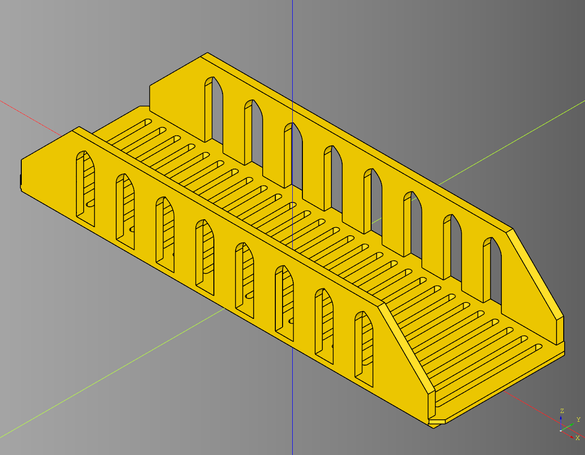

# Walkway Documentation

- [Walkway Documentation](#walkway-documentation)
  - [Walkway](#walkway)
    - [parameters](#parameters)
      - [slots](#slots)
      - [regular tiles](#regular-tiles)
      - [irregular tiles](#irregular-tiles)
      - [tabs](#tabs)
      - [rails](#rails)
      - [rail slots](#rail-slots)


---

## Walkway

### parameters
* length:float = 75
* width:float = 50
* height:float = 5
* walkway_chamfer:float = 3

#### slots
* render_slots:bool = True # grid, irregular
* slot_length:float = 3
* slot_width_padding:float = 2
* slot_length_offset:float = 2
* slots_end_margin:float = 10

#### regular tiles
* tile_length:float = 10
* tile_width:float = 10
* tile_height:float = 2
* tile_padding:float = 1
* make_tile_method = None

#### irregular tiles
* tile_max_height:float = self.height
* tile_max_columns:int = 5
* tile_max_rows:int = 5
* tile_union_grid:bool = False
* tile_seed:str = 'test'
* grid_width_padding:float = 2

#### tabs
* render_tabs:bool = True
* tab_length:float = 5
* tab_height:float = 1
* tab_width_padding:float = 0
* tab_chamfer:float = 4.5

#### rails
* render_rails:bool|str = True # True, 'left', right, False
* rail_height:float = 15
* rail_width:float = 4
* rail_chamfer:float = 5

#### rail slots
* render_rail_slots:bool = True
* rail_slot_length:float = 3
* rail_slot_top_padding:float = 2
* rail_slot_length_offset:float = 2
* rail_slots_end_margin:float = 10
* rail_slot_pointed_inner_height:float = 5
* rail_slot_type:str = "box" # box, archpointed, archround


``` python
import cadquery as cq
from cqterrain.walkway import Walkway

bp = Walkway()
bp.length = 225
bp.width = 75
bp.height = 6

bp.walkway_chamfer = 3

bp.render_slots = True
bp.slot_length = 3
bp.slot_width_padding = 5
bp.slot_length_offset = 5
bp.slot_width_padding = 4
bp.slots_end_margin = 0

bp.render_tabs = True
bp.tab_chamfer = 4.5
bp.tab_height = 2
bp.tab_length = 5

bp.render_rails = True
bp.rail_width = 4
bp.rail_height = 40
bp.rail_chamfer = 28

bp.render_rail_slots = True
bp.rail_slot_length = 10
bp.rail_slot_top_padding = 6
bp.rail_slot_length_offset = 12
bp.rail_slots_end_margin = 15
bp.rail_slot_pointed_inner_height = 7
bp.rail_slot_type = 'archpointed'

bp.make()
walkway_bridge = bp.build()
```



* [source](../src/cqterrain/walkway/Walkway.py)
* [example](../example/walkway/walkway.py)
* [stl](../stl/walkway_bridge.stl)