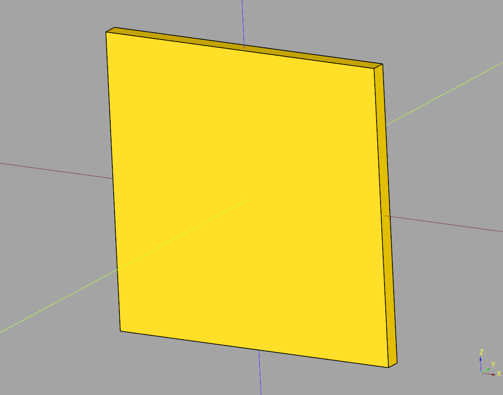

# Wall Documentation

## index
* [Base Wall](#base-wall)

## Base Wall
super basic wall class that inherits from caqueryhelper Base

## parameters
* length: float
* width: float
* height: float

``` python
import cadquery as cq
from cqterrain.wall import BaseWall

bp = BaseWall()
bp.length = 75
bp.width = 4
bp.height = 75
bp.make()

ex_wall = bp.build()
show_object(ex_wall)
```



* [source](../src/cqterrain/wall/BaseWall.py)
* [example](../example/wall/base_wall.py)
* [stl](../stl/wall_base_wall.stl)
