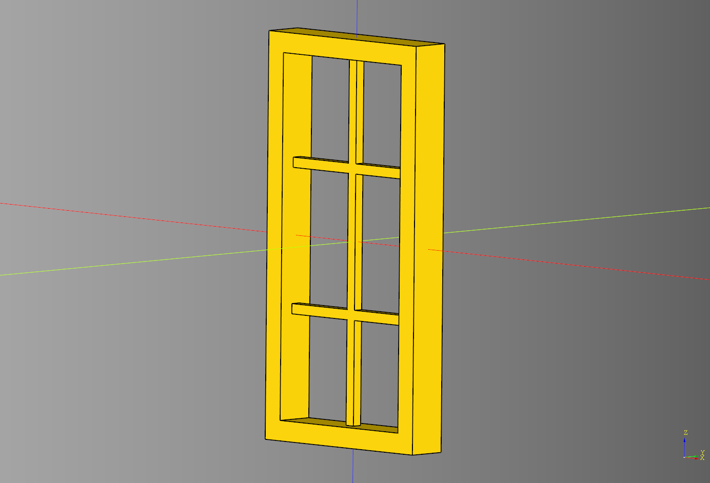
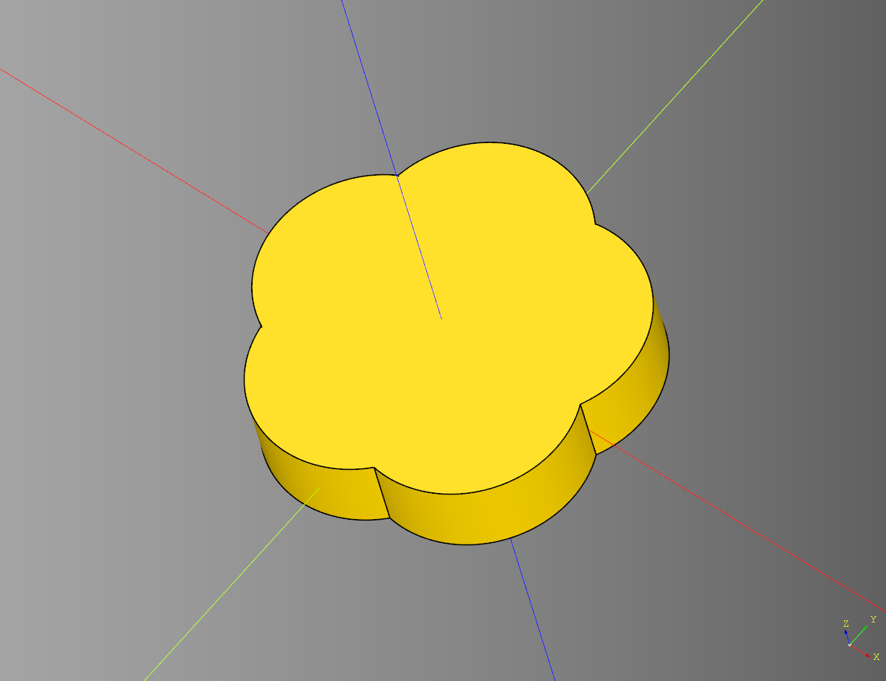
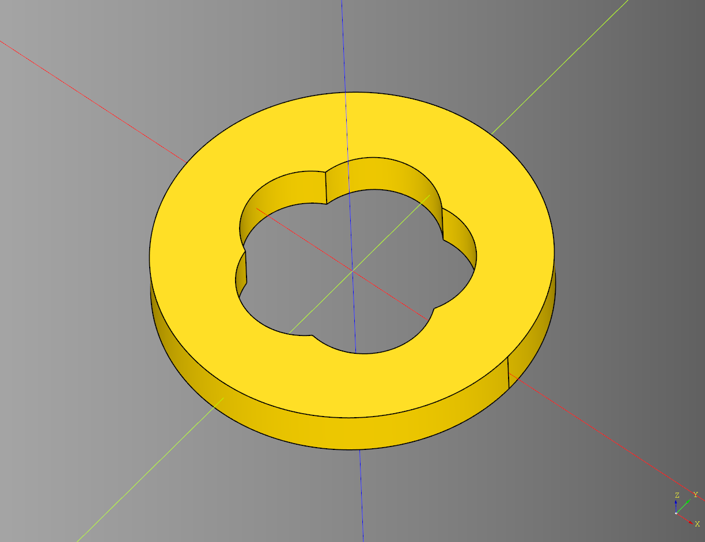
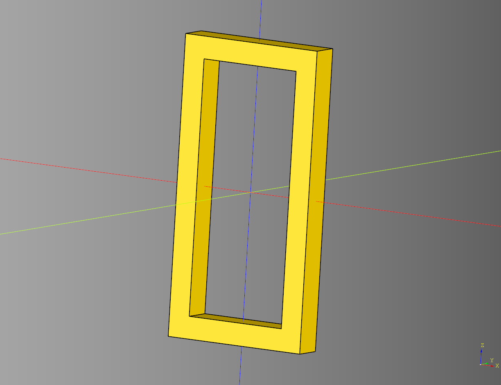
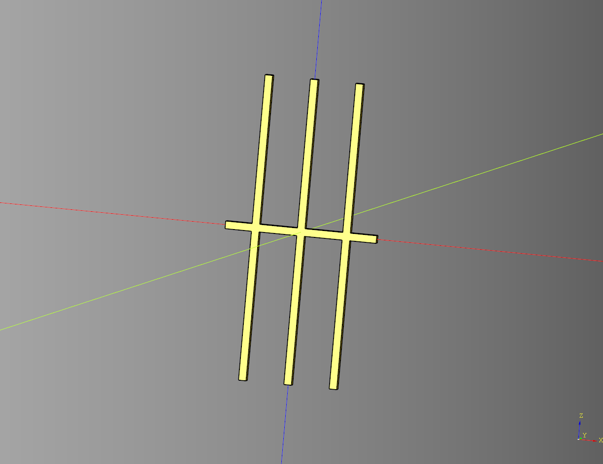
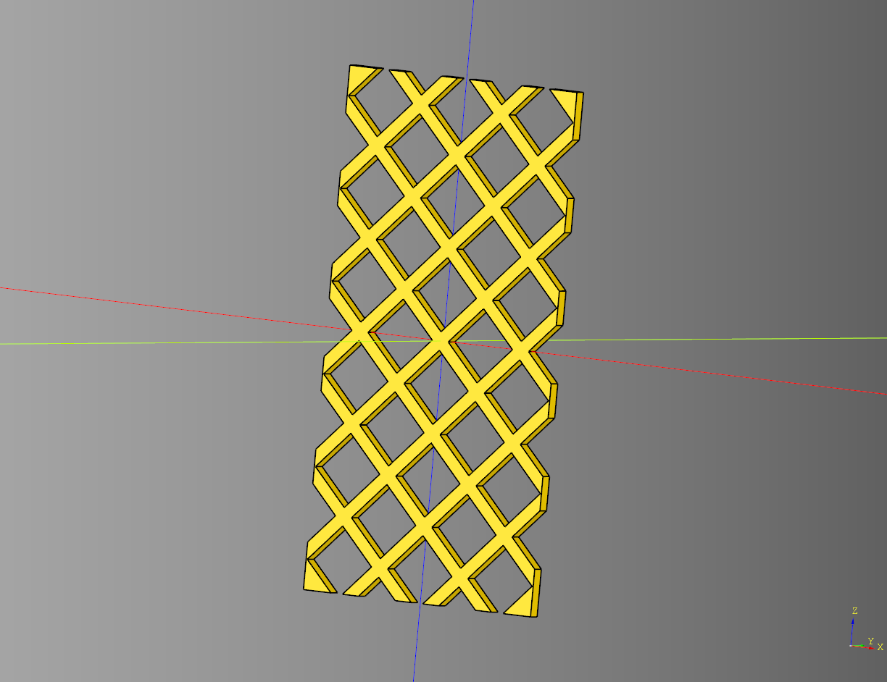

# Window

## Casement

Combination frame and grill.

### Parameters
* length: float 
* width: float
* height: float
* colums: int
* rows: int
* frame_width: float 
* grill_width: float 
* grill_height: float

``` python
result = window.casement(
    length=20, 
    width=4, 
    height=40, 
    colums=2, 
    rows=3, 
    frame_width=2, 
    grill_width=1, 
    grill_height=1
)
```

<br />

* [source](../src/cqterrain/window/casement.py)
* [example](../example/window/casement.py)
* [stl](../stl/window_casement.stl)

## Cinquefoil
### Parameters
* radius: float
* sides: int
* inner_radius: float
* height: float

``` python
result = window.cinquefoil(
    radius=5,
    sides=5,
    inner_radius=3,
    height=2
)
```

<br />

* [source](../src/cqterrain/window/cinquefoil.py)
* [example](../example/window/cinquefoil.py)
* [stl](../stl/window_cinquefoil.stl)


## Cinquefoil Frame
### Parameters
* radius: float 
* sides: int
* inner_radius: float
* height: float

``` python
result = window.cinquefoil_frame(
    outer_radius=7.5, 
    radius=5, 
    sides=5, 
    inner_radius=3, 
    height=2
)
```

<br />

* [source](../src/cqterrain/window/cinquefoil_frame.py)
* [example](../example/window/cinquefoil_frame.py)
* [stl](../stl/window_cinquefoil_frame.stl)

## Frame
### Parameters
* length: float
* width: float
* height: float
* frame_width: float

``` python
result = window.frame(
    length = 20, 
    width = 4, 
    height = 40, 
    frame_width = 3
)
```

<br />

* [source](../src/cqterrain/window/frame.py)
* [example](../example/window/frame.py)
* [stl](../stl/window_frame.stl)

## Grill
### Parameters
* length: float
* height: float
* columns: int
* rows: int
* grill_width: float
* grill_height: float

``` python
result = window.grill(
    length=20, 
    height=40, 
    columns=4, 
    rows=2, 
    grill_width=1, 
    grill_height=1
) 
```

<br />

* [source](../src/cqterrain/window/grill.py)
* [example](../example/window/grill.py)
* [stl](../stl/window_grill.stl)

## Lattice
### Parameters
* length: float
* height: float
* tile_size: float
* lattice_width: float
* lattice_height: float
* lattice_angle: float

``` python
result = window.lattice(
    length = 20, 
    height = 40,  
    tile_size = 4, 
    lattice_width = 1, 
    lattice_height = 1, 
    lattice_angle = 45
)
```

<br />

* [source](../src/cqterrain/window/lattice.py)
* [example](../example/window/lattice.py)
* [stl](../stl/window_lattice.stl)