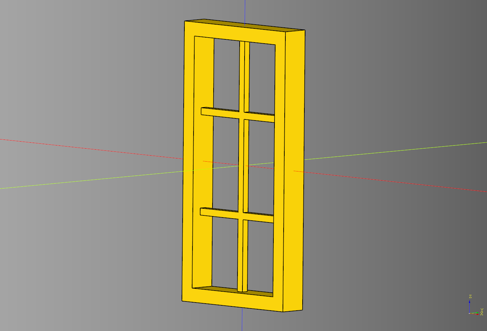
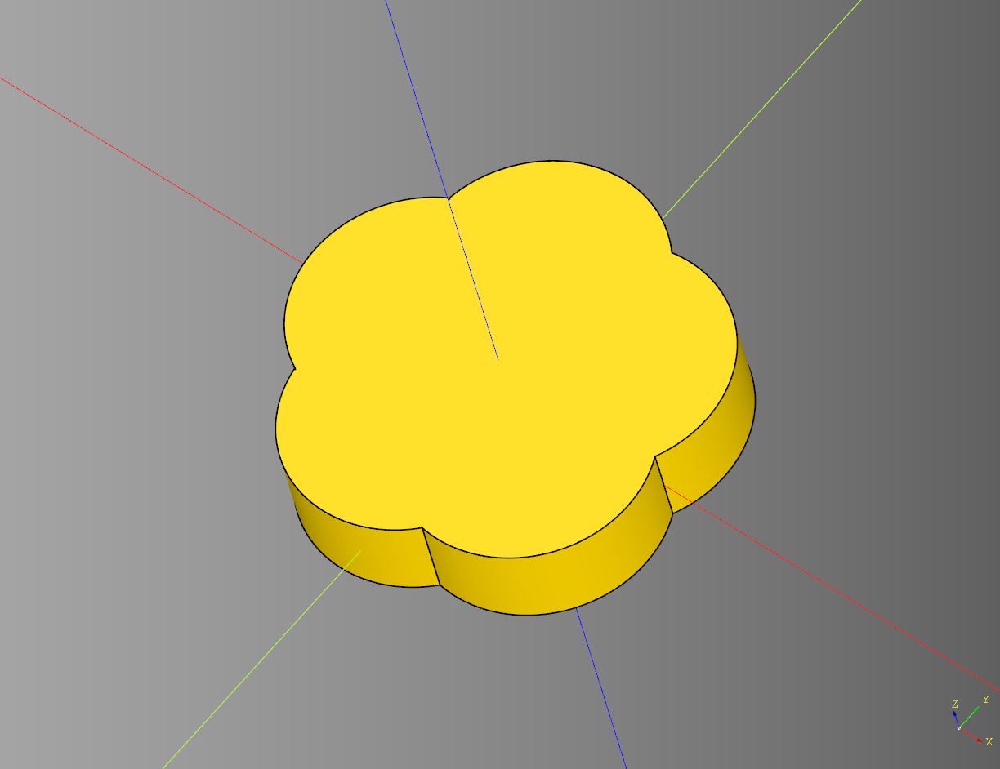
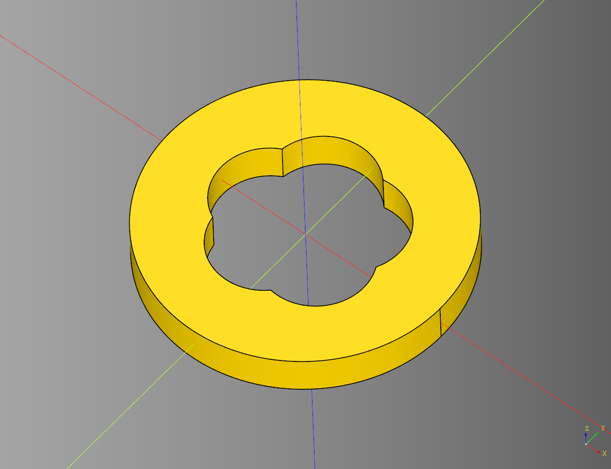
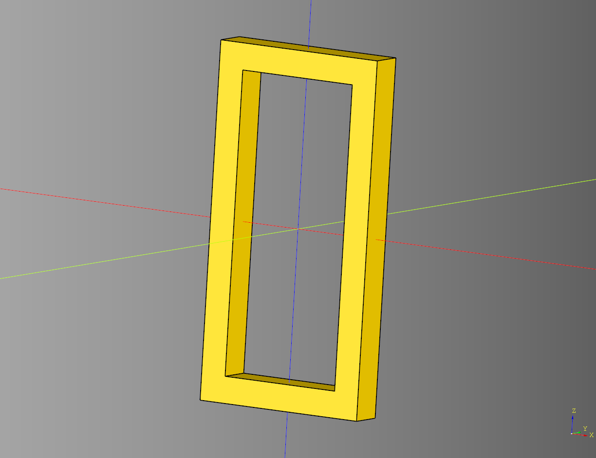
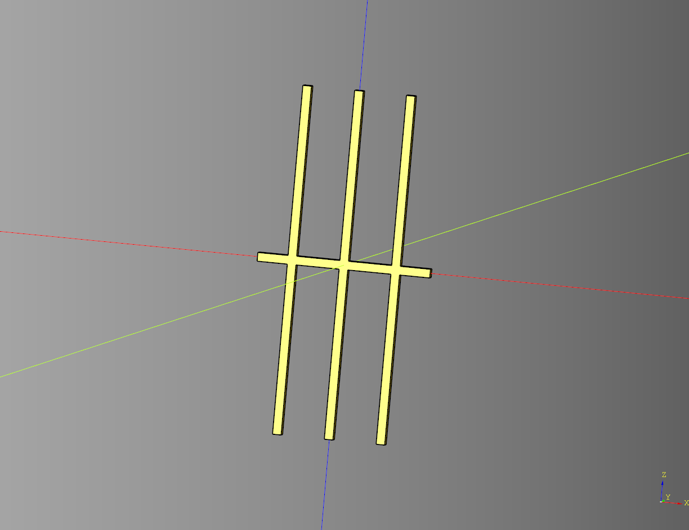
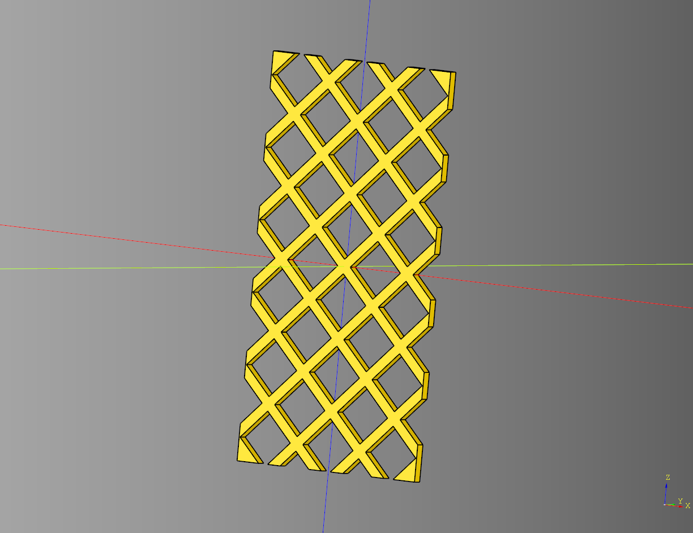
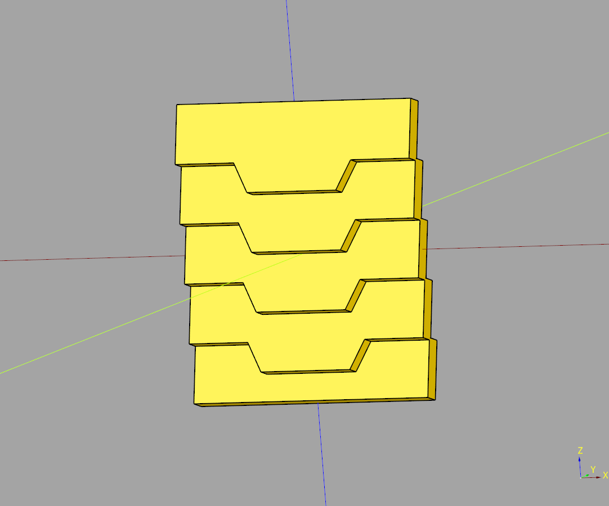
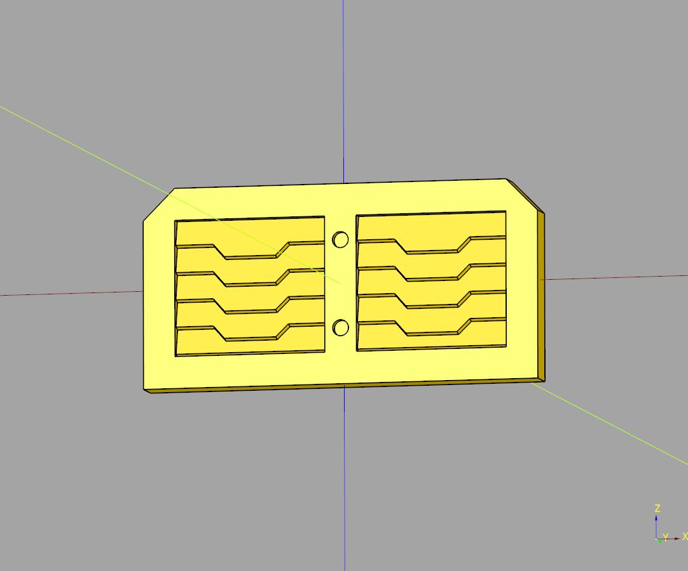

# Window

- [Window](#window)
  - [Casement](#casement)
  - [Cinquefoil](#cinquefoil)
  - [Cinquefoil Frame](#cinquefoil-frame)
  - [Frame](#frame)
  - [Grill](#grill)
  - [Lattice](#lattice)
  - [Shutter](#shutter)


---

## Casement

Combination frame and grill.

### Parameters
* length: float 
* width: float
* height: float
* colums: int
* rows: int
* frame_width: float 
* grill_width: float 
* grill_height: float

``` python
import cadquery as cq
from cqterrain import window

result = window.casement(
    length=20, 
    width=4, 
    height=40, 
    colums=2, 
    rows=3, 
    frame_width=2, 
    grill_width=1, 
    grill_height=1
)

show_object(result)
```

<br />

* [source](../src/cqterrain/window/casement.py)
* [example](../example/window/casement.py)
* [stl](../stl/window_casement.stl)

## Cinquefoil
### Parameters
* radius: float
* sides: int
* inner_radius: float
* height: float

``` python
import cadquery as cq
from cqterrain import window

result = window.cinquefoil(
    radius=5,
    sides=5,
    inner_radius=3,
    height=2
)

show_object(result)
```

<br />

* [source](../src/cqterrain/window/cinquefoil.py)
* [example](../example/window/cinquefoil.py)
* [stl](../stl/window_cinquefoil.stl)


## Cinquefoil Frame
### Parameters
* radius: float 
* sides: int
* inner_radius: float
* height: float

``` python
import cadquery as cq
from cqterrain import window

result = window.cinquefoil_frame(
    outer_radius=7.5, 
    radius=5, 
    sides=5, 
    inner_radius=3, 
    height=2
)

show_object(result)
```

<br />

* [source](../src/cqterrain/window/cinquefoil_frame.py)
* [example](../example/window/cinquefoil_frame.py)
* [stl](../stl/window_cinquefoil_frame.stl)

## Frame
### Parameters
* length: float
* width: float
* height: float
* frame_width: float

``` python
import cadquery as cq
from cqterrain import window

result = window.frame(
    length = 20, 
    width = 4, 
    height = 40, 
    frame_width = 3
)

show_object(result)
```

<br />

* [source](../src/cqterrain/window/frame.py)
* [example](../example/window/frame.py)
* [stl](../stl/window_frame.stl)

## Grill
### Parameters
* length: float
* height: float
* columns: int
* rows: int
* grill_width: float
* grill_height: float

``` python
import cadquery as cq
from cqterrain import window

result = window.grill(
    length=20, 
    height=40, 
    columns=4, 
    rows=2, 
    grill_width=1, 
    grill_height=1
)

show_object(result)
```

<br />

* [source](../src/cqterrain/window/grill.py)
* [example](../example/window/grill.py)
* [stl](../stl/window_grill.stl)

## Lattice
### Parameters
* length: float
* height: float
* tile_size: float
* lattice_width: float
* lattice_height: float
* lattice_angle: float

``` python
import cadquery as cq
from cqterrain import window

result = window.lattice(
    length = 20, 
    height = 40,  
    tile_size = 4, 
    lattice_width = 1, 
    lattice_height = 1, 
    lattice_angle = 45
)

show_object(result)
```

<br />

* [source](../src/cqterrain/window/lattice.py)
* [example](../example/window/lattice.py)
* [stl](../stl/window_lattice.stl)

---

## Shutter

### parameters
* length:float
* width:float
* height:float
* louver_count:float
* louver_rotate:float

``` python
import cadquery as cq
from  cqterrain.window import Shutter

bp_window = Shutter()
bp_window.length = 25
bp_window.width = 2
bp_window.height = 30
bp_window.louver_count  = 5
bp_window.louver_rotate  = 16

bp_window.make()
result = bp_window.build()

show_object(result)
```

<br />

* [source](../src/cqterrain/window/Shutter.py)
* [example](../example/window/shutter.py)
* [stl](../stl/window_shutter.stl)

---

## ShutterWindow

### parameters
* length: float
* width: float
* height: float
* frame_width: float
* pane_count: int
* louver_count: int
* louver_rotate: float

``` python
import cadquery as cq
from  cqterrain.window import ShutterWindow

bp_window = ShutterWindow()

bp_window.length = 50
bp_window.width = 4
bp_window.height = 25

bp_window.frame_width = 4
bp_window.pane_count = 2
bp_window.louver_count = 5
bp_window.louver_rotate = 16

bp_window.make()
result = bp_window.build()

show_object(result)
```

<br />

* [source](../src/cqterrain/window/ShutterWindow.py)
* [example](../example/window/shutter_window.py)
* [stl](../stl/window_shutter_window.stl)